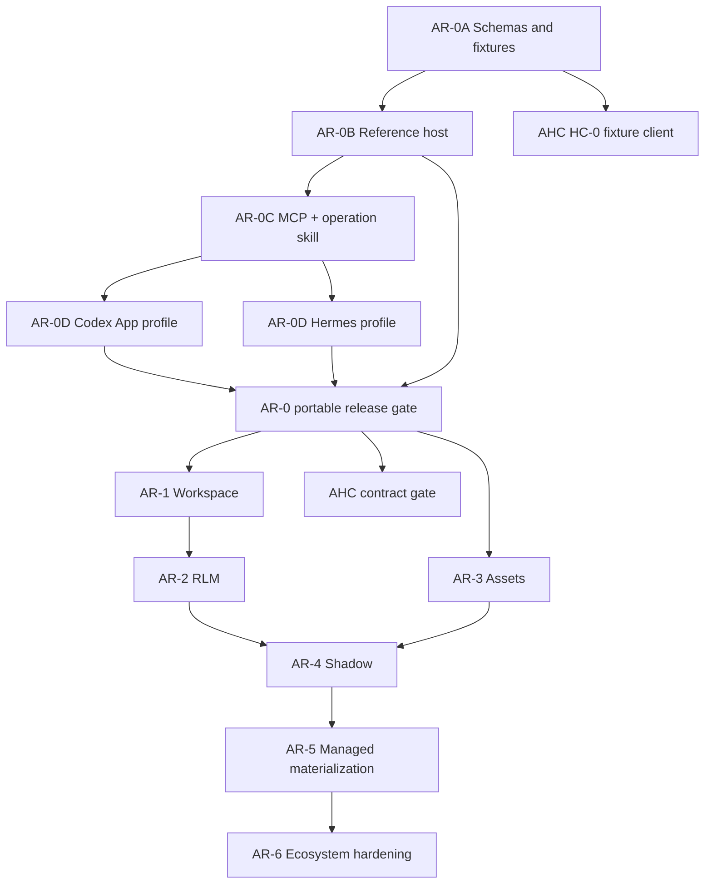

# Adaptive Agent Runtime Development Plan

**Status:** canonical project-local dependency plan
**Updated:** 2026-08-09
**Current phase:** AR-2 and AR-3 are locally verified at executable `c21d595` and audited evidence
candidate `1967dd5`; managed-host and cross-repository gates remain separate

## 1. Planning decision

AAR will ship an MCP-first interoperability slice before deep AHC integration.

This changes the earlier sequence in one important way: a minimal `aar-mcp` adapter is an AR-0 deliverable, not an AR-6 ecosystem extra. It does not change the authority split. MCP supplies discovery and invocation; AAR supplies runtime semantics; the host supplies authority.

The public narrow waist is a set of versioned, language-neutral schemas and a deterministic operation state machine. MCP is the first adapter for that narrow waist. Internal worker IPC and future native adapters reuse the same types and invariants rather than defining competing semantics.

## 2. Release train

### AR-0 — Host-Neutral Contract and MCP Vertical Slice

**Goal:** prove that AAR is independently usable and can be attached to multiple harnesses before AHC-specific code shapes the core.

#### AR-0A — Repository and protocol baseline

**Status:** verified. The executable contract candidate is
`0731847a908041cc46c7cdf02eebe57d7ff50d3c`; exact versions, digests, and commands are recorded
in `WAL.md`.

Deliverables:

- Python package/workspace layout and supported Python range;
- independent version domains for envelope, runtime, workspace, artifact, and broker schemas;
- opaque typed references for host, principal, lane, session, workspace, operation, and artifact identities;
- capability, grant, budget, deadline, generation, revision, idempotency, failure, and reconciliation types;
- canonical JSON and JSON Schema generation;
- valid and invalid golden fixtures with a deterministic digest;
- package boundary check proving core imports no AHC, Codex, or Hermes module;
- threat-boundary and unsupported-capability metadata.

Exit evidence:

- canonicalization is deterministic;
- invalid identity, version, digest, generation, revision, grant, and budget fixtures fail closed;
- exact schema versions and fixture digest are recorded;
- package import and static boundary checks pass in a clean environment.

#### AR-0B — Reference host

**Status:** verified. The executable reference-host candidate is
`a04ab92f5900c59e7dd8f4ec1e268369488aee5f`; lifecycle, process-restart, and package evidence is
recorded in `WAL.md`.

Deliverables:

- runtime supervisor skeleton;
- deterministic fake Model, Subagent, Effect, Artifact, and Evidence brokers;
- plain-Python WorkspaceBackend fake;
- persisted operation registry sufficient for idempotency and reconciliation tests;
- direct SDK path for tests and embedding.

Exit evidence:

- ready, execute, progress, cancel, timeout, stale result, restart, and reconcile scenarios pass;
- repeated idempotency keys return prior state only when payload digests match;
- uncertain state-changing outcomes remain indeterminate until reconciliation;
- no provider credential or user-delivery path enters the runtime.

#### AR-0C — MCP vertical slice

**Status:** verified. The executable MCP and operation-skill candidate is
`7656baa23d35086b1ecb20df50c3fdebf7e92ebd`; exact protocol versions, digests, package artifacts,
and commands are recorded in `WAL.md`.

Deliverables:

- `aar-mcp` stdio server;
- deterministic server identity, instructions, tool order, input schemas, and output schemas;
- canonical `skills/aar-operations/SKILL.md` plus version/digest metadata, generated or checked against the frozen MCP tool surface;
- a clear split between compact server-wide `instructions` and the full multi-step operation skill;
- bounded tools for capability inspection, workspace create/attach, execute, inspect, operation status, cancel, reconcile, checkpoint metadata, and artifact resolution;
- structured results plus a text fallback where compatibility requires it;
- operation handles for work that cannot finish safely within one tool call;
- explicit error mapping from AAR FailureEnvelope to MCP results;
- skill guidance for capability inspection, create/attach, execute, status/cancel/reconcile, artifact resolution, unsupported capabilities, and stale/restarted handles;
- compatibility probe covering the modern and legacy MCP eras supported by target clients.

Operation-skill contract:

- `aar-operations` is agent-facing workflow guidance, not an authority or a second protocol.
- It must use only public MCP tools/resources and declared host capabilities; it must not require AHC internals, provider credentials, operator paths, or final-delivery access.
- It must distinguish read-only inspection from mutating operations and preserve explicit generation, revision, deadline, grant, and idempotency inputs.
- It must explain when to return an operation handle, when to inspect status, when to cancel, and when reconciliation is mandatory after transport or worker uncertainty.
- It must treat MCP/tool outputs as untrusted input and keep artifact size, redaction, and disclosure limits visible.
- Tool/schema changes that invalidate the skill require one coherent version/digest update; stale skill bytes must fail compatibility checks rather than silently teaching the wrong workflow.

Protocol-version policy:

- The first spike records the versions actually spoken by current Codex App and Hermes clients.
- The implementation targets the current MCP specification and the newest required legacy revision when the chosen SDK can support both without semantic ambiguity.
- If dual-era support is not reliable, the server pins and publishes the supported era, rejects the other era clearly, and retains fixtures for the next compatibility step.
- MCP version identifiers never replace AAR schema versions or capability digests.

Exit evidence:

- a fresh MCP client can discover/list/call the server over stdio;
- advertised tool schemas and structured outputs are validated and deterministic;
- cancellation, timeout, stale generation, revision conflict, and restart/reconcile are distinguishable;
- tool annotations are treated as descriptive metadata, never as authorization proof;
- the canonical skill passes static tool-name/schema-reference checks and its version/digest is published with the MCP package;
- following the skill against the reference host completes the supported happy path and at least one stale-handle or reconciliation path without hidden operator-only steps;
- tool availability changes only from declared authorization/capability input, not hidden per-connection mutation;
- no state-changing result is inferred from transport loss.

#### AR-0D — Codex App and Hermes portability proof

**Status:** verified. The executable portability candidate is
`f3d1b913b479d7f8ef329c0bcc45ddd1f6e04395`; exact host versions, negotiated protocols, profile
digests, package artifacts, black-box traces, and known gaps are recorded in
`HOST-COMPATIBILITY.md` and `WAL.md`.

Deliverables:

- a Codex App host profile;
- a Hermes Agent host profile;
- exact install/config examples generated from the profile contract;
- host-specific bundles that deliver the canonical `aar-operations` skill with the MCP server without changing its authority or workflow meaning;
- compatibility matrix rows with client version, protocol era, transport, supported tools, limits, and known gaps;
- a reusable black-box smoke pack that does not depend on either host's internal Python objects.

Exit evidence:

- each host starts a fresh AAR MCP process and reads back the expected server identity and tool surface;
- each host receives or activates the expected operation-skill version/digest and completes create, execute, inspect, status/cancel, and artifact-reference scenarios that it claims to support;
- the execution trace shows the bundled skill and MCP surface agree; skill installation, catalog visibility, or prompt injection alone is not a passing result;
- invalid arguments, stale handles, and unsupported capabilities are surfaced without silent fallback;
- the AAR commit, package version, schema digest, host version, configuration digest, and test result are recorded;
- loss of the MCP server does not get reported as successful durable work or final delivery.

**AR-0 is verified because AR-0A through AR-0D pass at the candidate above.** AHC compatibility
remains a separate integration gate.

### AR-1 — Programmable Workspace

Start dependency: AR-0 verified.

**Status:** verified. The executable programmable-workspace candidate is
`6aa8fc7f7598ebc77560defe1d31d30719a64339`; exact direct, MCP, restart, Python-version,
Codex, Hermes, package, and host-workaround evidence is recorded in `HOST-COMPATIBILITY.md` and
`WAL.md`.

Deliverables:

- production IPython WorkspaceBackend in a separately supervised worker;
- package-declared IPython, NumPy, and pandas runtime dependencies for the default supervised
  analysis environment;
- `aar-codex-setup` as the general-user post-install path: one temporary real-worker dependency
  preflight, bundled-plugin installation as the sole MCP transport authority, and guarded removal
  of a matching legacy global registration; the cross-version and repository-wide matrices remain
  maintainer gates;
- deterministic plain-Python backend for shared behavior tests;
- complete versioned handles binding backend kind, version, capability digest, checkpoint formats,
  features, generation, and revision;
- create, attach, execute, inspect, interrupt, checkpoint, restore, close, health, and reconcile;
- structured stdout, stderr, display, exception, progress, and artifact events;
- digest-bound checkpoint manifests carrying source handle, creation operation, trace, environment
  fingerprint, supported values, exclusions, and artifacts;
- resource limits and host cancellation hooks.

Exit evidence:

- state persists within one workspace generation;
- supported checkpoint/restore is deterministic;
- unsupported live objects are reported, not silently serialized;
- stale revisions/generations and cross-session attachment fail closed;
- worker death produces a classified restore-or-loss result;
- runtime restart cannot turn a missing programmable receipt into false success or failure;
- backend-neutral tests pass through direct SDK and MCP paths where applicable.
- an exact-wheel compatibility smoke imports NumPy and pandas in the worker, performs a DataFrame
  calculation, and reports non-portable live objects as checkpoint exclusions.

### AR-2 — Portable RLM Engine

Start dependency: AR-1 verified.

**Status:** verified at executable `c21d595` and audited evidence candidate `1967dd5`. Direct,
restart, MCP, benchmark, Python 3.11–3.14, package, and fresh-Codex probes pass; the final synthesis
is `PASS / AUDITED_BATCH_COMPLETE`. The AHC fixture is transport-neutral contract evidence, not a
native-adapter acceptance.

Deliverables:

- bounded, persisted RLM state machine and strategy interface;
- typed, progressively disclosed Model, Subagent, Effect, Artifact, and Evidence broker clients;
- transport-neutral broker observability joining request, retained child, artifact, evidence,
  cancellation, budget, and reconciliation identities without exposing provider credentials;
- retained child handles and explicit result retrieval;
- host-authoritative budget/cancellation reconciliation;
- structured trace joining broker calls, artifacts, grants, and terminal state;
- a non-RLM baseline and evidence-heavy benchmark pack.

Design boundaries:

- AHC consumes the same transport-neutral broker and operation contracts; an AHC-native adapter may
  provide stronger lifecycle and authority integration without changing AAR core semantics.
- The current portable RLM is session- and operation-bound but workspace-independent. Programmable
  workspace execution and RLM execution are separate operations; a future joined strategy requires a
  separately versioned, end-to-end contract rather than an implicit binding.
- NOOA is design input only. Cherry-pick useful patterns such as progressive disclosure, typed
  routing, and observability; do not add a NOOA adapter, workspace backend, package dependency, or
  Python 3.11–3.14 core dependency.
- CodeGraph begins as a separate optional skill-guided external workflow for organizing and
  navigating AAR IPython artifacts. The AAR operation skill does not silently install, initialize,
  or sync it. Consider an optional provider package only after benchmark evidence shows that a
  package-level seam improves retrieval quality or cost over the external workflow.

Exit evidence:

- reference-host RLM conformance passes;
- one non-AHC host completes the supported brokered RLM slice;
- missing grants, expired budgets, cancellation, and stale generations fail closed;
- provider credentials, direct external effects, hidden synchronous children, and final delivery remain absent from the kernel;
- benchmark improvement is reported with cost, latency, uncertainty, and safety bounds.

### AR-3 — Canonical Adaptive Assets

Start dependency: AR-0 verified. May run in parallel with AR-1 and AR-2 after the shared schema boundary is stable.

**Status:** verified at executable `c21d595` and audited evidence candidate `1967dd5`.
Immutable-catalog, deterministic round-trip/migration, unknown-outcome, real process-loss, MCP v4,
isolated-wheel, and fresh-Codex empty-bundle probes pass; the final synthesis is
`PASS / AUDITED_BATCH_COMPLETE`. A fresh-host contentful bundle and Hermes AR-2/AR-3 replay remain
open host-matrix rows rather than core blockers.

Deliverables:

- immutable content-addressed assets and manifests;
- agent fingerprints, episodes, outcomes, evaluations, proposals, and materializer interfaces;
- deterministic import/export and independent schema migrations;
- explicit selection, disclosure, use, outcome, and attribution events.

Exit evidence:

- valid fixtures round-trip and invalid/conflicting references fail closed;
- missing outcomes remain unknown;
- import/export cannot mutate a host's active serving state;
- a non-AHC fixture set has no AHC-only required fields.

### AR-LT — Durable Long-Operation Continuity

**Status:** AR-LT0 through AR-LT3 are source-verified at the standalone reference-host boundary and
the complete schema-v5 boundary is installed for Hermes through the explicit host-managed
supervisor at runtime/dispatcher generation 13. The `0.3.0a1` work is a public source-parity
maintenance prerelease, not a new live cutover. This does not reopen or expand the verified AR-0 through AR-3
candidates. The owning architecture plan is
[`docs/LONG-TASK-CONTINUITY-PLAN.md`](docs/LONG-TASK-CONTINUITY-PLAN.md).

| Phase | Start dependency | Implementation outcome | Current status |
|---|---|---|---|
| [`AR-LT0`](docs/AR-LT0-CONTRACT-AND-FAILURE-MODEL-PLAN.md) | AR-0 verified; explicit approval | versioned attempts, leases, recovery decisions, cursor events, migrations, authority and failure fixtures | verified; additive v1 continuity contract and SQLite v2 migration |
| [`AR-LT1`](docs/AR-LT1-DURABLE-ASYNC-DISPATCH-PLAN.md) | AR-LT0 verified | durable dispatcher, atomic claim/lease, RLM async handler, reconnect/status/events/cancel | verified; standalone single-runtime durable `rlm.execute` |
| [`AR-LT2`](docs/AR-LT2-DURABLE-SUPERVISOR-PLAN.md) | AR-LT1 verified | durable supervisor, ephemeral frontends, private IPC, process/worker ownership and restart recovery | verified; exact wheel installed for Hermes under a host-managed supervisor |
| [`AR-LT3`](docs/AR-LT3-CHECKPOINT-AND-EFFECT-RECOVERY-PLAN.md) | AR-LT2 plus applicable AR-1/AR-2 primitives | RLM next-step successors, new-generation workspace restore and effect-aware reconciliation | verified and installed; schema v5, runtime/dispatcher generation 13 |

The bounded first target is reconnectable durable async execution rather than a distributed workflow
engine:

- make supported `start_only` operations durable queued work rather than persisted intent that still
  requires a later synchronous run call;
- separate logical operation identity from execution attempt, worker generation, lease, and MCP
  connection lifetime;
- add bounded cursor-based event readback, durable result/checkpoint bindings, explicit cancellation,
  restart pickup, and reconcile-before-replay;
- resume RLM only at certain step boundaries and programmable work only from a compatible portable
  checkpoint into a successor generation;
- keep all schemas transport-neutral and preserve host ownership of identity, provider credentials,
  external effects, activation, and final delivery.

AR-LT0 through AR-LT3 source acceptance is bounded to the versioned fixtures, standalone reference host,
durable RLM handler, private supervisor/frontend transport, process/worker identity, compatibility
checks, workspace checkpoint/new-generation restore, broker reconciliation, and T3 process-loss
scenarios that were executed. The installed Hermes row verifies the complete standalone schema-v5
boundary; managed AHC use and package-registry publication remain unverified.
The AHC mapping is planning-only and creates no new IG gate.

### AR-4 — Shadow Adaptation

Start dependencies: brokered RLM and asset seams verified for the selected managed host.

Deliverables and gates:

- idempotent episode/outcome ingest;
- frozen replay, evaluation, recommendation, abstention, and uncertainty;
- zero serving writes under normal operation and fault injection;
- reports binding inputs, code/config versions, and output digests.

### AR-5 — Managed Materialization

Start dependency: shadow evidence gate verified.

Deliverables and gates:

- deterministic candidate and rollback bundles;
- prepare, validate, request-activation, reconcile, and abort lifecycle;
- idempotent and crash-classified materialization;
- host-authorized activation only.

### AR-6 — Ecosystem Hardening

Start dependency: one managed integration verified.

Stabilize additional host adapters, remote backends, stores, strategies, evaluators, materializers, observability exporters, and remote MCP deployment. AR-6 is where extension contracts become stable; it is no longer where MCP first appears.

## 3. Cross-project order with AHC

AHC work remains dependency-ordered:

1. AR-0A produces candidate schemas and fixtures.
2. AHC HC-0 may build a fake/client boundary against that candidate.
3. AR-0, including the reference host and MCP portability rows, must verify before HC-0 freezes an AHC-facing compatibility contract.
4. Python and Rust must pass the same valid and invalid fixtures before the shared contract gate closes.
5. Workspace, RLM, asset, shadow, and managed-serving gates remain separate. MCP success does not collapse them.

AHC is expected to use the strongest suitable adapter for each mode:

- MCP may prove public-tool parity and basic EXECUTE behavior.
- A native adapter may be required for exact session binding, authoritative brokers, restart reconciliation, cohort activation, and final-delivery fencing.
- Both adapters must reuse the same core schemas and conformance meaning.

## 4. Workstream ordering

## 5. Verification altitude

| Claim | Minimum useful evidence |
|---|---|
| schema or tool shape | T0 generation, validation, and deterministic digest |
| operation state transition | T1 focused component behavior |
| MCP adapter maps to runtime correctly | T2 real stdio client/server seam |
| Codex or Hermes can use the surface | T2 fresh-host black-box readback |
| restart/reconcile preserves truth | T3 lifecycle scenario with process loss |
| AHC managed activation or delivery works | separately authorized T3/T4 managed-host evidence |

Health, config presence, catalog visibility, or a successful initialize/discover exchange cannot substitute for a tool call and exact result. A tool call cannot substitute for restart, authority, activation, or final-delivery evidence.

## 6. Immediate implementation backlog

AR-2, AR-3, and AR-LT0 through AR-LT3 are complete at the local AAR source boundary. The next work is
dependency-gated and must
not silently expand this acceptance:

1. publish the source-complete `0.3.0a1` maintenance prerelease without extending AAR into effect
   execution, provider credentials, activation, or delivery authority;
2. consume the transport-neutral AHC broker/operation fixture from the Rust side and bind exact
   Python/Rust fixture digests before claiming an AHC compatibility row;
3. decide whether a native AHC adapter is required for stronger identity, budget, cancellation,
   restart, evidence, activation, and delivery fencing while preserving the same core semantics;
4. replay AR-2/AR-3 through Hermes only when that host row is selected for expansion; retain the
   documented absolute-command workaround until its launcher issue is independently resolved;
5. exercise a contentful adaptive-asset bundle through a fresh external host when that additional
   compatibility claim is required;
6. benchmark the separate optional CodeGraph workflow on real IPython artifact-navigation cases
   before considering any package-level provider seam;
7. start AR-4 shadow adaptation only for a selected managed host with authoritative outcome and
   evidence inputs, zero serving writes, and an explicit acceptance contract.

NOOA remains design input only. Do not add a NOOA adapter, workspace backend, package dependency, or
Python 3.11–3.14 core dependency. Do not start live AHC mutation, direct provider access, external
effects, final delivery, activation, or managed materialization without the corresponding later gate.

## 7. Implementation workflow

Use the smallest reliable execution shape for each change. Architecture, protocol authority, compatibility judgment, integration, and final verification stay with the main agent.

For bounded implementation work:

- if delegation is being considered, run the Baton dispatch brake before starting any worker;
- prefer Luna at `max` when a native lane is available and the work is deterministic, cheaply falsifiable, and has exact writable paths;
- use the Luna CLI bridge only for stable code generation that meets its read-only patch-proposal contract;
- use a bounded read-only scout only when it can answer an independent evidence question more cheaply than direct inspection;
- never parallelize overlapping writes or an unresolved shared schema;
- independently review and execute the smallest relevant checks before accepting worker output.

Model choice is task-class routing, not a completion signal. A worker report is evidence input; the repository bytes and reproduced checks decide the result.
