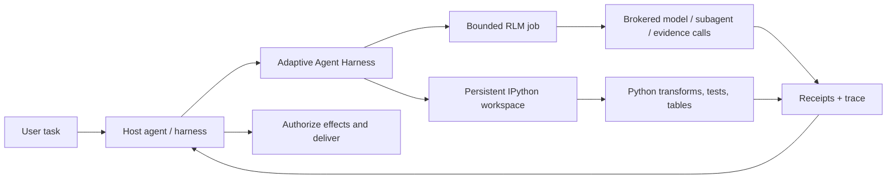

<div align="center">

# Adaptive Agent Harness

### Give agents a workbench — not just a bigger prompt.

**Host-composed RLM + persistent IPython + durable operations + receipt-backed model routing**

[](https://www.python.org/)
[](https://modelcontextprotocol.io/)
[](docs/RELEASE-v0.4.0a6.md)
[](LICENSE)
[](#project-status)

[**Quick start**](#quick-start) · [**Why RLM + IPython?**](#why-rlm--ipython) · [**What you get**](#what-you-get) · [**Architecture**](#architecture) · [**Technical status**](TECHNICAL-STATUS.md)

</div>

[English](README.md) · [**繁中**](docs/i18n/README.zh-TW.md) · [简中](docs/i18n/README.zh-CN.md) · [Español](docs/i18n/README.es.md) · [Português](docs/i18n/README.pt-BR.md) · [Français](docs/i18n/README.fr.md) · [Deutsch](docs/i18n/README.de.md) · [日本語](docs/i18n/README.ja.md) · [한국어](docs/i18n/README.ko.md) · [Русский](docs/i18n/README.ru.md) · [العربية](docs/i18n/README.ar.md) · [Italiano](docs/i18n/README.it.md) · [Tiếng Việt](docs/i18n/README.vi.md) · [ไทย](docs/i18n/README.th.md) · [Čeština](docs/i18n/README.cs.md) · [Suomi](docs/i18n/README.fi.md) · [Norsk](docs/i18n/README.no.md) · [Lietuvių](docs/i18n/README.lt.md)

---

## The 30-second answer

Most agents are asked to solve large problems with one expensive, forgetful interface: the prompt.

**Adaptive Agent Harness gives them a programmable workbench instead.** A host can use two sibling surfaces side by side: persistent IPython workspaces for stateful computation, and bounded RLM jobs for brokered evidence and model calls. Durable receipts and a small MCP surface make both governable and reconnectable.

The current public alpha does **not** execute an RLM job inside an IPython workspace or share state between them automatically. A host must transfer selected evidence, values, or artifacts explicitly.

The result is a practical foundation for agents that need to:

- reason over inputs larger than a single context window;
- turn repeated tool-call chatter into compact Python programs;
- keep variables, tables, helper functions, and evidence alive across steps;
- survive a frontend disconnect without confusing it with cancellation;
- resume only from a certain, receipt-backed boundary;
- leave final authority, credentials, effects, and delivery with the host.

The Python distribution is currently named **`adaptive-agent-runtime`**. This repository is its public project home under the **Adaptive Agent Harness** name.

---

## What is an RLM?

A **Recursive Language Model (RLM)** treats a long prompt or corpus as data in an external environment. Instead of squeezing everything into the model's active context, the model can write programs that:

1. inspect the data;
2. filter, split, join, rank, or summarize it;
3. call a model or subagent on selected slices;
4. combine the returned evidence;
5. repeat within explicit limits.

The important idea is not “infinite recursion.” It is **programmatic inference-time scaling**: spend model calls where they add value, and use ordinary computation everywhere else.

A simple mental model:

```text
Traditional long-context agent
  prompt -> one model call -> more prompt -> another model call

RLM-style agent
  long input -> Python examines it -> selected model/subagent calls
             -> Python combines evidence -> bounded answer + trace
```

The term comes from Zhang, Kraska, and Khattab's [Recursive Language Models](https://arxiv.org/abs/2512.24601) work. Adaptive Agent Harness implements a **bounded, brokered RLM runtime**; it does not claim that every workload needs recursion or that more calls automatically produce a better answer.

---

## Why IPython?

Long-running agents also need somewhere to think **with data**, not merely talk about it. IPython complements the RLM surface by giving the host a separate persistent computational workspace:

- variables stay available across execution steps;
- DataFrames, arrays, parsed documents, and graph results can be inspected directly;
- helper functions can replace repetitive tool-call loops;
- the model can test a hypothesis, inspect the result, and refine the next step;
- compact references can stay in context while full data remains in the workspace;
- selected JSON-like state can be checkpointed without pretending arbitrary live Python objects are portable.

A chat transcript is a record of what was said. **An IPython workspace is a working set of what has been computed.**

That distinction matters for long research, codebase analysis, data investigation, evaluation, and any task where the agent would otherwise keep rereading the same material.

---

## Why RLM × IPython?

Here, “×” means **host composition**, not an in-process RLM/workspace binding. Each sibling surface covers a different failure mode:

| Layer | What it contributes |
|---|---|
| **RLM** | Decides how to decompose a large problem and where bounded model/subagent calls are useful. |
| **IPython** | Executes loops, joins, filters, rankings, tests, and stateful investigation in a live workspace. |
| **Adaptive Agent Harness** | Adds durable operation identity, grants, budgets, receipts, artifacts, recovery policy, and host-neutral MCP access. |
| **Your host agent** | Owns identity, provider credentials, approval, privileged effects, acceptance, and final delivery. |

A host can compose them by passing selected, explicit evidence or artifacts between the surfaces. There is no implicit shared namespace or automatic RLM-to-IPython execution path.



The governing rules are deliberately simple:

> **The host composes the sibling surfaces explicitly; Python is a workspace language, and the host remains the authority boundary.**

---

## What you get

### A programmable agent workbench

- persistent plain-Python and IPython workspaces;
- bounded code execution with generation and revision checks;
- NumPy and pandas available in the default runtime;
- deterministic JSON-subset checkpoints with explicit exclusions;
- artifact-backed handling for larger or non-inline results.

### A brokered RLM engine

- persisted RLM jobs, steps, usage, and terminal results;
- explicit model-request, subagent, artifact, and evidence broker contracts;
- per-operation wall-time, model-call, token, child-operation, and artifact budgets;
- retained handles and receipts instead of “the tool probably ran”;
- reconciliation when a call may have started but no authoritative receipt exists.

### Receipt-backed model routing

- owner-authored, digest-bound route catalogs with no provider credentials in AAR state;
- exact requested-versus-effective provider, model, and reasoning-effort receipts;
- provider-reported token accounting, retry ordinals, and explicit fallback chains;
- an MCP Sampling gateway that keeps the physical provider call and credentials in the host;
- fail-closed route drift and `indeterminate` classification when a sent call loses its receipt;
- a pinned evidence contract for controlled AAR-versus-Prime-style evaluations.

### Durable operations

- stable logical operation IDs separate from attempts, workers, leases, and frontend connections;
- accepted work that can outlive one MCP request;
- cursor-readable events, status, cancel, and reconcile operations;
- a durable supervisor with ephemeral authenticated frontends;
- exact process-start identity rather than PID-only ownership;
- successor attempts that preserve deadline, cancellation, and cumulative usage.

### Portable contracts

- 30 MCP tools on the current v7 surface;
- versioned schemas and digest-bound assets;
- bundled operation guidance for Codex and Hermes profiles;
- deterministic reference brokers for development and conformance testing;
- host-neutral boundaries that do not require AHC, Prime Agent, or NOOA.

### A curated public ChatGPT and Codex plugin

- six OAuth-authenticated, tenant-private structured-workspace tools;
- five caller-delegated RLM tools for start, pre-spend claim, ticket-bound commit, status, and
  cancellation;
- one main-agent-selected model and optional reasoning effort per job, inherited by every call;
- host-owned model execution and credentials—AAR persists the plan, tickets, bounded observations,
  receipts, and continuation state;
- deterministic plugin, scoped skill ZIP, reviewer cases, brand assets, and container profile.

The tagged source includes the public plugin candidate, but GitHub availability is not Plugin
Directory publication. Production HTTPS/OAuth, a reviewer account, OpenAI review and approval, and
the publisher's final publish action remain separate gates. See
[Public plugin and submission boundary](docs/PUBLIC-PLUGIN.md) and
[Caller-delegated RLM design](docs/PUBLIC-RLM-PRODUCT-BOUNDARY.md).

---

## Where it shines

Adaptive Agent Harness is a strong fit for:

- **long-document research** — search, slice, compare, and recursively synthesize evidence;
- **codebase investigation** — retain symbol sets, call paths, test evidence, and candidate changes;
- **data analysis** — move between natural-language questions and DataFrame operations;
- **evaluation pipelines** — keep inputs, scores, receipts, and artifacts bound to one operation;
- **agent infrastructure experiments** — test durable execution and recovery without building a second user-facing agent OS;
- **controlled worker integration** — place richer workers behind explicit budgets, handles, and host acceptance.

It is intentionally narrower than a full autonomous coding agent. That is useful when you already have an orchestrator and need a dependable computation and evidence plane underneath it.

---

## How this relates to other RLM projects

We learned from public work without pretending the projects are interchangeable:

- **[Prime Agent](https://github.com/PrimeIntellect-ai/prime-agent)** demonstrates the product value of a persistent IPython environment, programmatic tool use, native child agents, and daemon-backed continuity. Prime is a fuller coding/research agent experience. Adaptive Agent Harness is the narrower runtime/control layer and can complement a worker like Prime rather than replace it.
- **[NVIDIA Object Oriented Agents (NOOA)](https://github.com/NVIDIA-NeMo/labs-OO-Agents)** demonstrates a Python-native, typed object model for agent capabilities and CodeAct-style orchestration. NOOA is design input only here: there is no bundled NOOA adapter or dependency.
- **[Recursive Language Models](https://arxiv.org/abs/2512.24601)** supplies the core inference paradigm: treat long context as an external environment that the model can programmatically inspect and recursively query.

See [Why RLM + IPython](docs/WHY-RLM-AND-IPYTHON.md) for the deeper design rationale and source notes.

---

## Quick start

> **Release snapshot:** `0.4.0a6` is pinned by `v0.4.0a6`. Use that pinned source, inspect the
> capabilities returned by your host, and start with disposable workspaces. This project executes
> model-authored Python and is **not a security sandbox**.

### Install the pinned release

```bash
uv tool install --force \
  "git+https://github.com/phenomenoner/adaptive-agent-harness.git@v0.4.0a6"
```

### Codex App setup

```bash
aar-codex-setup
```

Restart Codex App when the setup receipt reports `restart_required: true`. If setup instead returns
a manual plan, apply it through the owning Codex interface and preserve the receipt with
`restart_required_after_manual_apply: true`; a later no-op receipt with `restart_required: false`
does not clear that restart obligation. In a fresh task, load the exact deferred capability tool if
necessary and then call `aar_capabilities`; search or catalog visibility alone is not runtime proof.

### Develop from source

```bash
git clone https://github.com/phenomenoner/adaptive-agent-harness.git
cd adaptive-agent-harness
uv sync --locked
uv run aar-contract verify
uv run pytest -q
```

### Start with the MCP workflow

1. Call `aar_capabilities` and bind to the returned runtime generation and capability digest.
2. Create or attach a workspace, or submit a bounded `rlm.execute` operation.
3. Keep the returned operation handle.
4. Read status/events from a fresh authorized connection when needed.
5. Reconcile uncertainty before retrying any effect-shaped work.

Detailed install and host notes:

- [Codex installation](docs/CODEX-INSTALL.md)
- [Host compatibility](HOST-COMPATIBILITY.md)
- [Architecture](ARCHITECTURE.md)
- [Operation skill](skills/aar-operations/SKILL.md)
- [Technical verification status](TECHNICAL-STATUS.md)
- [Model routing and fair evaluation](docs/MODEL-ROUTING-AND-EVALUATION.md)
- [Public plugin and submission boundary](docs/PUBLIC-PLUGIN.md)
- [Caller-delegated RLM design](docs/PUBLIC-RLM-PRODUCT-BOUNDARY.md)

---

## Architecture

Adaptive Agent Harness follows a small-waist design:

```text
Host / orchestrator
  ├─ owns identity, provider credentials, approvals, effects, delivery
  └─ connects through MCP or a native adapter
          |
          v
Adaptive Agent Harness
  ├─ operation registry + event log + receipts
  ├─ bounded RLM engine + durable model broker journal
  ├─ route catalog + owner gateway + route/usage receipts
  ├─ programmable workspace manager
  ├─ durable supervisor + exact worker identity
  ├─ checkpoints, artifacts, assets, export/import
  └─ capability, grant, budget, deadline, and generation fencing
          |
          v
Plain Python / IPython workers and host-authorized brokers
```

The MCP frontend is intentionally replaceable. It does not own the continuity database or the worker lifecycle; the durable supervisor does.

---

## Project status

The current source implements the **`0.4.0a6`** release snapshot. Its stable source reference is
`phenomenoner/adaptive-agent-harness@v0.4.0a6`, with the corresponding
[GitHub release page](https://github.com/phenomenoner/adaptive-agent-harness/releases/tag/v0.4.0a6).
The in-tree machine-readable snapshot is
[`profiles/release-status-v1.json`](profiles/release-status-v1.json). Exact commit, tree, wheel,
supported-Python CI, local install, fresh native/RLM, review, tag, and downloaded-asset evidence is
bound outside the objects it hashes by the release asset
`adaptive-agent-runtime-v0.4.0a6-release-receipt.json`. The preceding `0.4.0a5` candidate is
**blocked, unreleased, and historical**; it is not the current release.

This release preserves the host-owned RLM boundary: the main agent fixes one callable model and
optional effort per job, the host performs each actual model call, and AAR stores bounded tickets,
receipts, and continuation state without provider credentials. The lifecycle repair uses an exact
native child handle for terminalization, generation-unique endpoint/credential/request paths, and an
atomically advanced stable discovery pointer with **non-destructive** normal retention. The existing
database-scoped process lock admits the sole
active runtime owner and is released automatically when that process exits. The subprocess
Codex setup route reports
`NO_ATOMIC_AUTHORITY`, returns an ordered manual plan before any mutation, and does not claim
automatic installation or rollback.

After `aar-codex-setup`, restart Codex Desktop and verify from a fresh task when the current receipt
reports `restart_required: true` or a preserved manual-plan receipt reports
`restart_required_after_manual_apply: true`. A later no-op result with `restart_required: false`
does not erase that handoff.

This GitHub release snapshot does not establish production deployment, official Plugin Directory
review/publication, OpenAI approval, or provider-signed attestation; those require separate external
authority. Read [Technical status](TECHNICAL-STATUS.md),
[Host compatibility](HOST-COMPATIBILITY.md), and the
[release notes](docs/RELEASE-v0.4.0a6.md) before making production claims.

---

## What this project does **not** do

- It is **not** a security sandbox.
- It does **not** hold your provider credentials by design.
- It does **not** execute arbitrary external effects or deliver user messages on its own.
- It does **not** promise universal exactly-once semantics.
- It does **not** resurrect arbitrary Python stacks, sockets, generators, or native process memory.
- It does **not** make Prime Agent, NOOA, CodeGraph, Hermes, Codex, or AHC a runtime dependency.

The authority statement is:

> **Adaptive Agent Harness computes and proposes. The host authorizes and delivers.**

---

## Contributing

Issues, focused pull requests, compatibility reports, and reproducible failure fixtures are welcome. Please read [CONTRIBUTING.md](CONTRIBUTING.md) and [SECURITY.md](SECURITY.md) first.

Useful contribution areas:

- additional host profiles and black-box compatibility rows;
- checkpoint eligibility and exclusion ergonomics;
- broker/effect reconciliation adapters;
- bounded RLM strategies and evidence-heavy benchmarks;
- worker backends and artifact stores;
- documentation and translation corrections.

---

## License

[MIT](LICENSE) © 2026 phenomenoner.

---

## References

- Alex L. Zhang, Tim Kraska, and Omar Khattab, [Recursive Language Models](https://arxiv.org/abs/2512.24601), arXiv:2512.24601.
- [Prime Agent](https://github.com/PrimeIntellect-ai/prime-agent), Prime Intellect.
- [NVIDIA Object Oriented Agents](https://github.com/NVIDIA-NeMo/labs-OO-Agents), NVIDIA-NeMo.
- [Model Context Protocol](https://modelcontextprotocol.io/).
