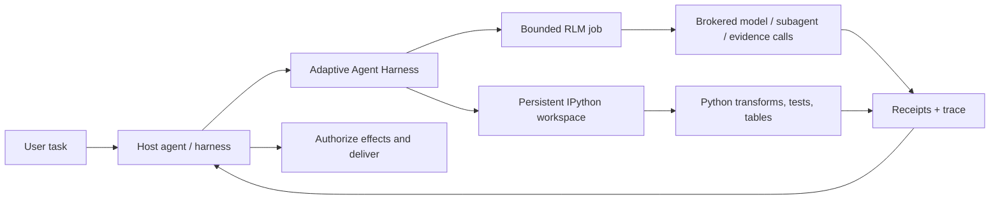

<div align="center">

> **`0.6.0a2` release-contract target** · target tag `v0.6.0a2` · source text does not establish publication; read the canonical English [release notes](../RELEASE-v0.6.0a2.md) before using the tag.

# Adaptive Agent Harness

### امنح الوكلاء بيئة عمل — لا مجرد مطالبة أكبر.

**RLM يؤلّفه المضيف + IPython مستمر + عمليات دائمة + سلطة يملكها المضيف**

[](https://www.python.org/)
[](https://modelcontextprotocol.io/)
[](../RELEASE-v0.6.0a2.md)
[](../../LICENSE)
[](#حالة-المشروع)

[**البدء السريع**](#البدء-السريع) · [**لماذا RLM + IPython؟**](#لماذا-rlm--ipython) · [**ما الذي تحصل عليه**](#ما-الذي-تحصل-عليه) · [**البنية**](#البنية) · [**الحالة التقنية**](../../TECHNICAL-STATUS.md)

</div>

[English](../../README.md) · [**繁中**](README.zh-TW.md) · [简中](README.zh-CN.md) · [Español](README.es.md) · [Português](README.pt-BR.md) · [Français](README.fr.md) · [Deutsch](README.de.md) · [日本語](README.ja.md) · [한국어](README.ko.md) · [Русский](README.ru.md) · [العربية](README.ar.md) · [Italiano](README.it.md) · [Tiếng Việt](README.vi.md) · [ไทย](README.th.md) · [Čeština](README.cs.md) · [Suomi](README.fi.md) · [Norsk](README.no.md) · [Lietuvių](README.lt.md)

---

## الخلاصة في 30 ثانية

يُطلب من معظم الوكلاء حل مشكلات كبيرة عبر واجهة واحدة مكلفة وسريعة النسيان: المطالبة.

**يمنحهم Adaptive Agent Harness بيئة عمل قابلة للبرمجة بدلًا من ذلك.** يستطيع المضيف استخدام سطحين شقيقين جنبًا إلى جنب: مساحات عمل IPython المستمرة للحوسبة ذات الحالة، ووظائف RLM المحدودة للأدلة واستدعاءات النموذج عبر وسيط. وتجعل الإيصالات الدائمة وواجهة MCP الصغيرة كلا السطحين قابلين للحوكمة وإعادة الاتصال.

ولا ينفّذ الإصدار العام الحالي من الألفا **وظيفة RLM داخل مساحة عمل IPython ولا يشارك الحالة بينهما تلقائيًا**. ويجب على المضيف نقل الأدلة أو القيم أو artifacts المختارة صراحةً.

والنتيجة أساس عملي للوكلاء الذين يحتاجون إلى:

- الاستدلال على مدخلات أكبر من نافذة سياق واحدة؛
- تحويل الثرثرة المتكررة في استدعاءات الأدوات إلى برامج Python موجزة؛
- إبقاء المتغيرات والجداول والدوال المساعدة والأدلة حية عبر الخطوات؛
- تجاوز انقطاع الواجهة الأمامية دون الخلط بينه وبين الإلغاء؛
- الاستئناف فقط من حد مؤكد ومدعوم بإيصال؛
- ترك السلطة النهائية وبيانات الاعتماد والتأثيرات والتسليم للمضيف.

تُسمّى توزيعة Python حاليًا **`adaptive-agent-runtime`**. وهذا المستودع هو موطنها العام للمشروع تحت اسم **Adaptive Agent Harness**.

---

## ما هو RLM؟

يتعامل **نموذج اللغة التكراري (Recursive Language Model، أو RLM)** مع المطالبة الطويلة أو مجموعة النصوص بوصفها بيانات في بيئة خارجية. وبدلًا من حشر كل شيء في سياق النموذج النشط، يستطيع النموذج كتابة برامج من أجل:

1. فحص البيانات؛
2. ترشيحها أو تقسيمها أو ضمّها أو ترتيبها أو تلخيصها؛
3. استدعاء نموذج أو وكيل فرعي على شرائح مختارة؛
4. دمج الأدلة التي أُعيدت؛
5. التكرار ضمن حدود صريحة.

الفكرة المهمة ليست «التكرار اللانهائي»، بل **التوسّع البرمجي أثناء الاستدلال**: إنفاق استدعاءات النموذج حيث تضيف قيمة، واستخدام الحساب العادي في كل موضع آخر.

نموذج ذهني بسيط:

```text
Traditional long-context agent
  prompt -> one model call -> more prompt -> another model call

RLM-style agent
  long input -> Python examines it -> selected model/subagent calls
             -> Python combines evidence -> bounded answer + trace
```

يأتي المصطلح من عمل Zhang وKraska وKhattab المعنون [Recursive Language Models](https://arxiv.org/abs/2512.24601). وينفّذ Adaptive Agent Harness **بيئة تشغيل RLM محدودة وتعمل عبر وسيط**؛ ولا يدّعي أن كل حمل عمل يحتاج إلى التكرار، أو أن زيادة عدد الاستدعاءات تنتج تلقائيًا إجابة أفضل.

---

## لماذا IPython؟

يحتاج الوكلاء الذين يعملون لفترات طويلة أيضًا إلى مكان للتفكير **بالبيانات**، لا لمجرد الحديث عنها. ويكمّل IPython سطح RLM عبر منح المضيف مساحة عمل حسابية مستمرة ومنفصلة:

- تظل المتغيرات متاحة عبر خطوات التنفيذ؛
- يمكن فحص DataFrames والمصفوفات والمستندات المحللة ونتائج الرسوم البيانية مباشرةً؛
- يمكن للدوال المساعدة أن تحل محل حلقات استدعاءات الأدوات المتكررة؛
- يستطيع النموذج اختبار فرضية، وفحص النتيجة، وتحسين الخطوة التالية؛
- يمكن أن تبقى المراجع الموجزة في السياق بينما تظل البيانات الكاملة في مساحة العمل؛
- يمكن وضع الحالة الشبيهة بـ JSON والمختارة في نقاط تحقق، من دون التظاهر بأن كائنات Python الحية، كيفما كانت، قابلة للنقل.

سجل المحادثة هو سجل لما قيل. **أما مساحة عمل IPython فهي مجموعة العمل لما حُسب.**

وهذا الفرق مهم في البحوث الطويلة، وتحليل قواعد الكود، واستقصاء البيانات، والتقييم، وأي مهمة كان الوكيل سيضطر فيها إلى إعادة قراءة المادة نفسها باستمرار.

---

## لماذا RLM × IPython؟

هنا، تعني «×» **تأليف المضيف**، وليس ربطًا بين RLM ومساحة العمل داخل العملية نفسها. ويغطي كل سطح شقيق نمطًا مختلفًا من أنماط الفشل:

| الطبقة | ما الذي تضيفه |
|---|---|
| **RLM** | يقرر كيفية تفكيك مشكلة كبيرة وأين تكون استدعاءات النموذج أو الوكيل الفرعي المحدودة مفيدة. |
| **IPython** | ينفّذ الحلقات وعمليات الضم والترشيح والترتيب والاختبار والتحقيق ذي الحالة في مساحة عمل حية. |
| **Adaptive Agent Harness** | يضيف هوية عمليات دائمة، ومنحًا، وميزانيات، وإيصالات، وartifacts، وسياسة استرداد، ووصول MCP محايدًا للمضيف. |
| **وكيل المضيف** | يملك الهوية وبيانات اعتماد المزوّد والموافقة والتأثيرات المميّزة والقبول والتسليم النهائي. |

يؤلّف المضيف هذين السطحين عبر نقل الأدلة أو القيم أو artifacts المختارة صراحةً بينهما. ولا توجد مساحة أسماء مشتركة ضمنية، ولا مسار تنفيذ تلقائي من RLM إلى IPython.



القواعد الحاكمة بسيطة عمدًا:

> **يؤلّف المضيف السطحين الشقيقين صراحةً؛ وPython هي لغة مساحة العمل، ويظل المضيف حدّ السلطة.**

---

## ما الذي تحصل عليه

### بيئة عمل قابلة للبرمجة للوكلاء

- مساحات عمل `plain-Python` وIPython مستمرة؛
- تنفيذ كود محدود مع فحوصات الجيل والمراجعة؛
- إتاحة NumPy وpandas في بيئة التشغيل الافتراضية؛
- نقاط تحقق حتمية من مجموعة JSON الفرعية، مع استبعادات صريحة؛
- معالجة أكبر أو غير مضمنة مباشرة ومدعومة بـ artifacts.

### محرّك RLM يعمل عبر وسيط

- وظائف RLM وخطواتها واستخدامها ونتائجها النهائية محفوظة؛
- عقود وسيط صريحة لـ `model-request` و`subagent` و`artifact` و`evidence`؛
- ميزانيات لكل عملية للوقت الجداري واستدعاءات النموذج والرموز والعمليات الفرعية وartifacts؛
- مقابض وإيصالات محتفظ بها بدلًا من «ربما نفّذت الأداة»؛
- تسوية عندما يكون من الممكن أن يكون الاستدعاء قد بدأ، لكن لا يوجد إيصال موثوق به من الجهة المالكة.

### عمليات دائمة

- معرّفات عمليات منطقية مستقرة منفصلة عن المحاولات والعاملين وعقود الإيجار واتصالات الواجهة الأمامية؛
- عمل مقبول يمكنه البقاء بعد انتهاء طلب MCP واحد؛
- أحداث قابلة للقراءة عبر مؤشرات، وعمليات حالة وإلغاء وتسوية؛
- مشرف دائم مع واجهات أمامية مؤقتة ومصادَق عليها؛
- هوية دقيقة عند بدء العملية بدل ملكية تعتمد على PID وحده؛
- محاولات لاحقة تحافظ على الموعد النهائي والإلغاء والاستخدام التراكمي.

### عقود قابلة للنقل

- 38 أداة MCP على سطح v8 الحالي؛
- مخططات ذات إصدارات وassets مرتبطة ببصمات digest؛
- إرشادات عمليات مضمنة لملفات تعريف Codex وHermes؛
- وسطاء مرجعيون حتميون للتطوير واختبار المطابقة؛
- حدود محايدة للمضيف لا تتطلب AHC أو Prime Agent أو NOOA.

---

## أين يتألق

يناسب Adaptive Agent Harness بقوة ما يلي:

- **البحث في المستندات الطويلة** — البحث عن الأدلة، وتقطيعها، ومقارنتها، وتركيبها تكراريًا؛
- **استقصاء قواعد الكود** — الاحتفاظ بمجموعات الرموز ومسارات الاستدعاء وأدلة الاختبار والتغييرات المرشحة؛
- **تحليل البيانات** — الانتقال بين الأسئلة باللغة الطبيعية وعمليات DataFrame؛
- **خطوط التقييم** — إبقاء المدخلات والدرجات والإيصالات وartifacts مرتبطة بعملية واحدة؛
- **تجارب البنية التحتية للوكلاء** — اختبار التنفيذ الدائم والاسترداد دون بناء نظام تشغيل ثانٍ لوكيل موجّه للمستخدم؛
- **تكامل العمال المنضبط** — وضع العمال الأغنى خلف ميزانيات ومقابض وقبول صريح من المضيف.

وهو أضيق عمدًا من وكيل برمجة مستقل بالكامل. وتفيد هذه الخاصية عندما يكون لديك منسّق بالفعل وتحتاج إلى طبقة موثوقة للحساب والأدلة تحته.

---

## ما علاقته بمشروعات RLM الأخرى

لقد استفدنا من العمل العام دون الادعاء بأن المشروعات قابلة للتبادل:

- يوضح **[Prime Agent](https://github.com/PrimeIntellect-ai/prime-agent)** قيمة المنتج في بيئة IPython مستمرة، واستخدام الأدوات برمجيًا، والوكلاء الفرعيين الأصليين، والاستمرارية المدعومة بخادم daemon. وPrime تجربة أكمل لوكيل البرمجة والبحث. أما Adaptive Agent Harness فهو طبقة وقت تشغيل/تحكم أضيق، ويمكنه التكامل مع عامل مثل Prime بدلًا من استبداله.
- يوضح **[NVIDIA Object Oriented Agents (NOOA)](https://github.com/NVIDIA-NeMo/labs-OO-Agents)** نموذج كائنات مكتوب الأنواع ومبنيًا أصلاً في Python لقدرات الوكيل، إلى جانب التنسيق بأسلوب CodeAct. وNOOA هنا مجرد مدخل تصميمي: لا يوجد محوّل NOOA أو تبعية NOOA مضمنة.
- توفر **[Recursive Language Models](https://arxiv.org/abs/2512.24601)** نموذج الاستدلال الأساسي: التعامل مع السياق الطويل بوصفه بيئة خارجية يستطيع النموذج فحصها واستعلامها تكراريًا وبطريقة برمجية.

راجع [لماذا RLM + IPython](../../docs/WHY-RLM-AND-IPYTHON.md) للاطلاع على مبررات التصميم الأعمق وملاحظات المصادر.

---

## البدء السريع

> **ألفا عامة:** استخدم وسمًا مثبتًا، وافحص القدرات التي يعيدها مضيفك، وابدأ بمساحات عمل مؤقتة. ينفّذ هذا المشروع كود Python الذي يؤلّفه النموذج، وهو **ليس صندوق حماية أمنيًا**.

### التثبيت من أحدث وسم عام

```bash
# Use only after external GitHub readback confirms the target tag exists.
uv tool install --force \
  "git+https://github.com/phenomenoner/adaptive-agent-harness.git@v0.6.0a2"
```

### إعداد Codex App

```bash
aar-codex-setup
```

أعد تشغيل Codex Desktop إذا أشار إيصال الإعداد إلى `restart_required: true`، واحتفظ بإيصال إعادة التشغيل اليدوي `restart_required_after_manual_apply: true` بعد التطبيق؛ ولا يمكن لإيصال لاحق بلا تغيير يحتوي على `restart_required: false` أن يلغي التزام إعادة التشغيل. ثم استدعِ `aar_capabilities` في مهمة جديدة.

### التطوير من المصدر

```bash
git clone https://github.com/phenomenoner/adaptive-agent-harness.git
cd adaptive-agent-harness
uv sync --locked
uv run aar-contract verify
uv run pytest -q
```

### البدء بسير عمل MCP

1. استدعِ `aar_capabilities` واربط التنفيذ بالجيل وببصمة capability digest اللذين أعادهما.
2. أنشئ مساحة عمل أو أرفقها، أو أرسل عملية `rlm.execute` محدودة.
3. احتفظ بمقبض العملية الذي أُعيد.
4. اقرأ الحالة/الأحداث من اتصال جديد ومخوّل عند الحاجة.
5. سوِّ حالة عدم اليقين قبل إعادة محاولة أي عمل على شكل تأثير.

ملاحظات التثبيت والمضيف التفصيلية:

- [تثبيت Codex](../../docs/CODEX-INSTALL.md)
- [توافق المضيف](../../HOST-COMPATIBILITY.md)
- [البنية](../../ARCHITECTURE.md)
- [مهارة العمليات](../../skills/aar-operations/SKILL.md)
- [حالة التحقق التقنية](../../TECHNICAL-STATUS.md)

---

## البنية

يتبع Adaptive Agent Harness تصميمًا ذا خصر صغير:

```text
Host / orchestrator
  ├─ owns identity, provider credentials, approvals, effects, delivery
  └─ connects through MCP or a native adapter
          |
          v
Adaptive Agent Harness
  ├─ operation registry + event log + receipts
  ├─ bounded RLM engine + broker journal
  ├─ programmable workspace manager
  ├─ durable supervisor + exact worker identity
  ├─ checkpoints, artifacts, assets, export/import
  └─ capability, grant, budget, deadline, and generation fencing
          |
          v
Plain Python / IPython workers and host-authorized brokers
```

واجهة MCP الأمامية قابلة للاستبدال عمدًا. فهي لا تملك قاعدة بيانات الاستمرارية أو دورة حياة العامل؛ بل يملكهما المشرف الدائم.

---

## حالة المشروع

الإصدار العام الحالي من الألفا: **`0.6.0a2`**.

> **Translation status:** the overview below retains the `v0.3.0a1` public baseline as historical
> context. For `v0.6.0a2` receipt-backed model routing, current verification, and exact publication
> boundaries, read the canonical English [release notes](../RELEASE-v0.6.0a2.md) and
> [model-routing guide](../MODEL-ROUTING-AND-EVALUATION.md).


`v0.6.0a2` release-contract evidence represented by this source:

- تغطية Python من 3.11 إلى 3.14؛
- 38-tool MCP v8 executable surface (frozen 30-tool MCP v7 prefix + exact 8-tool successor suffix);
- مخطط SQLite تزايدي حتى v5؛
- current full-repository verification is recorded in the canonical English release note and external release receipt;
- فحص exact-wheel نظيف للمشرف والواجهة الأمامية على Linux/WSL؛
- سيناريوهات المشرف الدائم، واستبدال الواجهة الأمامية، وفقدان العملية، والكاتب القديم، وإعادة استخدام الإيصال، وسيناريوهات محاولات RLM اللاحقة المقيّدة بالسياسة؛

وتبقى صفوف التوافق الأقدم الخاصة بـ Windows الأصلي وHermes المثبتة محفوظة بوصفها **سياقًا تاريخيًا أبلغ عنه المشرفون**. ولا تُضمَّن إيصالات المضيف الداعمة لها في هذا المستودع العام، ولذلك لا يمكن تدقيق تلك الصفوف بصورة مستقلة من هذه الشجرة، كما أنها ليست معايير إصدار لمرشح المصدر العام.

ما يزال مفتوحًا:

- الاستعادة التلقائية القابلة للنقل لحالة أوسع من مساحة عمل IPython إلى جيل جديد؛
- محوّلات التسوية العامة للتأثيرات الخارجية؛
- العزل الأمني متعدد المستأجرين؛
- التأثيرات العامة ذات التنفيذ مرة واحدة تمامًا؛
- نشر سجل الحزم وضمانات واجهة API مستقرة.

اقرأ [TECHNICAL-STATUS.md](../../TECHNICAL-STATUS.md) و[HOST-COMPATIBILITY.md](../../HOST-COMPATIBILITY.md) و قبل إطلاق ادعاءات الإنتاج.

---

## ما لا يفعله هذا المشروع

- **ليس صندوق حماية أمنيًا.**
- **لا يحتفظ ببيانات اعتماد المزوّد، حسب التصميم.**
- **لا ينفّذ تأثيرات خارجية اعتباطية أو يسلّم رسائل المستخدمين من تلقاء نفسه.**
- **لا يَعِد بدلالات عامة للتنفيذ مرة واحدة تمامًا.**
- **لا يعيد إحياء مكدسات Python أو المقابس أو المولّدات أو ذاكرة العمليات الأصلية، كيفما كانت.**
- **لا يجعل Prime Agent أو NOOA أو CodeGraph أو Hermes أو Codex أو AHC تبعية لوقت التشغيل.**

بيان السلطة هو:

> **يحسب Adaptive Agent Harness ويقترح. أما المضيف فيخوّل ويسلّم.**

---

## المساهمة

نرحب بالمشكلات وطلبات السحب المركّزة وتقارير التوافق وتجهيزات الفشل القابلة لإعادة الإنتاج. يُرجى قراءة [CONTRIBUTING.md](../../CONTRIBUTING.md) و[SECURITY.md](../../SECURITY.md) أولًا.

مجالات مساهمة مفيدة:

- ملفات تعريف مضيف إضافية وصفوف توافق للصندوق الأسود؛
- أهلية نقاط التحقق وسهولة التعامل مع الاستبعادات؛
- محوّلات تسوية الوسيط/التأثير؛
- استراتيجيات RLM محدودة واختبارات معيارية كثيفة الأدلة؛
- خلفيات العمال ومخازن artifacts؛
- تصحيحات التوثيق والترجمة.

---

## الترخيص

[MIT](../../LICENSE) © 2026 phenomenoner.

---

## المراجع

- Alex L. Zhang وTim Kraska وOmar Khattab، [Recursive Language Models](https://arxiv.org/abs/2512.24601)، arXiv:2512.24601.
- [Prime Agent](https://github.com/PrimeIntellect-ai/prime-agent)، Prime Intellect.
- [NVIDIA Object Oriented Agents](https://github.com/NVIDIA-NeMo/labs-OO-Agents)، NVIDIA-NeMo.
- [Model Context Protocol](https://modelcontextprotocol.io/).
