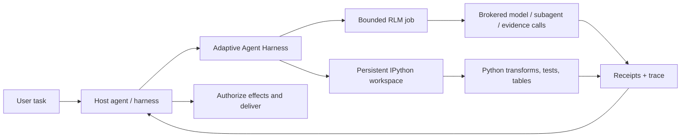

<div align="center">

# Adaptive Agent Harness

### Dejte agentům pracovní stůl — ne jen větší prompt.

**Hostitelem sestavené RLM + persistentní IPython + trvalé operace + autorita hostitele**

[](https://www.python.org/)
[](https://modelcontextprotocol.io/)
[](https://github.com/phenomenoner/adaptive-agent-harness/releases/tag/v0.4.0a5)
[](../../LICENSE)
[](#stav-projektu)

[**Rychlý start**](#rychlý-start) · [**Proč RLM + IPython?**](#proč-rlm--ipython) · [**Co získáte**](#co-získáte) · [**Architektura**](#architektura) · [**Technický stav**](../../TECHNICAL-STATUS.md)

</div>

[English](../../README.md) · [**繁中**](README.zh-TW.md) · [简中](README.zh-CN.md) · [Español](README.es.md) · [Português](README.pt-BR.md) · [Français](README.fr.md) · [Deutsch](README.de.md) · [日本語](README.ja.md) · [한국어](README.ko.md) · [Русский](README.ru.md) · [العربية](README.ar.md) · [Italiano](README.it.md) · [Tiếng Việt](README.vi.md) · [ไทย](README.th.md) · [Čeština](README.cs.md) · [Suomi](README.fi.md) · [Norsk](README.no.md) · [Lietuvių](README.lt.md)

---

## Odpověď do 30 sekund

Většina agentů má řešit velké problémy prostřednictvím jediného drahého rozhraní, které zapomíná: promptu.

**Adaptive Agent Harness jim místo toho poskytuje programovatelný pracovní stůl.** Hostitel může vedle sebe používat dvě jím sestavené sibling surfaces: persistentní pracovní prostory IPython pro stavové výpočty a omezené úlohy RLM pro zprostředkované důkazy a volání modelu. Trvalá potvrzení a malé rozhraní MCP umožňují obě plochy řídit a znovu k nim připojit práci.

Aktuální veřejná alfa **nespouští úlohu RLM uvnitř pracovního prostoru IPython a nesdílí mezi nimi stav automaticky.** Hostitel musí explicitně přenášet vybrané důkazy, hodnoty nebo artefakty.

Výsledkem je praktický základ pro agenty, kteří potřebují:

- uvažovat nad vstupy většími než jedno kontextové okno;
- převádět opakované šumění kolem volání nástrojů na kompaktní programy v Pythonu;
- udržovat proměnné, tabulky, pomocné funkce a důkazy dostupné napříč kroky;
- přežít odpojení frontendu, aniž by je zaměnili za zrušení;
- pokračovat pouze od jisté hranice podložené potvrzením;
- ponechat konečnou autoritu, přihlašovací údaje, efekty a doručení hostiteli.

Distribuce Pythonu se v současnosti jmenuje **`adaptive-agent-runtime`**. Toto úložiště je jejím veřejným domovem projektu pod názvem **Adaptive Agent Harness**.

---

## Co je RLM?

**Recursive Language Model (RLM)** zachází s dlouhým promptem nebo korpusem jako s daty v externím prostředí. Místo toho, aby vše vtěsnalo do aktivního kontextu modelu, může model psát programy, které:

1. prohlédnou data;
2. filtrují je, rozdělují, spojují, řadí nebo shrnují;
3. zavolají model nebo subagenta nad vybranými výseky;
4. zkombinují vrácené důkazy;
5. opakují tento postup v rámci výslovných limitů.

Důležitá myšlenka není „nekonečná rekurze“. Jde o **programové škálování v čase inference**: modelová volání používat tam, kde přinášejí hodnotu, a všude jinde použít běžný výpočet.

Tento pojem pochází z práce [Recursive Language Models](https://arxiv.org/abs/2512.24601) autorů Zhanga, Krasky a Khattaba. Adaptive Agent Harness implementuje **omezený, zprostředkovaný běh RLM**; netvrdí, že každá úloha potřebuje rekurzi nebo že více volání automaticky vytvoří lepší odpověď.

Jednoduchý mentální model:

```text
Traditional long-context agent
  prompt -> one model call -> more prompt -> another model call

RLM-style agent
  long input -> Python examines it -> selected model/subagent calls
             -> Python combines evidence -> bounded answer + trace
```

---

## Proč IPython?

Dlouho běžící agenti také potřebují místo, kde mohou přemýšlet **s daty**, nejen o nich mluvit. IPython doplňuje povrch RLM tím, že hostiteli poskytuje samostatný persistentní výpočetní pracovní prostor:

- proměnné zůstávají dostupné napříč kroky provádění;
- DataFrames, pole, parsované dokumenty a výsledky grafů lze přímo prohlížet;
- pomocné funkce mohou nahradit opakující se smyčky volání nástrojů;
- model může otestovat hypotézu, prohlédnout výsledek a zpřesnit další krok;
- kompaktní reference mohou zůstat v kontextu, zatímco úplná data zůstávají v pracovním prostoru;
- vybraný stav podobný JSONu lze uložit do checkpointu, aniž by se předstíralo, že libovolné živé objekty Pythonu jsou přenositelné.

Přepis chatu je záznamem toho, co bylo řečeno. **Pracovní prostor IPython je pracovní sadou toho, co bylo vypočteno.**

Toto rozlišení je důležité pro dlouhý výzkum, analýzu kódové základny, zkoumání dat, evaluace i jakoukoli úlohu, při níž by agent jinak stále znovu načítal stejný materiál.

---

## Proč RLM × IPython?

Zde „ד znamená **host composition**, nikoli vazbu RLM/pracovního prostoru v rámci jednoho procesu. Každá sibling surface pokrývá jiný režim selhání:

| Vrstva | Co přináší |
|---|---|
| **RLM** | Rozhoduje, jak rozložit velký problém a kde jsou užitečná omezená volání modelu či subagenta. |
| **IPython** | V živém pracovním prostoru provádí smyčky, spojování, filtry, řazení, testy a průzkum se zachováním stavu. |
| **Adaptive Agent Harness** | Přidává trvalou identitu operací, granty, rozpočty, potvrzení, artefakty, zásady obnovy a přístup k MCP nezávislý na hostiteli. |
| **Váš hostitelský agent** | Vlastní identitu, přihlašovací údaje poskytovatele, schválení, privilegované efekty, akceptaci a konečné doručení. |

Hostitel je může skládat tak, že mezi plochami předává vybrané, explicitně určené důkazy, hodnoty nebo artefakty. Neexistuje implicitní sdílený jmenný prostor ani automatická cesta spuštění z RLM do IPythonu.



Řídicí pravidla jsou záměrně jednoduchá:

> **Hostitel explicitně skládá sibling surfaces; Python je jazykem pracovního prostoru a hostitel zůstává hranicí autority.**

---

## Co získáte

### Programovatelný pracovní stůl pro agenty

- trvalé pracovní prostory plain-Python a IPython;
- omezené provádění kódu s kontrolami generace a revize;
- NumPy a pandas dostupné ve výchozím běhovém prostředí;
- deterministické checkpointy podmnožiny JSON s explicitními výjimkami;
- zpracování větších nebo neinline výsledků založené na artefaktech.

### Zprostředkovaný engine RLM

- trvale uložené úlohy RLM, kroky, využití a koncové výsledky;
- explicitní brokerové kontrakty pro požadavky modelu, subagenty, artefakty a důkazy;
- rozpočty času, volání modelu, tokenů, podřízených operací a artefaktů pro každou operaci;
- uchované handly a potvrzení místo „nástroj se nejspíš spustil“;
- rekonciliace v případě, že volání mohlo začít, ale neexistuje autoritativní potvrzení.

### Trvalé operace

- stabilní logická ID operací oddělená od pokusů, workerů, lease a frontendových připojení;
- přijatá práce, která může přežít jednu MCP žádost;
- události čitelné pomocí kurzoru a operace pro stav, zrušení a rekonciliaci;
- trvalý supervisor s pomíjivými autentizovanými frontendy;
- přesná identita při spuštění procesu namísto vlastnictví založeného pouze na PID;
- následné pokusy, které zachovávají deadline, zrušení a kumulativní využití.

### Přenositelné kontrakty

- 30 nástrojů MCP v aktuálním rozhraní v7;
- verzovaná schémata a assety vázané na digest;
- přibalené pokyny k operacím pro profily Codex a Hermes;
- deterministické referenční brokery pro vývoj a testování shody;
- hranice nezávislé na hostiteli, které nevyžadují AHC, Prime Agent ani NOOA.

---

## Kde vyniká

Adaptive Agent Harness se dobře hodí pro:

- **výzkum dlouhých dokumentů** — vyhledávat, vyřezávat, porovnávat a rekurzivně syntetizovat důkazy;
- **zkoumání kódové základny** — uchovávat množiny symbolů, volací cesty, důkazy z testů a kandidátní změny;
- **analýzu dat** — přecházet mezi otázkami v přirozeném jazyce a operacemi DataFrame;
- **evaluační pipeline** — svázat vstupy, skóre, potvrzení a artefakty s jedinou operací;
- **experimenty s agentní infrastrukturou** — testovat trvalé provádění a obnovu bez budování druhého uživatelsky zaměřeného operačního systému pro agenty;
- **řízenou integraci workerů** — umístit bohatší workery za explicitní rozpočty, handly a akceptaci hostitelem.

Záměrně je užší než plně autonomní codingový agent. To je užitečné, pokud již máte orchestrátor a pod ním potřebujete spolehlivou výpočetní a důkazní vrstvu.

---

## Jak souvisí s dalšími projekty RLM

Učili jsme se z veřejné práce, aniž bychom předstírali, že jsou tyto projekty zaměnitelné:

- **[Prime Agent](https://github.com/PrimeIntellect-ai/prime-agent)** ukazuje produktovou hodnotu persistentního prostředí IPython, programového používání nástrojů, nativních podagentů a kontinuity založené na daemonu. Prime je plnější zkušenost codingového a výzkumného agenta. Adaptive Agent Harness je užší běhová a řídicí vrstva a může doplňovat workera, jako je Prime, nikoli jej nahrazovat.
- **[NVIDIA Object Oriented Agents (NOOA)](https://github.com/NVIDIA-NeMo/labs-OO-Agents)** ukazuje Pythonový, typovaný objektový model schopností agentů a orchestraci ve stylu CodeAct. NOOA je zde pouze návrhovým vstupem: není přibalen žádný adaptér NOOA ani závislost na NOOA.
- **[Recursive Language Models](https://arxiv.org/abs/2512.24601)** poskytují základní inferenční paradigma: zacházet s dlouhým kontextem jako s externím prostředím, které model může programově prohlížet a rekurzivně dotazovat.

Podrobnější odůvodnění návrhu a poznámky ke zdrojům najdete v části [Proč RLM + IPython](../../docs/WHY-RLM-AND-IPYTHON.md).

---

## Rychlý start

> **Veřejná alfa:** používejte přesně určený tag, prohlédněte si capabilities vrácené hostitelem a začněte s dočasnými pracovními prostory. Tento projekt spouští Python vytvořený modelem a **nejde o bezpečnostní sandbox**.

### Instalace z nejnovějšího veřejného tagu

```bash
uv tool install --force \
  "git+https://github.com/phenomenoner/adaptive-agent-harness.git@v0.4.0a5"
```

### Nastavení Codex App

```bash
aar-codex-setup
```

Pokud potvrzení nastavení hlásí změnu konfigurace, restartujte Codex App a poté v nové úloze zavolejte `aar_capabilities`.

### Vývoj ze zdrojového kódu

```bash
git clone https://github.com/phenomenoner/adaptive-agent-harness.git
cd adaptive-agent-harness
uv sync --locked
uv run aar-contract verify
uv run pytest -q
```

### Začínáme s workflow MCP

1. Zavolejte `aar_capabilities` a navažte se na vrácenou generaci běhu a digest capabilities.
2. Vytvořte nebo připojte pracovní prostor, případně odešlete omezenou operaci `rlm.execute`.
3. Uchovejte vrácený handle operace.
4. Podle potřeby čtěte stav a události z nového autorizovaného připojení.
5. Před opakováním práce, která může mít efekt, vyřešte nejistotu pomocí rekonciliace.

Podrobné poznámky k instalaci a hostiteli:

- [Instalace Codex](../../docs/CODEX-INSTALL.md)
- [Kompatibilita hostitele](../../HOST-COMPATIBILITY.md)
- [Architektura](../../ARCHITECTURE.md)
- [Skill pro operace](../../skills/aar-operations/SKILL.md)
- [Technický stav ověření](../../TECHNICAL-STATUS.md)

---

## Architektura

Adaptive Agent Harness používá design s úzkým pasem:

```text
Host / orchestrator
  ├─ owns identity, provider credentials, approvals, effects, delivery
  └─ connects through MCP or a native adapter
          |
          v
Adaptive Agent Harness
  ├─ operation registry + event log + receipts
  ├─ bounded RLM engine + broker journal
  ├─ programmable workspace manager
  ├─ durable supervisor + exact worker identity
  ├─ checkpoints, artifacts, assets, export/import
  └─ capability, grant, budget, deadline, and generation fencing
          |
          v
Plain Python / IPython workers and host-authorized brokers
```

Frontend MCP je záměrně vyměnitelný. Nevlastní databázi kontinuity ani životní cyklus workera; ty patří trvalému supervisoru.

---

## Stav projektu

Aktuální veřejná alfa: **`0.4.0a5`**.

> **Translation status:** the overview below retains the `v0.3.0a1` public baseline as historical
> context. For `v0.4.0a5` receipt-backed model routing, current verification, and exact release
> boundaries, read the canonical English [release notes](../RELEASE-v0.4.0a5.md) and
> [model-routing guide](../MODEL-ROUTING-AND-EVALUATION.md).


Reprodukováno z tohoto veřejného kandidáta:

- pokrytí Pythonu 3.11 až 3.14;
- plocha MCP v7 s 30 nástroji;
- aditivní schéma SQLite až do v5;
- úplný běh repozitáře: **249 úspěšných testů, 1 přeskočený test kvůli platformě**;
- čisté exact-wheel probe supervisoru/frontendu na Linuxu/WSL;
- scénáře trvalého supervisoru, náhrady frontendu, ztráty procesu, zastaralého zapisovatele, opětovného použití potvrzení a následníků RLM vázaných na zásady.

Dřívější řádky kompatibility pro nativní Windows a nainstalovaný Hermes jsou zachovány jako **historický kontext uváděný správci**. Podpůrné host receipts nejsou součástí tohoto veřejného repozitáře, takže tyto řádky nelze nezávisle auditovat z tohoto stromu a nejsou release kritériem veřejného source kandidáta.

Stále otevřené:

- přenositelná automatická obnova širšího stavu pracovního prostoru IPython do nové generace;
- obecné adaptéry pro rekonciliaci externích efektů;
- bezpečnostní izolace více tenantů;
- obecné efekty exactly-once;
- publikace do registru balíčků a stabilní záruky API.

Než začnete uvádět produkční tvrzení, přečtěte si [TECHNICAL-STATUS.md](../../TECHNICAL-STATUS.md), [HOST-COMPATIBILITY.md](../../HOST-COMPATIBILITY.md) a .

---

## Co tento projekt **nedělá**

- **Není bezpečnostním sandboxem.**
- Záměrně neuchovává přihlašovací údaje vašeho poskytovatele.
- Nespouští libovolné externí efekty ani sám nedoručuje uživatelské zprávy.
- Neslibuje univerzální sémantiku exactly-once.
- Neobnovuje libovolné zásobníky Pythonu, sockety, generátory ani nativní paměť procesu.
- Nedělá z Prime Agent, NOOA, CodeGraph, Hermes, Codex ani AHC závislost běhového prostředí.

Prohlášení o autoritě zní:

> **Adaptive Agent Harness počítá a navrhuje. Hostitel autorizuje a doručuje.**

---

## Přispívání

Vítány jsou issues, zaměřené pull requesty, zprávy o kompatibilitě a reprodukovatelné fixture selhání. Nejprve si prosím přečtěte [CONTRIBUTING.md](../../CONTRIBUTING.md) a [SECURITY.md](../../SECURITY.md).

Užitečné oblasti pro příspěvky:

- další hostitelské profily a řádky black-box kompatibility;
- způsobilost checkpointů a ergonomie výjimek;
- adaptéry pro rekonciliaci brokeru a efektů;
- omezené strategie RLM a benchmarky bohaté na důkazy;
- backendy workerů a úložiště artefaktů;
- opravy dokumentace a překladů.

---

## Licence

[MIT](../../LICENSE) © 2026 phenomenoner.

---

## Reference

- Alex L. Zhang, Tim Kraska a Omar Khattab, [Recursive Language Models](https://arxiv.org/abs/2512.24601), arXiv:2512.24601.
- [Prime Agent](https://github.com/PrimeIntellect-ai/prime-agent), Prime Intellect.
- [NVIDIA Object Oriented Agents](https://github.com/NVIDIA-NeMo/labs-OO-Agents), NVIDIA-NeMo.
- [Model Context Protocol](https://modelcontextprotocol.io/).
