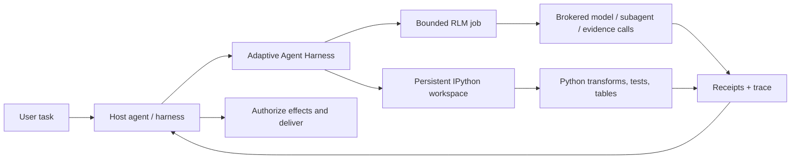

<div align="center">

# Adaptive Agent Harness

### Gib Agenten eine Werkbank — nicht nur einen größeren Prompt.

**Vom Host zusammengesetztes RLM + persistentes IPython + dauerhafte Operationen + host-eigene Autorität**

[](https://www.python.org/)
[](https://modelcontextprotocol.io/)
[](https://github.com/phenomenoner/adaptive-agent-harness/releases/tag/v0.3.0a2)
[](../../LICENSE)
[](#projektstatus)

[**Schnellstart**](#schnellstart) · [**Warum RLM + IPython?**](#warum-rlm--ipython) · [**Was du bekommst**](#was-du-bekommst) · [**Architektur**](#architektur) · [**Technischer Status**](../../TECHNICAL-STATUS.md)

</div>

[English](../../README.md) · [**繁中**](README.zh-TW.md) · [简中](README.zh-CN.md) · [Español](README.es.md) · [Português](README.pt-BR.md) · [Français](README.fr.md) · [Deutsch](README.de.md) · [日本語](README.ja.md) · [한국어](README.ko.md) · [Русский](README.ru.md) · [العربية](README.ar.md) · [Italiano](README.it.md) · [Tiếng Việt](README.vi.md) · [ไทย](README.th.md) · [Čeština](README.cs.md) · [Suomi](README.fi.md) · [Norsk](README.no.md) · [Lietuvių](README.lt.md)

---

## Die Antwort in 30 Sekunden

Die meisten Agenten sollen große Probleme mit einer einzigen teuren, vergesslichen Schnittstelle lösen: dem Prompt.

**Adaptive Agent Harness gibt ihnen stattdessen eine programmierbare Werkbank.** Ein Host kann zwei von ihm zusammengesetzte sibling surfaces nebeneinander verwenden: persistente IPython-Arbeitsbereiche für zustandsbehaftete Berechnungen und begrenzte RLM-Jobs für vermittelte Evidenz- und Modellaufrufe. Dauerhafte Quittungen und eine kleine MCP-Oberfläche machen beide steuerbar und erneut anbindbar.

Die aktuelle öffentliche Alpha führt **keinen RLM-Job innerhalb eines IPython-Arbeitsbereichs aus und teilt Zustand zwischen ihnen nicht automatisch.** Ein Host muss ausgewählte Evidenz, Werte oder Artefakte explizit übertragen.

Das Ergebnis ist eine praktische Grundlage für Agenten, die:

- über Eingaben größer als ein einzelnes Kontextfenster schlussfolgern müssen;
- wiederholtes Werkzeugaufruf-Geschwätz in kompakte Python-Programme umwandeln;
- Variablen, Tabellen, Hilfsfunktionen und Belege über mehrere Schritte hinweg erhalten müssen;
- eine Trennung der Frontend-Verbindung überstehen müssen, ohne sie mit einer Abmeldung zu verwechseln;
- nur von einer bestimmten, durch eine Quittung belegten Grenze aus fortsetzen dürfen;
- die endgültige Autorität über Anmeldedaten, Effekte und Zustellung beim Host belassen müssen.

Die Python-Distribution heißt derzeit **`adaptive-agent-runtime`**. Dieses Repository ist unter dem Namen **Adaptive Agent Harness** ihr öffentliches Projekt-Zuhause.

---

## Was ist ein RLM?

Ein **Recursive Language Model (RLM)** behandelt einen langen Prompt oder Korpus als Daten in einer externen Umgebung. Statt alles in den aktiven Kontext des Modells zu pressen, kann das Modell Programme schreiben, die:

1. die Daten prüfen;
2. sie filtern, aufteilen, zusammenführen, ordnen oder zusammenfassen;
3. ein Modell oder einen Subagenten für ausgewählte Ausschnitte aufrufen;
4. die zurückgegebene Evidenz zusammenführen;
5. dies innerhalb expliziter Grenzen wiederholen.

Der entscheidende Gedanke ist nicht „unendliche Rekursion“. Es geht um **programmatische Skalierung zur Inferenzzeit**: Modellaufrufe dort einsetzen, wo sie Nutzen bringen, und ansonsten gewöhnliche Berechnung verwenden.

Der Begriff stammt aus der Arbeit [Recursive Language Models](https://arxiv.org/abs/2512.24601) von Zhang, Kraska und Khattab. Adaptive Agent Harness implementiert eine **begrenzte, vermittelte RLM-Laufzeit**; es behauptet weder, dass jede Arbeitslast Rekursion benötigt, noch dass mehr Aufrufe automatisch zu einer besseren Antwort führen.

Ein einfaches mentales Modell:

```text
Traditional long-context agent
  prompt -> one model call -> more prompt -> another model call

RLM-style agent
  long input -> Python examines it -> selected model/subagent calls
             -> Python combines evidence -> bounded answer + trace
```

---

## Warum IPython?

Lang laufende Agenten brauchen ebenfalls einen Ort, an dem sie **mit Daten** denken können, statt nur darüber zu sprechen. IPython ergänzt die RLM-Oberfläche, indem es dem Host einen separaten persistenten Rechenarbeitsbereich gibt:

- Variablen bleiben über Ausführungsschritte hinweg verfügbar;
- DataFrames, Arrays, geparste Dokumente und Graphergebnisse können direkt geprüft werden;
- Hilfsfunktionen können sich wiederholende Werkzeugaufruf-Schleifen ersetzen;
- das Modell kann eine Hypothese testen, das Ergebnis prüfen und den nächsten Schritt verfeinern;
- kompakte Referenzen können im Kontext bleiben, während die vollständigen Daten im Arbeitsbereich verbleiben;
- ausgewählter JSON-ähnlicher Zustand kann als Checkpoint gespeichert werden, ohne vorzugeben, dass beliebige aktive Python-Objekte portierbar sind.

Ein Chatprotokoll ist eine Aufzeichnung dessen, was gesagt wurde. **Ein IPython-Arbeitsbereich ist eine Arbeitsmenge dessen, was berechnet wurde.**

Dieser Unterschied ist für umfangreiche Recherchen, Codebasisanalysen, Datenuntersuchungen, Evaluierungen und jede Aufgabe wichtig, bei der der Agent die gleichen Materialien sonst immer wieder lesen müsste.

---

## Warum RLM × IPython?

Hier bedeutet „ד **host composition**, keine RLM-/Arbeitsbereichsbindung innerhalb eines Prozesses. Jede sibling surface deckt einen anderen Fehlermodus ab:

| Ebene | Beitrag |
|---|---|
| **RLM** | Entscheidet, wie ein großes Problem zerlegt wird und wo begrenzte Modell-/Subagent-Aufrufe nützlich sind. |
| **IPython** | Führt Schleifen, Joins, Filter, Rangfolgen, Tests und zustandsbehaftete Untersuchungen in einem aktiven Arbeitsbereich aus. |
| **Adaptive Agent Harness** | Ergänzt dauerhafte Operationsidentität, Grants, Budgets, Quittungen, Artefakte, Wiederherstellungsrichtlinien und hostneutrale MCP-Zugriffe. |
| **Dein Host-Agent** | Besitzt Identität, Provider-Anmeldedaten, Genehmigung, privilegierte Effekte, Abnahme und endgültige Zustellung. |

Ein Host kann sie zusammensetzen, indem er ausgewählte, explizite Evidenz, Werte oder Artefakte zwischen den Oberflächen überträgt. Es gibt weder einen implizit gemeinsamen Namensraum noch einen automatischen RLM-to-IPython-Ausführungspfad.



Die maßgeblichen Regeln sind bewusst einfach:

> **Der Host setzt die sibling surfaces explizit zusammen; Python ist eine Arbeitsbereichssprache, und der Host bleibt die Autoritätsgrenze.**

---

## Was du bekommst

### Eine programmierbare Agenten-Werkbank

- persistente plain-Python- und IPython-Arbeitsbereiche;
- begrenzte Codeausführung mit Prüfungen von Generation und Revision;
- NumPy und pandas in der Standardlaufzeit verfügbar;
- deterministische Checkpoints aus einer JSON-Teilmenge mit expliziten Ausschlüssen;
- artefaktgestützte Verarbeitung größerer oder nicht inline darstellbarer Ergebnisse.

### Eine vermittelte RLM-Engine

- persistierte RLM-Jobs, Schritte, Nutzung und Endergebnisse;
- explizite Broker-Verträge für Modellanforderungen, Subagenten, Artefakte und Evidenz;
- Zeit-, Modellaufruf-, Token-, Kindoperations- und Artefaktbudgets pro Operation;
- aufbewahrte Handles und Quittungen statt „das Tool ist wahrscheinlich gelaufen“;
- Abgleich, wenn ein Aufruf begonnen haben könnte, aber keine autoritative Quittung existiert.

### Dauerhafte Operationen

- stabile logische Operations-IDs, getrennt von Versuchen, Workern, Leases und Frontend-Verbindungen;
- angenommene Arbeit, die eine einzelne MCP-Anfrage überdauern kann;
- über Cursor lesbare Ereignisse sowie Status-, Abbruch- und Abgleichoperationen;
- ein dauerhafter Supervisor mit kurzlebigen authentifizierten Frontends;
- eine exakte Prozessstartidentität statt Besitzzuordnung nur über die PID;
- Folgeversuche, die Deadline, Abbruch und kumulierte Nutzung bewahren.

### Portierbare Verträge

- 30 MCP-Tools auf der aktuellen v7-Oberfläche;
- versionierte Schemas und an Digests gebundene Assets;
- gebündelte Operationsanleitungen für Codex- und Hermes-Profile;
- deterministische Referenz-Broker für Entwicklung und Konformitätstests;
- hostneutrale Grenzen, die AHC, Prime Agent oder NOOA nicht voraussetzen.

---

## Wo es besonders stark ist

Adaptive Agent Harness eignet sich besonders für:

- **Recherche in langen Dokumenten** — Evidenz suchen, zuschneiden, vergleichen und rekursiv synthetisieren;
- **Untersuchung von Codebasen** — Symbolmengen, Aufrufpfade, Testevidenz und mögliche Änderungen behalten;
- **Datenanalyse** — zwischen Fragen in natürlicher Sprache und DataFrame-Operationen wechseln;
- **Evaluierungspipelines** — Eingaben, Bewertungen, Quittungen und Artefakte an eine Operation binden;
- **Experimente mit Agenteninfrastruktur** — dauerhafte Ausführung und Wiederherstellung testen, ohne ein zweites benutzerseitiges Agentenbetriebssystem zu bauen;
- **Kontrollierte Worker-Integration** — leistungsfähigere Worker hinter expliziten Budgets, Handles und Host-Abnahme platzieren.

Es ist absichtlich schmaler als ein vollständig autonomer Coding-Agent. Das ist nützlich, wenn bereits ein Orchestrator vorhanden ist und darunter eine zuverlässige Rechen- und Evidenzebene benötigt wird.

---

## Wie es zu anderen RLM-Projekten steht

Wir haben aus öffentlicher Arbeit gelernt, ohne so zu tun, als seien die Projekte austauschbar:

- **[Prime Agent](https://github.com/PrimeIntellect-ai/prime-agent)** demonstriert den Produktnutzen einer persistenten IPython-Umgebung, programmatischer Werkzeugnutzung, nativer Kindagenten und daemonbasierter Kontinuität. Prime ist eine umfassendere Coding-/Recherche-Agentenerfahrung. Adaptive Agent Harness ist die schmalere Laufzeit-/Kontrollschicht und kann einen Worker wie Prime ergänzen, statt ihn zu ersetzen.
- **[NVIDIA Object Oriented Agents (NOOA)](https://github.com/NVIDIA-NeMo/labs-OO-Agents)** demonstriert ein Python-natives, typisiertes Objektmodell für Agentenfähigkeiten und eine Orchestrierung im CodeAct-Stil. NOOA dient hier nur als Designinput: Es gibt keinen gebündelten NOOA-Adapter und keine NOOA-Abhängigkeit.
- **[Recursive Language Models](https://arxiv.org/abs/2512.24601)** liefert das grundlegende Inferenzparadigma: langen Kontext als externe Umgebung behandeln, die das Modell programmgesteuert prüfen und rekursiv abfragen kann.

Siehe [Warum RLM + IPython](../../docs/WHY-RLM-AND-IPYTHON.md) für die ausführlichere Designbegründung und Quellenhinweise.

---

## Schnellstart

> **Öffentliche Alpha:** Verwende einen getaggten, festgelegten Stand, prüfe die von deinem Host zurückgegebenen Fähigkeiten und beginne mit wegwerfbaren Arbeitsbereichen. Dieses Projekt führt vom Modell verfassten Python-Code aus und ist **keine Sicherheits-Sandbox**.

### Installation vom neuesten öffentlichen Tag

```bash
uv tool install --force \
  "git+https://github.com/phenomenoner/adaptive-agent-harness.git@v0.3.0a2"
```

### Codex-App einrichten

```bash
aar-codex-setup
```

Starte Codex App neu, wenn der Einrichtungsbeleg meldet, dass sich die Konfiguration geändert hat, und rufe anschließend `aar_capabilities` in einer neuen Aufgabe auf.

### Aus dem Quellcode entwickeln

```bash
git clone https://github.com/phenomenoner/adaptive-agent-harness.git
cd adaptive-agent-harness
uv sync --locked
uv run aar-contract verify
uv run pytest -q
```

### Mit dem MCP-Workflow beginnen

1. Rufe `aar_capabilities` auf und binde dich an die zurückgegebene Laufzeitgeneration und den Capability-Digest.
2. Erstelle einen Arbeitsbereich oder hänge dich an einen an, oder übermittle eine begrenzte `rlm.execute`-Operation.
3. Bewahre das zurückgegebene Operations-Handle auf.
4. Lies bei Bedarf Status und Ereignisse über eine neue autorisierte Verbindung.
5. Gleiche Ungewissheit ab, bevor du Arbeit mit möglicher Effektwirkung erneut versuchst.

Detaillierte Installations- und Host-Hinweise:

- [Codex-Installation](../../docs/CODEX-INSTALL.md)
- [Host-Kompatibilität](../../HOST-COMPATIBILITY.md)
- [Architektur](../../ARCHITECTURE.md)
- [Operations-Skill](../../skills/aar-operations/SKILL.md)
- [Technischer Verifikationsstatus](../../TECHNICAL-STATUS.md)

---

## Architektur

Adaptive Agent Harness folgt einem Small-Waist-Design:

```text
Host / orchestrator
  ├─ owns identity, provider credentials, approvals, effects, delivery
  └─ connects through MCP or a native adapter
          |
          v
Adaptive Agent Harness
  ├─ operation registry + event log + receipts
  ├─ bounded RLM engine + broker journal
  ├─ programmable workspace manager
  ├─ durable supervisor + exact worker identity
  ├─ checkpoints, artifacts, assets, export/import
  └─ capability, grant, budget, deadline, and generation fencing
          |
          v
Plain Python / IPython workers and host-authorized brokers
```

Das MCP-Frontend ist absichtlich austauschbar. Es besitzt weder die Kontinuitätsdatenbank noch den Lebenszyklus der Worker; dafür ist der dauerhafte Supervisor zuständig.

---

## Projektstatus

Aktuelle öffentliche Alpha: **`0.3.0a2`**.

> **Translation status:** the overview below retains the `v0.3.0a1` public baseline as historical
> context. For `v0.3.0a2` receipt-backed model routing, current verification, and exact release
> boundaries, read the canonical English [release notes](../RELEASE-v0.3.0a2.md) and
> [model-routing guide](../MODEL-ROUTING-AND-EVALUATION.md).


Aus diesem öffentlichen Kandidaten reproduziert:

- Abdeckung von Python 3.11 bis 3.14;
- MCP-v7-Oberfläche mit 30 Tools;
- additive SQLite-Schemata bis v5;
- vollständiger Repository-Lauf: **249 bestanden, 1 plattformbedingt übersprungen**;
- ein sauberer Exact-Wheel-Probe für Supervisor/Frontend unter Linux/WSL;
- Szenarien für dauerhaften Supervisor, Frontend-Ersatz, Prozessverlust, veraltete Schreiber, Wiederverwendung von Quittungen und richtliniengebundene RLM-Folgeversuche.

Frühere Kompatibilitätszeilen für natives Windows und installiertes Hermes bleiben als **von den Maintainern gemeldeter historischer Kontext** erhalten. Die unterstützenden Host-Receipts sind nicht in diesem öffentlichen Repository enthalten; diese Zeilen sind daher aus diesem Tree nicht unabhängig auditierbar und keine Release-Kriterien für den öffentlichen Source-Kandidaten.

Noch offen:

- portable automatische Wiederherstellung eines größeren Teils des IPython-Arbeitsbereichszustands in eine neue Generation;
- allgemeine Adapter zum Abgleich externer Effekte;
- mandantenfähige Sicherheitsisolierung;
- generische exactly-once-Effekte;
- Veröffentlichung in einer Paketregistrierung und stabile API-Garantien.

Lies [TECHNICAL-STATUS.md](../../TECHNICAL-STATUS.md), [HOST-COMPATIBILITY.md](../../HOST-COMPATIBILITY.md), bevor du Aussagen zur Produktionstauglichkeit machst.

---

## Was dieses Projekt **nicht** tut

- Es ist **keine Sicherheits-Sandbox**.
- Es enthält absichtlich nicht deine Provider-Anmeldedaten.
- Es führt keine beliebigen externen Effekte aus und stellt nicht selbstständig Benutzernachrichten zu.
- Es verspricht keine universelle exactly-once-Semantik.
- Es erweckt keine beliebigen Python-Stacks, Sockets, Generatoren oder nativen Prozessspeicher wieder zum Leben.
- Es macht Prime Agent, NOOA, CodeGraph, Hermes, Codex oder AHC nicht zu Laufzeitabhängigkeiten.

Die Aussage zur Autorität lautet:

> **Adaptive Agent Harness berechnet und schlägt vor. Der Host autorisiert und stellt zu.**

---

## Mitwirken

Issues, fokussierte Pull Requests, Kompatibilitätsberichte und reproduzierbare Fehler-Fixtures sind willkommen. Lies bitte zuerst [CONTRIBUTING.md](../../CONTRIBUTING.md) und [SECURITY.md](../../SECURITY.md).

Nützliche Beitragsbereiche:

- zusätzliche Host-Profile und Blackbox-Kompatibilitätszeilen;
- Eignungskriterien und Ausschlussergonomie für Checkpoints;
- Adapter zum Abgleich von Broker- und Effektoperationen;
- begrenzte RLM-Strategien und evidenzreiche Benchmarks;
- Worker-Backends und Artefaktspeicher;
- Korrekturen an Dokumentation und Übersetzungen.

---

## Lizenz

[MIT](../../LICENSE) © 2026 phenomenoner.

---

## Referenzen

- Alex L. Zhang, Tim Kraska und Omar Khattab, [Recursive Language Models](https://arxiv.org/abs/2512.24601), arXiv:2512.24601.
- [Prime Agent](https://github.com/PrimeIntellect-ai/prime-agent), Prime Intellect.
- [NVIDIA Object Oriented Agents](https://github.com/NVIDIA-NeMo/labs-OO-Agents), NVIDIA-NeMo.
- [Model Context Protocol](https://modelcontextprotocol.io/).
