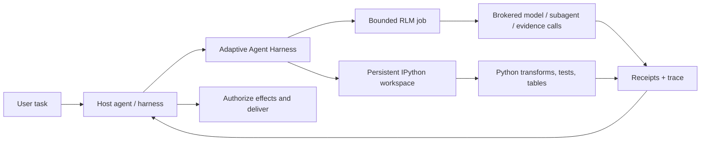

<div align="center">

> **`0.6.0a1` release-contract target** · target tag `v0.6.0a1` · source text does not establish publication; read the canonical English [release notes](../RELEASE-v0.6.0a1.md) before using the tag.

# Adaptive Agent Harness

### Dale a los agentes un banco de trabajo — no solo un prompt más grande.

**RLM compuesto por el host + IPython persistente + operaciones duraderas + autoridad del host**

[](https://www.python.org/)
[](https://modelcontextprotocol.io/)
[](../RELEASE-v0.6.0a1.md)
[](../../LICENSE)
[](#estado-del-proyecto)

[**Inicio rápido**](#inicio-rápido) · [**¿Por qué RLM + IPython?**](#por-qué-rlm--ipython) · [**Qué obtienes**](#qué-obtienes) · [**Arquitectura**](#arquitectura) · [**Estado técnico**](../../TECHNICAL-STATUS.md)

</div>

[English](../../README.md) · [**繁中**](README.zh-TW.md) · [简中](README.zh-CN.md) · [Español](README.es.md) · [Português](README.pt-BR.md) · [Français](README.fr.md) · [Deutsch](README.de.md) · [日本語](README.ja.md) · [한국어](README.ko.md) · [Русский](README.ru.md) · [العربية](README.ar.md) · [Italiano](README.it.md) · [Tiếng Việt](README.vi.md) · [ไทย](README.th.md) · [Čeština](README.cs.md) · [Suomi](README.fi.md) · [Norsk](README.no.md) · [Lietuvių](README.lt.md)

---

## La respuesta en 30 segundos

La mayoría de los agentes tienen que resolver problemas grandes con una única interfaz cara y olvidadiza: el prompt.

**Adaptive Agent Harness les proporciona en su lugar un banco de trabajo programable.** Un host puede usar dos superficies hermanas en paralelo: espacios de trabajo IPython persistentes para el cálculo con estado y trabajos RLM acotados para evidencias y llamadas a modelos intermediadas por un broker. Los recibos duraderos y una pequeña superficie MCP hacen que ambas sean gobernables y reconectables.

La alfa pública actual **no** ejecuta un trabajo RLM dentro de un espacio de trabajo IPython ni comparte estado entre ambos automáticamente. El host debe transferir explícitamente las evidencias, valores o artefactos seleccionados.

El resultado es una base práctica para agentes que necesitan:

- razonar sobre entradas más grandes que una sola ventana de contexto;
- convertir el parloteo repetitivo de llamadas a herramientas en programas Python compactos;
- mantener variables, tablas, funciones auxiliares y evidencias vivas entre pasos;
- sobrevivir a una desconexión del frontend sin confundirla con una cancelación;
- reanudar únicamente desde un límite cierto y respaldado por un recibo;
- dejar la autoridad final, las credenciales, los efectos y la entrega en manos del host.

La distribución de Python se llama actualmente **`adaptive-agent-runtime`**. Este repositorio es su espacio público bajo el nombre **Adaptive Agent Harness**.

---

## ¿Qué es un RLM?

Un **Recursive Language Model (RLM)** trata un prompt o corpus largo como datos en un entorno externo. En lugar de comprimirlo todo en el contexto activo del modelo, el modelo puede escribir programas que:

1. inspeccionen los datos;
2. filtren, dividan, unan, ordenen o resuman esos datos;
3. llamen a un modelo o subagente sobre fragmentos seleccionados;
4. combinen las evidencias devueltas;
5. repitan dentro de límites explícitos.

La idea importante no es la «recursión infinita». Es el **escalado programático en tiempo de inferencia**: gastar llamadas al modelo donde aportan valor y usar computación ordinaria en todo lo demás.

Un modelo mental sencillo:

```text
Traditional long-context agent
  prompt -> one model call -> more prompt -> another model call

RLM-style agent
  long input -> Python examines it -> selected model/subagent calls
             -> Python combines evidence -> bounded answer + trace
```

El término proviene del trabajo [Recursive Language Models](https://arxiv.org/abs/2512.24601) de Zhang, Kraska y Khattab. Adaptive Agent Harness implementa un **runtime RLM acotado e intermediado**; no afirma que toda carga de trabajo necesite recursión ni que más llamadas produzcan automáticamente una respuesta mejor.

---

## ¿Por qué IPython?

Los agentes de larga duración también necesitan un lugar donde pensar **con datos**, no solo hablar sobre ellos. IPython complementa la superficie RLM al proporcionar al host un espacio de trabajo computacional persistente y separado:

- las variables permanecen disponibles entre pasos de ejecución;
- los DataFrames, arrays, documentos analizados y resultados de grafos se pueden inspeccionar directamente;
- las funciones auxiliares pueden sustituir bucles repetitivos de llamadas a herramientas;
- el modelo puede probar una hipótesis, inspeccionar el resultado y perfeccionar el siguiente paso;
- las referencias compactas pueden permanecer en el contexto mientras los datos completos siguen en el espacio de trabajo;
- el estado seleccionado, similar a JSON, se puede guardar en checkpoints sin fingir que objetos Python vivos arbitrarios son portables.

Un transcript de chat es un registro de lo que se dijo. **Un espacio de trabajo IPython es el conjunto de trabajo de lo que se ha calculado.**

Esa distinción importa en investigaciones largas, análisis de bases de código, investigaciones de datos, evaluaciones y cualquier tarea en la que el agente, de otro modo, tuviera que volver a leer el mismo material.

---

## ¿Por qué RLM × IPython?

Aquí, «×» significa **composición del host**, no un enlace RLM/espacio de trabajo dentro del mismo proceso. Cada superficie hermana cubre un modo de fallo diferente:

| Capa | Qué aporta |
|---|---|
| **RLM** | Decide cómo descomponer un problema grande y dónde resultan útiles las llamadas acotadas a modelos o subagentes. |
| **IPython** | Ejecuta bucles, uniones, filtros, ordenaciones, pruebas e investigaciones con estado en un espacio de trabajo activo. |
| **Adaptive Agent Harness** | Añade identidad de operación duradera, grants, presupuestos, recibos, artefactos, política de recuperación y acceso MCP neutral respecto al host. |
| **Tu agente host** | Es dueño de la identidad, las credenciales del proveedor, la aprobación, los efectos privilegiados, la aceptación y la entrega final. |

Un host puede componerlas pasando evidencias o artefactos seleccionados y explícitos entre las superficies. No existe un espacio de nombres compartido implícito ni una ruta automática de ejecución de RLM a IPython.



Las reglas rectoras son deliberadamente sencillas:

> **El host compone explícitamente las superficies hermanas; Python es el lenguaje del espacio de trabajo y el host sigue siendo el límite de autoridad.**

---

## Qué obtienes

### Un banco de trabajo de agente programable

- espacios de trabajo persistentes de Python simple e IPython;
- ejecución de código acotada con comprobaciones de generación y revisión;
- NumPy y pandas disponibles en el runtime predeterminado;
- checkpoints deterministas de un subconjunto JSON con exclusiones explícitas;
- gestión respaldada por artefactos para resultados más grandes o no insertables en línea.

### Un motor RLM con broker

- trabajos RLM persistidos, pasos, uso y resultados terminales;
- contratos explícitos de broker para solicitudes de modelo, subagentes, artefactos y evidencias;
- presupuestos por operación para tiempo de pared, llamadas al modelo, tokens, operaciones hijas y artefactos;
- handles y recibos retenidos en lugar de «probablemente la herramienta se ejecutó»;
- reconciliación cuando una llamada pudo haber comenzado pero no existe un recibo autoritativo.

### Operaciones duraderas

- IDs de operación lógica estables, separados de intentos, workers, leases y conexiones del frontend;
- trabajo aceptado que puede sobrevivir a una única solicitud MCP;
- eventos legibles mediante cursor y operaciones de estado, cancelación y reconciliación;
- un supervisor duradero con frontends efímeros autenticados;
- identidad exacta de inicio de proceso en lugar de propiedad basada solo en PID;
- intentos sucesores que conservan el plazo, la cancelación y el uso acumulado.

### Contratos portables

- 38 herramientas MCP en la superficie v8 actual;
- esquemas versionados y activos ligados a digest;
- orientación de operaciones incluida para perfiles de Codex y Hermes;
- brokers de referencia deterministas para desarrollo y pruebas de conformidad;
- límites neutrales respecto al host que no requieren AHC, Prime Agent ni NOOA.

---

## Dónde destaca

Adaptive Agent Harness encaja especialmente bien en:

- **investigación de documentos largos** — buscar, fragmentar, comparar y sintetizar evidencias de forma recursiva;
- **investigación de bases de código** — conservar conjuntos de símbolos, rutas de llamadas, evidencias de pruebas y cambios candidatos;
- **análisis de datos** — pasar de preguntas en lenguaje natural a operaciones con DataFrame;
- **pipelines de evaluación** — mantener entradas, puntuaciones, recibos y artefactos ligados a una sola operación;
- **experimentos de infraestructura de agentes** — probar ejecución duradera y recuperación sin construir un segundo sistema operativo de agentes orientado al usuario;
- **integración controlada de workers** — colocar workers más ricos detrás de presupuestos, handles y aceptación del host explícitos.

Intencionadamente es más estrecho que un agente de programación autónomo completo. Esto resulta útil cuando ya tienes un orquestador y necesitas debajo una capa fiable de computación y evidencias.

---

## Cómo se relaciona con otros proyectos RLM

Aprendimos del trabajo público sin fingir que los proyectos son intercambiables:

- **[Prime Agent](https://github.com/PrimeIntellect-ai/prime-agent)** demuestra el valor de producto de un entorno IPython persistente, el uso programático de herramientas, agentes hijos nativos y continuidad respaldada por un daemon. Prime ofrece una experiencia más completa de agente de programación/investigación. Adaptive Agent Harness es la capa más estrecha de runtime/control y puede complementar a un worker como Prime en lugar de sustituirlo.
- **[NVIDIA Object Oriented Agents (NOOA)](https://github.com/NVIDIA-NeMo/labs-OO-Agents)** demuestra un modelo de objetos tipado y nativo de Python para las capacidades de los agentes y la orquestación al estilo CodeAct. Aquí NOOA solo aporta ideas de diseño: no se incluye ningún adaptador ni dependencia de NOOA.
- **[Recursive Language Models](https://arxiv.org/abs/2512.24601)** proporciona el paradigma de inferencia central: tratar el contexto largo como un entorno externo que el modelo puede inspeccionar y consultar recursivamente de forma programática.

Consulta [Por qué RLM + IPython](../../docs/WHY-RLM-AND-IPYTHON.md) para conocer la justificación de diseño más profunda y las notas de las fuentes.

---

## Inicio rápido

> **Alfa pública:** usa una etiqueta fijada, inspecciona las capacidades que devuelve tu host y empieza con espacios de trabajo desechables. Este proyecto ejecuta Python escrito por el modelo y **no es un sandbox de seguridad**.

### Instalar desde la etiqueta pública más reciente

```bash
# Use only after external GitHub readback confirms the target tag exists.
uv tool install --force \
  "git+https://github.com/phenomenoner/adaptive-agent-harness.git@v0.6.0a1"
```

### Configuración de Codex App

```bash
aar-codex-setup
```

Reinicia Codex Desktop si el recibo de configuración indica `restart_required: true`; conserva, tras la aplicación manual, el recibo `restart_required_after_manual_apply: true`; un recibo posterior sin cambios con `restart_required: false` no puede borrar la obligación de reiniciar. Después, llama a `aar_capabilities` en una tarea nueva.

### Desarrollar desde el código fuente

```bash
git clone https://github.com/phenomenoner/adaptive-agent-harness.git
cd adaptive-agent-harness
uv sync --locked
uv run aar-contract verify
uv run pytest -q
```

### Empezar con el flujo de trabajo MCP

1. Llama a `aar_capabilities` y vincúlate a la generación de runtime y al digest de capacidades devueltos.
2. Crea o adjunta un espacio de trabajo, o envía una operación `rlm.execute` acotada.
3. Conserva el handle de operación devuelto.
4. Lee el estado y los eventos desde una conexión nueva y autorizada cuando sea necesario.
5. Reconcilia la incertidumbre antes de volver a intentar cualquier trabajo con forma de efecto.

Notas detalladas de instalación y del host:

- [Instalación de Codex](../../docs/CODEX-INSTALL.md)
- [Compatibilidad del host](../../HOST-COMPATIBILITY.md)
- [Arquitectura](../../ARCHITECTURE.md)
- [Skill de operaciones](../../skills/aar-operations/SKILL.md)
- [Estado de verificación técnica](../../TECHNICAL-STATUS.md)

---

## Arquitectura

Adaptive Agent Harness sigue un diseño de cintura estrecha:

```text
Host / orchestrator
  ├─ owns identity, provider credentials, approvals, effects, delivery
  └─ connects through MCP or a native adapter
          |
          v
Adaptive Agent Harness
  ├─ operation registry + event log + receipts
  ├─ bounded RLM engine + broker journal
  ├─ programmable workspace manager
  ├─ durable supervisor + exact worker identity
  ├─ checkpoints, artifacts, assets, export/import
  └─ capability, grant, budget, deadline, and generation fencing
          |
          v
Plain Python / IPython workers and host-authorized brokers
```

El frontend MCP se puede sustituir deliberadamente. No es dueño de la base de datos de continuidad ni del ciclo de vida del worker; el supervisor duradero sí lo es.

---

## Estado del proyecto

Alfa pública actual: **`0.6.0a1`**.

> **Translation status:** the overview below retains the `v0.3.0a1` public baseline as historical
> context. For `v0.6.0a1` receipt-backed model routing, current verification, and exact publication
> boundaries, read the canonical English [release notes](../RELEASE-v0.6.0a1.md) and
> [model-routing guide](../MODEL-ROUTING-AND-EVALUATION.md).


`v0.6.0a1` release-contract evidence represented by this source:

- cobertura de Python 3.11 a 3.14;
- 38-tool MCP v8 executable surface (frozen 30-tool MCP v7 prefix + exact 8-tool successor suffix);
- esquema SQLite aditivo hasta v5;
- full repository run: **743 passed, 5 platform-gated skips, 1 existing MCP Sampling deprecation warning**;
- una prueba limpia del supervisor/frontend con wheel exacto en Linux/WSL;
- supervisor duradero, sustitución del frontend, pérdida de procesos, escritor obsoleto, reutilización de recibos y escenarios de sucesores RLM ligados a políticas;

Las filas de compatibilidad anteriores de Windows nativo y de Hermes instalado se conservan como **contexto histórico reportado por los mantenedores**. Los recibos del host que las respaldan no se incluyen en este repositorio público, por lo que esas filas no se pueden auditar de forma independiente desde este árbol y no son criterios de publicación para el candidato de código fuente público.

Aún pendiente:

- restauración automática portable de un estado más amplio del espacio de trabajo IPython en una nueva generación;
- adaptadores generales de reconciliación de efectos externos;
- aislamiento de seguridad multi-tenant;
- efectos genéricos exactamente una vez;
- publicación en un registro de paquetes y garantías de API estables.

Lee [TECHNICAL-STATUS.md](../../TECHNICAL-STATUS.md), [HOST-COMPATIBILITY.md](../../HOST-COMPATIBILITY.md) antes de hacer afirmaciones de producción.

---

## Lo que este proyecto **no** hace

- **No** es un sandbox de seguridad.
- **No** conserva tus credenciales de proveedor por diseño.
- **No** ejecuta efectos externos arbitrarios ni entrega mensajes de usuario por sí solo.
- **No** promete semántica universal de ejecución exactamente una vez.
- **No** resucita pilas de Python arbitrarias, sockets, generadores ni memoria de procesos nativos.
- **No** convierte Prime Agent, NOOA, CodeGraph, Hermes, Codex ni AHC en dependencias del runtime.

La declaración de autoridad es:

> **Adaptive Agent Harness calcula y propone. El host autoriza y entrega.**

---

## Contribuir

Se agradecen los issues, los pull requests centrados, los informes de compatibilidad y los fixtures reproducibles de fallos. Lee primero [CONTRIBUTING.md](../../CONTRIBUTING.md) y [SECURITY.md](../../SECURITY.md).

Áreas útiles para contribuir:

- perfiles de host adicionales y filas de compatibilidad de caja negra;
- elegibilidad de checkpoints y ergonomía de las exclusiones;
- adaptadores de reconciliación de brokers/efectos;
- estrategias RLM acotadas y benchmarks con muchas evidencias;
- backends de workers y almacenes de artefactos;
- correcciones de documentación y traducciones.

---

## Licencia

[MIT](../../LICENSE) © 2026 phenomenoner.

---

## Referencias

- Alex L. Zhang, Tim Kraska y Omar Khattab, [Recursive Language Models](https://arxiv.org/abs/2512.24601), arXiv:2512.24601.
- [Prime Agent](https://github.com/PrimeIntellect-ai/prime-agent), Prime Intellect.
- [NVIDIA Object Oriented Agents](https://github.com/NVIDIA-NeMo/labs-OO-Agents), NVIDIA-NeMo.
- [Model Context Protocol](https://modelcontextprotocol.io/).
