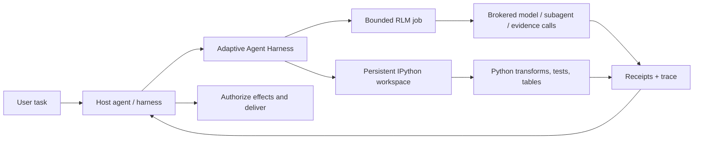

<div align="center">

# Adaptive Agent Harness

### Anna agenteille työpöytä — älä vain suurempaa promptia.

**Hostin koostama RLM + pysyvä IPython + kestävät operaatiot + hostin hallussa oleva päätösvalta**

[](https://www.python.org/)
[](https://modelcontextprotocol.io/)
[](https://github.com/phenomenoner/adaptive-agent-harness/releases/tag/v0.4.0a0)
[](../../LICENSE)
[](#projektin-tila)

[**Pika-aloitus**](#pika-aloitus) · [**Miksi RLM + IPython?**](#miksi-rlm--ipython) · [**Mitä saat**](#mitä-saat) · [**Arkkitehtuuri**](#arkkitehtuuri) · [**Tekninen tila**](../../TECHNICAL-STATUS.md)

</div>

[English](../../README.md) · [**繁中**](README.zh-TW.md) · [简中](README.zh-CN.md) · [Español](README.es.md) · [Português](README.pt-BR.md) · [Français](README.fr.md) · [Deutsch](README.de.md) · [日本語](README.ja.md) · [한국어](README.ko.md) · [Русский](README.ru.md) · [العربية](README.ar.md) · [Italiano](README.it.md) · [Tiếng Việt](README.vi.md) · [ไทย](README.th.md) · [Čeština](README.cs.md) · [Suomi](README.fi.md) · [Norsk](README.no.md) · [Lietuvių](README.lt.md)

---

## 30 sekunnin vastaus

Useimpia agentteja pyydetään ratkaisemaan suuria ongelmia yhdellä kalliilla, unohtavalla rajapinnalla: promptilla.

**Adaptive Agent Harness antaa niille sen sijaan ohjelmoitavan työpöydän.** Host voi käyttää rinnakkain kahta hostin koostamaa sibling surfacea: tilalliseen laskentaan tarkoitettuja pysyviä IPython-työtiloja sekä välitettyä evidenssiä ja mallikutsuja varten rajattuja RLM-töitä. Pysyvät kuitit ja pieni MCP-pinta tekevät molemmista hallittavia ja uudelleen yhdistettäviä.

Nykyinen julkinen alfa **ei suorita RLM-työtä IPython-työtilan sisällä eikä jaa tilaa niiden välillä automaattisesti.** Hostin on siirrettävä valittu evidenssi, arvot tai artefaktit eksplisiittisesti.

Tuloksena on käytännöllinen perusta agenteille, joiden täytyy:

- käsitellä syötteitä, jotka ovat suurempia kuin yksi konteksti-ikkuna;
- muuttaa toistuva työkalukutsujen keskusteluhäly kompakteiksi Python-ohjelmiksi;
- pitää muuttujat, taulukot, apufunktiot ja evidenssi käytettävissä vaiheesta toiseen;
- selvitä käyttöliittymäyhteyden katkeamisesta sekoittamatta sitä peruutukseen;
- jatkaa vain tietyltä, kuitilla tuetulta rajalta;
- jättää lopullinen päätösvalta, tunnistetiedot, vaikutukset ja toimitus hostille.

Python-jakelun nimi on tällä hetkellä **`adaptive-agent-runtime`**. Tämä repositorio on sen julkinen projektikoti nimellä **Adaptive Agent Harness**.

---

## Mikä on RLM?

**Recursive Language Model (RLM)** käsittelee pitkää promptia tai korpusta ulkoisen ympäristön datana. Sen sijaan että kaikki puristettaisiin mallin aktiiviseen kontekstiin, malli voi kirjoittaa ohjelmia, jotka:

1. tarkastelevat dataa;
2. suodattavat, jakavat, yhdistävät, järjestävät tai tiivistävät sitä;
3. kutsuvat mallia tai aliagenttia valituilla osilla;
4. yhdistävät palautetun evidenssin;
5. toistavat tämän eksplisiittisten rajojen puitteissa.

Tärkeä ajatus ei ole ”ääretön rekursio”. Kyse on **päättelyajan ohjelmallisesta skaalauksesta**: käytetään mallikutsuja siellä, missä ne tuottavat arvoa, ja tavallista laskentaa kaikkialla muualla.

Termi on peräisin Zhangin, Kraskan ja Khattabin työstä [Recursive Language Models](https://arxiv.org/abs/2512.24601). Adaptive Agent Harness toteuttaa **rajatun, välitetyn RLM-ajoaikaympäristön**; se ei väitä, että jokainen työkuorma tarvitsee rekursiota tai että useammat kutsut tuottaisivat automaattisesti paremman vastauksen.

Yksinkertainen ajatusmalli:

```text
Traditional long-context agent
  prompt -> one model call -> more prompt -> another model call

RLM-style agent
  long input -> Python examines it -> selected model/subagent calls
             -> Python combines evidence -> bounded answer + trace
```

---

## Miksi IPython?

Pitkäkestoiset agentit tarvitsevat myös paikan, jossa ajatella **datan kanssa**, ei vain puhua siitä. IPython täydentää RLM-pintaa tarjoamalla hostille erillisen pysyvän laskennallisen työtilan:

- muuttujat säilyvät käytettävissä suoritusvaiheiden välillä;
- DataFrameja, taulukoita, jäsennettyjä asiakirjoja ja graafituloksia voi tarkastella suoraan;
- apufunktiot voivat korvata toistuvat työkalukutsujen silmukat;
- malli voi testata hypoteesia, tarkastella tulosta ja tarkentaa seuraavaa vaihetta;
- kompaktit viitteet voivat säilyä kontekstissa samalla kun koko data pysyy työtilassa;
- valittu JSON-tyyppinen tila voidaan checkpointata teeskentelemättä, että mielivaltaiset aktiiviset Python-oliot ovat siirrettäviä.

Chat-transkripti on tallenne siitä, mitä sanottiin. **IPython-työtila on työjoukko siitä, mitä on laskettu.**

Tämä ero on tärkeä pitkässä tutkimuksessa, koodikannan analyysissä, datan tutkimisessa, arvioinneissa ja kaikissa tehtävissä, joissa agentti muuten joutuisi lukemaan saman aineiston yhä uudelleen.

---

## Miksi RLM × IPython?

Tässä “×” tarkoittaa **hostin tekemää koostamista**, ei prosessin sisäistä RLM/työtila-sidosta. Kumpikin sibling surface kattaa erilaisen vikatilanteen:

| Kerros | Mitä se tuo |
|---|---|
| **RLM** | Päättää, miten suuri ongelma hajotetaan ja missä rajatut malli- tai aliagenttikutsut ovat hyödyllisiä. |
| **IPython** | Suorittaa silmukoita, yhdistämisiä, suodatuksia, järjestämisiä, testejä ja tilallista tutkimista elävässä työtilassa. |
| **Adaptive Agent Harness** | Lisää operaatioiden pysyvän identiteetin, grantit, budjetit, kuitit, artefaktit, palautumiskäytännön ja hostista riippumattoman MCP-käytön. |
| **Host-agenttisi** | Omistaa identiteetin, palveluntarjoajan tunnistetiedot, hyväksynnän, etuoikeutetut vaikutukset, hyväksymisen ja lopullisen toimituksen. |

Host voi koostaa ne siirtämällä valittua, eksplisiittistä evidenssiä, arvoja tai artefakteja pintojen välillä. Implisiittistä jaettua nimiavaruutta tai automaattista RLM–IPython-suorituspolkua ei ole.



Ohjaavat säännöt ovat tarkoituksella yksinkertaiset:

> **Host koostaa nämä sisaruspinnat eksplisiittisesti; Python on työtilan kieli, ja host pysyy auktoriteettirajana.**

---

## Mitä saat

### Ohjelmoitava agenttityöpöytä

- pysyvät plain-Python- ja IPython-työtilat;
- rajattu koodin suoritus generation- ja revision-tarkistuksilla;
- NumPy ja pandas käytettävissä oletusajoaikaympäristössä;
- deterministiset JSON-osajoukon checkpointit eksplisiittisine poissulkuineen;
- artefakteihin perustuva suurempien tai inline-muotoon sopimattomien tulosten käsittely.

### Välitetty RLM-moottori

- pysyvät RLM-työt, vaiheet, käyttö ja päätetulokset;
- eksplisiittiset mallipyyntöjen, aliagenttien, artefaktien ja evidenssin broker-sopimukset;
- operaatiokohtaiset seinäkelloaika-, mallikutsu-, token-, lapsioperaatio- ja artefaktibudjetit;
- säilytetyt handlet ja kuitit sen sijaan, että luotettaisiin ajatukseen ”työkalu taisi suorittua”;
- täsmäytys tilanteisiin, joissa kutsu on saattanut alkaa mutta auktoritatiivista kuittia ei ole.

### Pysyvät operaatiot

- vakaat loogiset operaatio-ID:t erillään yrityksistä, workereista, leaseista ja käyttöliittymäyhteyksistä;
- hyväksytty työ, joka voi elää yhden MCP-pyynnön yli;
- kursorilla luettavat tapahtumat sekä tila-, peruutus- ja täsmäytystoiminnot;
- pysyvä valvoja ja lyhytikäiset todennetut käyttöliittymät;
- tarkka prosessin käynnistysidentiteetti pelkkään PID-omistajuuteen luottamisen sijaan;
- seuraajayritykset, jotka säilyttävät deadlinen, peruutuksen ja kumulatiivisen käytön.

### Siirrettävät sopimukset

- 30 MCP-työkalua nykyisessä v7-rajapinnassa;
- versioidut skeemat ja digestiin sidotut assetit;
- Codex- ja Hermes-profiileille niputetut operaatio-ohjeet;
- deterministiset referenssibrokerit kehitystä ja konformanssitestausta varten;
- hostista riippumattomat rajat, jotka eivät vaadi AHC:tä, Prime Agentia tai NOOA:a.

---

## Missä se loistaa

Adaptive Agent Harness sopii erityisen hyvin:

- **pitkien asiakirjojen tutkimiseen** — etsiä, rajata, vertailla ja syntetisoida evidenssiä rekursiivisesti;
- **koodikannan tutkimiseen** — säilyttää symbolijoukot, kutsupolut, testievidenssin ja ehdotetut muutokset;
- **data-analyysiin** — siirtyä luonnollisen kielen kysymysten ja DataFrame-operaatioiden välillä;
- **arviointiputkiin** — sitoa syötteet, pisteet, kuitit ja artefaktit yhteen operaatioon;
- **agentti-infrastruktuurikokeiluihin** — testata pysyvää suoritusta ja palautumista rakentamatta toista käyttäjälle suunnattua agenttikäyttöjärjestelmää;
- **hallittuun worker-integraatioon** — sijoittaa monipuolisemmat workerit eksplisiittisten budjettien, handlejen ja hostin hyväksynnän taakse.

Se on tarkoituksella kapeampi kuin täysin autonominen koodausagentti. Tämä on hyödyllistä, kun sinulla on jo orkestroija ja tarvitset sen alle luotettavan laskenta- ja evidenssitason.

---

## Miten tämä liittyy muihin RLM-projekteihin

Olemme oppineet julkisesta työstä teeskentelemättä, että projektit olisivat keskenään vaihdettavissa:

- **[Prime Agent](https://github.com/PrimeIntellect-ai/prime-agent)** osoittaa pysyvän IPython-ympäristön, ohjelmallisen työkalukäytön, natiivien lapsiagenttien ja daemon-pohjaisen jatkuvuuden tuotehyödyn. Prime on täydellisempi koodaus- ja tutkimusagenttikokemus. Adaptive Agent Harness on kapeampi ajoaika- ja ohjauskerros, joka voi täydentää Primen kaltaista workeria sen sijaan, että korvaisi sen.
- **[NVIDIA Object Oriented Agents (NOOA)](https://github.com/NVIDIA-NeMo/labs-OO-Agents)** osoittaa Python-natiivin, tyypitetyn oliomallin agenttikyvyille ja CodeAct-tyyppisen orkestroinnin. NOOA on tässä vain suunnittelun lähtökohta: mukana ei ole NOOA-adapteria tai -riippuvuutta.
- **[Recursive Language Models](https://arxiv.org/abs/2512.24601)** tarjoaa päättelyn perusparadigman: pitkä konteksti käsitellään ulkoisena ympäristönä, jota malli voi ohjelmallisesti tarkastella ja kysellä rekursiivisesti.

Katso [Miksi RLM + IPython](../../docs/WHY-RLM-AND-IPYTHON.md), jossa suunnittelun perustelu ja lähdehuomiot käsitellään syvemmin.

---

## Pika-aloitus

> **Julkinen alfa:** käytä pinattua tagia, tarkista hostisi palauttamat capabilities-tiedot ja aloita hävitettävillä työtiloilla. Tämä projekti suorittaa mallin kirjoittamaa Pythonia, eikä se ole **tietoturvasandbox**.

### Asennus uusimmasta julkisesta tagista

```bash
uv tool install --force \
  "git+https://github.com/phenomenoner/adaptive-agent-harness.git@v0.4.0a0"
```

### Codex Appin asetukset

```bash
aar-codex-setup
```

Käynnistä Codex App uudelleen, jos asetusten kuitti ilmoittaa määritysten muuttuneen, ja kutsu sen jälkeen `aar_capabilities` uudessa tehtävässä.

### Kehitys lähdekoodista

```bash
git clone https://github.com/phenomenoner/adaptive-agent-harness.git
cd adaptive-agent-harness
uv sync --locked
uv run aar-contract verify
uv run pytest -q
```

### MCP-työnkulun aloittaminen

1. Kutsu `aar_capabilities` ja sido käyttöön palautettu runtime-sukupolvi sekä capability-digest.
2. Luo työtila tai liity sellaiseen, tai lähetä rajattu `rlm.execute`-operaatio.
3. Säilytä palautettu operaatiohandle.
4. Lue tila ja tapahtumat tarvittaessa uudesta valtuutetusta yhteydestä.
5. Täsmäytä epävarmuus ennen kuin yrität uudelleen työtä, joka voi tuottaa vaikutuksia.

Yksityiskohtaiset asennus- ja host-huomiot:

- [Codex-asennus](../../docs/CODEX-INSTALL.md)
- [Host-yhteensopivuus](../../HOST-COMPATIBILITY.md)
- [Arkkitehtuuri](../../ARCHITECTURE.md)
- [Operaatiotaito](../../skills/aar-operations/SKILL.md)
- [Teknisen verifioinnin tila](../../TECHNICAL-STATUS.md)

---

## Arkkitehtuuri

Adaptive Agent Harness noudattaa small-waist-mallia:

```text
Host / orchestrator
  ├─ owns identity, provider credentials, approvals, effects, delivery
  └─ connects through MCP or a native adapter
          |
          v
Adaptive Agent Harness
  ├─ operation registry + event log + receipts
  ├─ bounded RLM engine + broker journal
  ├─ programmable workspace manager
  ├─ durable supervisor + exact worker identity
  ├─ checkpoints, artifacts, assets, export/import
  └─ capability, grant, budget, deadline, and generation fencing
          |
          v
Plain Python / IPython workers and host-authorized brokers
```

MCP-käyttöliittymä on tarkoituksella vaihdettavissa. Se ei omista jatkuvuustietokantaa tai workerin elinkaarta; niistä vastaa pysyvä valvoja.

---

## Projektin tila

Nykyinen julkinen alfa: **`0.4.0a0`**.

> **Translation status:** the overview below retains the `v0.3.0a1` public baseline as historical
> context. For `v0.4.0a0` receipt-backed model routing, current verification, and exact release
> boundaries, read the canonical English [release notes](../RELEASE-v0.4.0a0.md) and
> [model-routing guide](../MODEL-ROUTING-AND-EVALUATION.md).


Tästä julkisesta ehdokkaasta toistettu:

- Python 3.11–3.14-kattavuus;
- 30 työkalun MCP v7 -pinta;
- additiivinen SQLite-skeema versioon v5 asti;
- koko repositorion ajo: **249 läpäisi, 1 ohitettiin alustan vuoksi**;
- puhdas exact-wheel supervisor/frontend -probe Linux/WSL:ssä;
- pysyvän valvojan, käyttöliittymän korvaamisen, prosessihäviön, vanhentuneen kirjoittajan, kuitin uudelleenkäytön ja käytäntöihin sidottujen RLM-seuraajaskenaarioiden testit.

Aiemmat natiivin Windowsin ja asennetun Hermeksen yhteensopivuusrivit säilytetään **ylläpitäjien raportoimana historiallisena kontekstina**. Niitä tukevat host receipts eivät sisälly tähän julkiseen repositoryyn, joten rivejä ei voi auditoida riippumattomasti tästä treestä eivätkä ne ole julkisen source candidate -julkaisun kriteerejä.

Avoinna ovat edelleen:

- laajemman IPython-työtilan tilan siirrettävä automaattinen palautus uuteen sukupolveen;
- yleiset ulkoisten vaikutusten täsmäytysadapterit;
- monen vuokraajan tietoturvaeristys;
- yleiset exactly-once-vaikutukset;
- pakettirekisterijulkaisu ja vakaat API-takuut.

Lue [TECHNICAL-STATUS.md](../../TECHNICAL-STATUS.md), [HOST-COMPATIBILITY.md](../../HOST-COMPATIBILITY.md) ennen tuotantoa koskevien väitteiden tekemistä.

---

## Mitä tämä projekti **ei** tee

- Se **ei ole tietoturvasandbox**.
- Se ei suunnittelun vuoksi säilytä palveluntarjoajasi tunnistetietoja.
- Se ei suorita mielivaltaisia ulkoisia vaikutuksia eikä toimita käyttäjäviestejä itsenäisesti.
- Se ei lupaa yleistä exactly-once-semantikkaa.
- Se ei herätä henkiin mielivaltaisia Python-pinoja, socket-yhteyksiä, generaattoreita tai natiivin prosessimuistin sisältöä.
- Se ei tee Prime Agentista, NOOA:sta, CodeGraphista, Hermeksestä, Codexista tai AHC:stä ajoaikariippuvuutta.

Auktoriteettia koskeva lausuma on:

> **Adaptive Agent Harness laskee ja ehdottaa. Host valtuuttaa ja toimittaa.**

---

## Osallistuminen

Issues, kohdennetut pull requestit, yhteensopivuusraportit ja toistettavat vikatestit ovat tervetulleita. Lue ensin [CONTRIBUTING.md](../../CONTRIBUTING.md) ja [SECURITY.md](../../SECURITY.md).

Hyödyllisiä osallistumisalueita:

- lisähost-profiilit ja black-box-yhteensopivuusrivit;
- checkpointien kelpoisuus ja poissulkujen ergonomia;
- brokerin ja vaikutusten täsmäytysadapterit;
- rajatut RLM-strategiat ja evidenssirikkaat benchmarkit;
- worker-taustajärjestelmät ja artefaktivarastot;
- dokumentaation ja käännösten korjaukset.

---

## Lisenssi

[MIT](../../LICENSE) © 2026 phenomenoner.

---

## Viitteet

- Alex L. Zhang, Tim Kraska ja Omar Khattab, [Recursive Language Models](https://arxiv.org/abs/2512.24601), arXiv:2512.24601.
- [Prime Agent](https://github.com/PrimeIntellect-ai/prime-agent), Prime Intellect.
- [NVIDIA Object Oriented Agents](https://github.com/NVIDIA-NeMo/labs-OO-Agents), NVIDIA-NeMo.
- [Model Context Protocol](https://modelcontextprotocol.io/).
