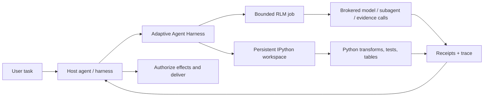

<div align="center">

> **`0.6.0a2` release-contract target** · target tag `v0.6.0a2` · source text does not establish publication; read the canonical English [release notes](../RELEASE-v0.6.0a2.md) before using the tag.

# Adaptive Agent Harness

### Offrez aux agents un espace de travail — pas seulement un prompt plus grand.

**RLM composé par l’hôte + IPython persistant + opérations durables + autorité détenue par l’hôte**

[](https://www.python.org/)
[](https://modelcontextprotocol.io/)
[](../RELEASE-v0.6.0a2.md)
[](../../LICENSE)
[](#état-du-projet)

[**Démarrage rapide**](#démarrage-rapide) · [**Pourquoi RLM + IPython ?**](#pourquoi-rlm--ipython) · [**Ce que vous obtenez**](#ce-que-vous-obtenez) · [**Architecture**](#architecture) · [**État technique**](../../TECHNICAL-STATUS.md)

</div>

[English](../../README.md) · [**繁中**](README.zh-TW.md) · [简中](README.zh-CN.md) · [Español](README.es.md) · [Português](README.pt-BR.md) · [Français](README.fr.md) · [Deutsch](README.de.md) · [日本語](README.ja.md) · [한국어](README.ko.md) · [Русский](README.ru.md) · [العربية](README.ar.md) · [Italiano](README.it.md) · [Tiếng Việt](README.vi.md) · [ไทย](README.th.md) · [Čeština](README.cs.md) · [Suomi](README.fi.md) · [Norsk](README.no.md) · [Lietuvių](README.lt.md)

---

## La réponse en 30 secondes

La plupart des agents doivent résoudre de grands problèmes avec une seule interface coûteuse et oublieuse : le prompt.

**Adaptive Agent Harness leur offre à la place un espace de travail programmable.** Un hôte peut utiliser côte à côte deux surfaces sœurs : des espaces de travail IPython persistants pour le calcul avec état, et des tâches RLM bornées pour les éléments de preuve gérés par un broker et les appels de modèle. Les reçus durables et une petite surface MCP rendent les deux gouvernables et reconnectables.

L’alpha publique actuelle **n’exécute pas** une tâche RLM dans un espace de travail IPython et ne partage pas automatiquement leur état. L’hôte doit transférer explicitement les éléments de preuve, valeurs ou artefacts sélectionnés.

Le résultat est une base pratique pour les agents qui doivent :

- raisonner sur des entrées plus grandes qu’une seule fenêtre de contexte ;
- transformer le bavardage répétitif des appels d’outils en programmes Python compacts ;
- conserver variables, tables, fonctions auxiliaires et éléments de preuve entre les étapes ;
- survivre à une déconnexion du frontend sans la confondre avec une annulation ;
- reprendre uniquement à partir d’une frontière certaine et couverte par un reçu ;
- laisser l’autorité finale, les identifiants, les effets et la livraison à l’hôte.

La distribution Python s’appelle actuellement **`adaptive-agent-runtime`**. Ce dépôt est son espace public sous le nom **Adaptive Agent Harness**.

---

## Qu’est-ce qu’un RLM ?

Un **Recursive Language Model (RLM)** traite un prompt ou corpus long comme des données dans un environnement externe. Au lieu de tout comprimer dans le contexte actif du modèle, celui-ci peut écrire des programmes qui :

1. inspectent les données ;
2. les filtrent, divisent, joignent, classent ou résument ;
3. appellent un modèle ou un sous-agent sur des fragments sélectionnés ;
4. combinent les éléments de preuve renvoyés ;
5. recommencent dans des limites explicites.

L’idée importante n’est pas la « récursion infinie ». C’est la **mise à l’échelle programmatique au moment de l’inférence** : dépenser les appels au modèle là où ils apportent de la valeur et utiliser le calcul ordinaire partout ailleurs.

Un modèle mental simple :

```text
Traditional long-context agent
  prompt -> one model call -> more prompt -> another model call

RLM-style agent
  long input -> Python examines it -> selected model/subagent calls
             -> Python combines evidence -> bounded answer + trace
```

Le terme vient des travaux de Zhang, Kraska et Khattab sur les [Recursive Language Models](https://arxiv.org/abs/2512.24601). Adaptive Agent Harness implémente un **runtime RLM borné et brokerisé** ; il ne prétend pas que toute charge de travail nécessite la récursion ni que davantage d’appels produisent automatiquement une meilleure réponse.

---

## Pourquoi IPython ?

Les agents de longue durée ont eux aussi besoin d’un endroit où penser **avec les données**, pas seulement en parler. IPython complète la surface RLM en fournissant à l’hôte un espace de travail computationnel persistant et séparé :

- les variables restent disponibles entre les étapes d’exécution ;
- les DataFrames, tableaux, documents analysés et résultats de graphes peuvent être inspectés directement ;
- des fonctions auxiliaires peuvent remplacer les boucles répétitives d’appels d’outils ;
- le modèle peut tester une hypothèse, inspecter le résultat et affiner l’étape suivante ;
- des références compactes peuvent rester dans le contexte tandis que les données complètes demeurent dans l’espace de travail ;
- un état sélectionné de type JSON peut être sauvegardé en checkpoints sans prétendre que des objets Python vivants arbitraires sont portables.

Une transcription de chat est le relevé de ce qui a été dit. **Un espace de travail IPython est l’ensemble de travail de ce qui a été calculé.**

Cette distinction compte pour les recherches longues, l’analyse de bases de code, l’investigation de données, l’évaluation et toute tâche où l’agent devrait sinon relire sans cesse le même contenu.

---

## Pourquoi RLM × IPython?

Ici, « × » signifie **composition par l’hôte**, et non une liaison RLM/espace de travail au sein d’un même processus. Chaque surface sœur couvre un mode de défaillance différent :

| Couche | Ce qu’elle apporte |
|---|---|
| **RLM** | Décide comment décomposer un problème volumineux et où les appels bornés à un modèle ou à un sous-agent sont utiles. |
| **IPython** | Exécute boucles, jointures, filtres, classements, tests et investigations avec état dans un espace de travail actif. |
| **Adaptive Agent Harness** | Ajoute une identité d’opération durable, des grants, des budgets, des reçus, des artefacts, une politique de récupération et un accès MCP neutre vis-à-vis de l’hôte. |
| **Votre agent hôte** | Détient l’identité, les identifiants du fournisseur, l’approbation, les effets privilégiés, l’acceptation et la livraison finale. |

Un hôte peut les composer en transférant entre les surfaces des éléments de preuve ou artefacts sélectionnés explicitement. Il n’existe ni espace de noms partagé implicite ni chemin d’exécution automatique de RLM vers IPython.



Les règles directrices sont volontairement simples :

> **L’hôte compose explicitement les surfaces sœurs ; Python est le langage de l’espace de travail et l’hôte reste la frontière d’autorité.**

---

## Ce que vous obtenez

### Un espace de travail d’agent programmable

- des espaces de travail persistants en Python simple et IPython ;
- une exécution de code bornée avec contrôles de génération et de révision ;
- NumPy et pandas disponibles dans le runtime par défaut ;
- des checkpoints déterministes du sous-ensemble JSON avec exclusions explicites ;
- une gestion fondée sur les artefacts pour les résultats plus volumineux ou non intégrables en ligne.

### Un moteur RLM brokerisé

- des tâches RLM persistées, leurs étapes, leur usage et leurs résultats terminaux ;
- des contrats de broker explicites pour les requêtes de modèle, les sous-agents, les artefacts et les éléments de preuve ;
- des budgets par opération pour le temps d’horloge (« wall-time »), les appels de modèle, les tokens, les opérations enfants et les artefacts ;
- des handles et des reçus conservés plutôt que « l’outil a probablement été exécuté » ;
- une réconciliation lorsqu’un appel a peut-être commencé mais qu’aucun reçu faisant autorité n’existe.

### Des opérations durables

- des identifiants logiques d’opération stables, séparés des tentatives, workers, leases et connexions frontend ;
- un travail accepté qui peut survivre à une seule requête MCP ;
- des événements lisibles par curseur et des opérations de statut, d’annulation et de réconciliation ;
- un superviseur durable avec des frontends éphémères authentifiés ;
- une identité exacte du démarrage de processus plutôt qu’une propriété fondée uniquement sur le PID ;
- des tentatives successeurs qui préservent l’échéance, l’annulation et l’usage cumulé.

### Des contrats portables

- 38 outils MCP sur la surface v8 actuelle ;
- des schémas versionnés et des actifs liés à un digest ;
- des conseils d’opérations intégrés pour les profils Codex et Hermes ;
- des brokers de référence déterministes pour le développement et les tests de conformité ;
- des frontières neutres vis-à-vis de l’hôte qui n’exigent ni AHC, ni Prime Agent, ni NOOA.

---

## Là où il excelle

Adaptive Agent Harness convient particulièrement :

- à la **recherche dans de longs documents** — rechercher, découper, comparer et synthétiser récursivement les éléments de preuve ;
- à l’**investigation de bases de code** — conserver ensembles de symboles, chemins d’appels, preuves de tests et changements candidats ;
- à l’**analyse de données** — passer de questions en langage naturel à des opérations DataFrame ;
- aux **pipelines d’évaluation** — garder entrées, scores, reçus et artefacts liés à une opération ;
- aux **expériences d’infrastructure d’agents** — tester l’exécution durable et la récupération sans construire un second système d’exploitation d’agents destiné à l’utilisateur ;
- à l’**intégration contrôlée de workers** — placer des workers plus riches derrière des budgets, des handles et une acceptation explicite de l’hôte.

Il est volontairement plus étroit qu’un agent de programmation autonome complet. C’est utile lorsque vous disposez déjà d’un orchestrateur et avez besoin en dessous d’une couche fiable de calcul et de preuves.

---

## Liens avec d’autres projets RLM

Nous avons appris du travail public sans prétendre que ces projets sont interchangeables :

- **[Prime Agent](https://github.com/PrimeIntellect-ai/prime-agent)** démontre la valeur produit d’un environnement IPython persistant, de l’utilisation programmatique d’outils, d’agents enfants natifs et d’une continuité soutenue par un daemon. Prime propose une expérience plus complète d’agent de programmation/recherche. Adaptive Agent Harness est la couche runtime/contrôle plus étroite et peut compléter un worker comme Prime plutôt que le remplacer.
- **[NVIDIA Object Oriented Agents (NOOA)](https://github.com/NVIDIA-NeMo/labs-OO-Agents)** démontre un modèle objet typé et natif Python pour les capacités des agents et une orchestration de style CodeAct. NOOA n’est ici qu’une source d’inspiration de conception : aucun adaptateur ni aucune dépendance NOOA n’est fourni.
- **[Recursive Language Models](https://arxiv.org/abs/2512.24601)** fournit le paradigme d’inférence central : traiter le contexte long comme un environnement externe que le modèle peut inspecter et interroger récursivement par programme.

Voir [Pourquoi RLM + IPython](../../docs/WHY-RLM-AND-IPYTHON.md) pour la justification de conception détaillée et les notes sur les sources.

---

## Démarrage rapide

> **Alpha publique :** utilisez un tag épinglé, inspectez les capacités renvoyées par votre hôte et commencez avec des espaces de travail jetables. Ce projet exécute du Python écrit par le modèle et **n’est pas un sandbox de sécurité**.

### Installer depuis le dernier tag public

```bash
# Use only after external GitHub readback confirms the target tag exists.
uv tool install --force \
  "git+https://github.com/phenomenoner/adaptive-agent-harness.git@v0.6.0a2"
```

### Configuration de Codex App

```bash
aar-codex-setup
```

Redémarrez Codex Desktop si le reçu de configuration indique `restart_required: true` ; après l’application manuelle, conservez le reçu `restart_required_after_manual_apply: true` ; un reçu no-op ultérieur contenant `restart_required: false` n’annule pas l’obligation de redémarrer. Appelez ensuite `aar_capabilities` dans une nouvelle tâche.

### Développer depuis les sources

```bash
git clone https://github.com/phenomenoner/adaptive-agent-harness.git
cd adaptive-agent-harness
uv sync --locked
uv run aar-contract verify
uv run pytest -q
```

### Commencer avec le flux MCP

1. Appelez `aar_capabilities` et liez-vous à la génération du runtime et au digest de capacités renvoyés.
2. Créez ou attachez un espace de travail, ou soumettez une opération `rlm.execute` bornée.
3. Conservez le handle d’opération renvoyé.
4. Lisez l’état et les événements depuis une connexion fraîche et autorisée lorsque nécessaire.
5. Réconciliez l’incertitude avant de retenter tout travail de forme « effet ».

Notes détaillées d’installation et d’hôte :

- [Installation de Codex](../../docs/CODEX-INSTALL.md)
- [Compatibilité de l’hôte](../../HOST-COMPATIBILITY.md)
- [Architecture](../../ARCHITECTURE.md)
- [Skill d’opérations](../../skills/aar-operations/SKILL.md)
- [État de la vérification technique](../../TECHNICAL-STATUS.md)

---

## Architecture

Adaptive Agent Harness suit une conception à taille réduite :

```text
Host / orchestrator
  ├─ owns identity, provider credentials, approvals, effects, delivery
  └─ connects through MCP or a native adapter
          |
          v
Adaptive Agent Harness
  ├─ operation registry + event log + receipts
  ├─ bounded RLM engine + broker journal
  ├─ programmable workspace manager
  ├─ durable supervisor + exact worker identity
  ├─ checkpoints, artifacts, assets, export/import
  └─ capability, grant, budget, deadline, and generation fencing
          |
          v
Plain Python / IPython workers and host-authorized brokers
```

Le frontend MCP est volontairement remplaçable. Il ne possède ni la base de données de continuité ni le cycle de vie du worker ; c’est le superviseur durable qui les possède.

---

## État du projet

Alpha publique actuelle : **`0.6.0a2`**.

> **Translation status:** the overview below retains the `v0.3.0a1` public baseline as historical
> context. For `v0.6.0a2` receipt-backed model routing, current verification, and exact publication
> boundaries, read the canonical English [release notes](../RELEASE-v0.6.0a2.md) and
> [model-routing guide](../MODEL-ROUTING-AND-EVALUATION.md).


`v0.6.0a2` release-contract evidence represented by this source:

- couverture Python 3.11 à 3.14 ;
- 38-tool MCP v8 executable surface (frozen 30-tool MCP v7 prefix + exact 8-tool successor suffix);
- schéma SQLite additif jusqu’à v5 ;
- current full-repository verification is recorded in the canonical English release note and external release receipt;
- une sonde propre du superviseur/frontend avec wheel exact sous Linux/WSL ;
- superviseur durable, remplacement du frontend, perte de processus, écrivain obsolète, réutilisation de reçus et scénarios de successeurs RLM liés à une politique ;

Les anciennes lignes de compatibilité Windows natif et Hermes installé sont conservées comme **contexte historique rapporté par les mainteneurs**. Les reçus de l’hôte qui les étayent ne sont pas inclus dans ce dépôt public ; ces lignes ne peuvent donc pas être auditées indépendamment depuis cette arborescence et ne constituent pas des critères de publication pour le candidat source public.

Encore ouverts :

- restauration automatique et portable d’un état IPython plus large dans une nouvelle génération ;
- adaptateurs généraux de réconciliation des effets externes ;
- isolation de sécurité multi-tenant ;
- effets génériques exactement une fois ;
- publication dans un registre de paquets et garanties d’API stables.

Lisez [TECHNICAL-STATUS.md](../../TECHNICAL-STATUS.md), [HOST-COMPATIBILITY.md](../../HOST-COMPATIBILITY.md) avant toute affirmation de production.

---

## Ce que ce projet ne fait **pas**

- Ce n’est **pas** un sandbox de sécurité.
- Il ne conserve **pas** vos identifiants fournisseur par conception.
- Il n’exécute **pas** d’effets externes arbitraires et ne livre **pas** de messages utilisateur de lui-même.
- Il ne promet **pas** une sémantique universelle exactement une fois.
- Il ne ressuscite **pas** des piles Python arbitraires, des sockets, des générateurs ni la mémoire de processus natifs.
- Il ne fait **pas** de Prime Agent, NOOA, CodeGraph, Hermes, Codex ou AHC une dépendance du runtime.

La déclaration d’autorité est la suivante :

> **Adaptive Agent Harness calcule et propose. L’hôte autorise et livre.**

---

## Contribuer

Les issues, pull requests ciblées, rapports de compatibilité et fixtures d’échec reproductibles sont les bienvenus. Veuillez d’abord lire [CONTRIBUTING.md](../../CONTRIBUTING.md) et [SECURITY.md](../../SECURITY.md).

Domaines de contribution utiles :

- profils d’hôte supplémentaires et lignes de compatibilité en boîte noire ;
- éligibilité des checkpoints et ergonomie des exclusions ;
- adaptateurs de réconciliation broker/effet ;
- stratégies RLM bornées et benchmarks riches en preuves ;
- backends de workers et magasins d’artefacts ;
- corrections de documentation et de traduction.

---

## Licence

[MIT](../../LICENSE) © 2026 phenomenoner.

---

## Références

- Alex L. Zhang, Tim Kraska et Omar Khattab, [Recursive Language Models](https://arxiv.org/abs/2512.24601), arXiv:2512.24601.
- [Prime Agent](https://github.com/PrimeIntellect-ai/prime-agent), Prime Intellect.
- [NVIDIA Object Oriented Agents](https://github.com/NVIDIA-NeMo/labs-OO-Agents), NVIDIA-NeMo.
- [Model Context Protocol](https://modelcontextprotocol.io/).
