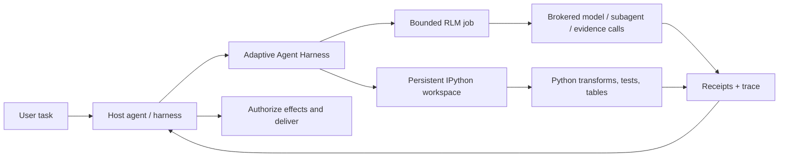

<div align="center">

> **`0.5.0a0`** public alpha · [`phenomenoner/adaptive-agent-harness@v0.5.0a0`](https://github.com/phenomenoner/adaptive-agent-harness/releases/tag/v0.5.0a0)

# Adaptive Agent Harness

### Dai agli agenti un banco di lavoro — non solo un prompt più grande.

**RLM composto dall’host + IPython persistente + operazioni durevoli + autorità dell’host**

[](https://www.python.org/)
[](https://modelcontextprotocol.io/)
[](https://github.com/phenomenoner/adaptive-agent-harness/releases/tag/v0.5.0a0)
[](../../LICENSE)
[](#stato-del-progetto)

[**Avvio rapido**](#avvio-rapido) · [**Perché RLM + IPython?**](#perché-rlm--ipython) · [**Cosa ottieni**](#cosa-ottieni) · [**Architettura**](#architettura) · [**Stato tecnico**](../../TECHNICAL-STATUS.md)

</div>

[English](../../README.md) · [**繁中**](README.zh-TW.md) · [简中](README.zh-CN.md) · [Español](README.es.md) · [Português](README.pt-BR.md) · [Français](README.fr.md) · [Deutsch](README.de.md) · [日本語](README.ja.md) · [한국어](README.ko.md) · [Русский](README.ru.md) · [العربية](README.ar.md) · [Italiano](README.it.md) · [Tiếng Việt](README.vi.md) · [ไทย](README.th.md) · [Čeština](README.cs.md) · [Suomi](README.fi.md) · [Norsk](README.no.md) · [Lietuvių](README.lt.md)

---

## La risposta in 30 secondi

La maggior parte degli agenti deve risolvere problemi grandi con un’unica interfaccia costosa e smemorata: il prompt.

**Adaptive Agent Harness offre invece un banco di lavoro programmabile.** Un host può usare fianco a fianco due superfici sorelle: spazi di lavoro IPython persistenti per il calcolo con stato e job RLM delimitati per evidenze gestite dal broker e chiamate al modello. Ricevute durevoli e una piccola superficie MCP rendono entrambe governabili e riconnettibili.

L’alfa pubblica attuale **non** esegue un job RLM all’interno di uno spazio di lavoro IPython né condivide automaticamente lo stato tra i due. L’host deve trasferire esplicitamente evidenze, valori o artefatti selezionati.

Il risultato è una base pratica per agenti che devono:

- ragionare su input più grandi di una singola finestra di contesto;
- trasformare il chiacchiericcio ripetitivo delle chiamate agli strumenti in programmi Python compatti;
- mantenere disponibili variabili, tabelle, funzioni helper ed evidenze tra un passaggio e l’altro;
- sopravvivere alla disconnessione del frontend senza confonderla con una cancellazione;
- riprendere soltanto da un confine certo e supportato da una ricevuta;
- lasciare autorità finale, credenziali, effetti e consegna all’host.

La distribuzione Python attualmente si chiama **`adaptive-agent-runtime`**. Questo repository è la sua sede pubblica con il nome **Adaptive Agent Harness**.

---

## Che cos’è un RLM?

Un **Recursive Language Model (RLM)** tratta un prompt o corpus lungo come dati in un ambiente esterno. Invece di comprimere tutto nel contesto attivo del modello, il modello può scrivere programmi che:

1. ispezionano i dati;
2. li filtrano, dividono, uniscono, classificano o riassumono;
3. chiamano un modello o subagente su porzioni selezionate;
4. combinano le evidenze restituite;
5. ripetono entro limiti espliciti.

L’idea importante non è la “ricorsione infinita”. È la **scalabilità programmatica al tempo dell’inferenza**: spendere chiamate al modello dove aggiungono valore e usare il calcolo ordinario ovunque sia possibile.

Un modello mentale semplice:

```text
Traditional long-context agent
  prompt -> one model call -> more prompt -> another model call

RLM-style agent
  long input -> Python examines it -> selected model/subagent calls
             -> Python combines evidence -> bounded answer + trace
```

Il termine proviene dal lavoro di Zhang, Kraska e Khattab sui [Recursive Language Models](https://arxiv.org/abs/2512.24601). Adaptive Agent Harness implementa un **runtime RLM limitato e mediato**; non sostiene che ogni carico di lavoro richieda la ricorsione o che più chiamate producano automaticamente una risposta migliore.

---

## Perché IPython?

Gli agenti di lunga durata hanno anch’essi bisogno di un luogo in cui pensare **con i dati**, non soltanto parlarne. IPython completa la superficie RLM offrendo all’host uno spazio di lavoro computazionale persistente e separato:

- le variabili restano disponibili tra i passaggi di esecuzione;
- DataFrame, array, documenti analizzati e risultati dei grafi possono essere ispezionati direttamente;
- le funzioni helper possono sostituire cicli ripetitivi di chiamate agli strumenti;
- il modello può testare un’ipotesi, ispezionare il risultato e perfezionare il passaggio successivo;
- riferimenti compatti possono restare nel contesto mentre i dati completi rimangono nello spazio di lavoro;
- lo stato selezionato simile a JSON può essere salvato in checkpoint senza fingere che oggetti Python vivi arbitrari siano portabili.

Una trascrizione di chat è il resoconto di ciò che è stato detto. **Uno spazio di lavoro IPython è l’insieme di lavoro di ciò che è stato calcolato.**

Questa distinzione conta per la ricerca lunga, l’analisi delle basi di codice, l’indagine sui dati, la valutazione e qualsiasi attività in cui l’agente altrimenti dovrebbe rileggere continuamente lo stesso materiale.

---

## Perché RLM × IPython?

Qui “×” significa **composizione dell’host**, non un collegamento RLM/spazio di lavoro all’interno dello stesso processo. Ogni superficie sorella copre una modalità di errore diversa:

| Livello | Cosa offre |
|---|---|
| **RLM** | Decide come scomporre un problema grande e dove siano utili chiamate limitate a modelli o subagenti. |
| **IPython** | Esegue cicli, join, filtri, ordinamenti, test e indagini con stato in uno spazio di lavoro attivo. |
| **Adaptive Agent Harness** | Aggiunge identità operativa durevole, grant, budget, ricevute, artefatti, criteri di recupero e accesso MCP neutrale rispetto all’host. |
| **Il tuo agente host** | Possiede identità, credenziali del provider, approvazione, effetti privilegiati, accettazione e consegna finale. |

Un host può comporle passando tra le superfici evidenze o artefatti selezionati in modo esplicito. Non esistono né uno spazio dei nomi condiviso implicito né un percorso automatico di esecuzione da RLM a IPython.



Le regole guida sono volutamente semplici:

> **L’host compone esplicitamente le superfici sorelle; Python è il linguaggio dello spazio di lavoro e l’host rimane il confine di autorità.**

---

## Cosa ottieni

### Un banco di lavoro programmabile per agenti

- spazi di lavoro persistenti in Python semplice e IPython;
- esecuzione del codice delimitata con controlli su generazione e revisione;
- NumPy e pandas disponibili nel runtime predefinito;
- checkpoint deterministici del sottoinsieme JSON con esclusioni esplicite;
- gestione basata su artefatti per risultati più grandi o non inseribili inline.

### Un motore RLM mediato

- job RLM persistiti, passaggi, utilizzo e risultati terminali;
- contratti espliciti del broker per richieste al modello, subagenti, artefatti ed evidenze;
- budget per operazione relativi a tempo di esecuzione, chiamate al modello, token, operazioni figlie e artefatti;
- handle e ricevute conservati invece di “lo strumento probabilmente è stato eseguito”;
- riconciliazione quando una chiamata potrebbe essere iniziata ma non esiste una ricevuta autorevole.

### Operazioni durevoli

- ID logici di operazione stabili, separati da tentativi, worker, lease e connessioni frontend;
- lavoro accettato che può sopravvivere a una singola richiesta MCP;
- eventi leggibili tramite cursore e operazioni di stato, annullamento e riconciliazione;
- un supervisore durevole con frontend effimeri autenticati;
- identità esatta dell’avvio del processo invece della proprietà basata soltanto sul PID;
- tentativi successivi che conservano scadenza, annullamento e utilizzo cumulativo.

### Contratti portabili

- 30 strumenti MCP sulla superficie v7 corrente;
- schemi versionati e asset legati al digest;
- guida alle operazioni inclusa per i profili Codex e Hermes;
- broker di riferimento deterministici per sviluppo e test di conformità;
- confini neutrali rispetto all’host che non richiedono AHC, Prime Agent o NOOA.

---

## Dove dà il meglio

Adaptive Agent Harness è particolarmente adatto a:

- **ricerca su documenti lunghi** — cercare, suddividere, confrontare e sintetizzare ricorsivamente le evidenze;
- **indagine su basi di codice** — conservare insiemi di simboli, percorsi di chiamata, evidenze dei test e modifiche candidate;
- **analisi dei dati** — passare da domande in linguaggio naturale a operazioni DataFrame;
- **pipeline di valutazione** — mantenere input, punteggi, ricevute e artefatti legati a una singola operazione;
- **esperimenti sull’infrastruttura degli agenti** — testare esecuzione durevole e recupero senza costruire un secondo sistema operativo per agenti rivolto all’utente;
- **integrazione controllata dei worker** — collocare worker più ricchi dietro budget, handle e accettazione esplicita dell’host.

È intenzionalmente più circoscritto di un agente di programmazione autonomo completo. È utile quando hai già un orchestratore e ti serve sotto di esso un livello affidabile di calcolo ed evidenze.

---

## Come si rapporta agli altri progetti RLM

Abbiamo imparato dal lavoro pubblico senza fingere che i progetti siano intercambiabili:

- **[Prime Agent](https://github.com/PrimeIntellect-ai/prime-agent)** dimostra il valore di prodotto di un ambiente IPython persistente, dell’uso programmatico degli strumenti, degli agenti figli nativi e della continuità basata su daemon. Prime è un’esperienza più completa per agenti di programmazione/ricerca. Adaptive Agent Harness è il livello runtime/controllo più circoscritto e può affiancare un worker come Prime invece di sostituirlo.
- **[NVIDIA Object Oriented Agents (NOOA)](https://github.com/NVIDIA-NeMo/labs-OO-Agents)** dimostra un modello a oggetti tipizzato e nativo Python per le capacità degli agenti e un’orchestrazione in stile CodeAct. Qui NOOA è solo un riferimento progettuale: non sono inclusi adattatori o dipendenze NOOA.
- **[Recursive Language Models](https://arxiv.org/abs/2512.24601)** fornisce il paradigma d’inferenza centrale: trattare il contesto lungo come un ambiente esterno che il modello può ispezionare e interrogare ricorsivamente in modo programmatico.

Vedi [Perché RLM + IPython](../../docs/WHY-RLM-AND-IPYTHON.md) per la motivazione progettuale approfondita e le note sulle fonti.

---

## Avvio rapido

> **Alfa pubblica:** usa un tag fissato, esamina le capacità restituite dal tuo host e inizia con spazi di lavoro usa e getta. Questo progetto esegue Python scritto dal modello e **non è un sandbox di sicurezza**.

### Installare dall'ultimo tag pubblico

```bash
uv tool install --force \
  "git+https://github.com/phenomenoner/adaptive-agent-harness.git@v0.5.0a0"
```

### Configurazione di Codex App

```bash
aar-codex-setup
```

Riavvia Codex Desktop se la ricevuta di configurazione indica `restart_required: true`; dopo l’applicazione manuale, conserva la ricevuta `restart_required_after_manual_apply: true`; una ricevuta no-op successiva con `restart_required: false` non annulla l’obbligo di riavvio. Poi chiama `aar_capabilities` in una nuova attività.

### Sviluppare dal codice sorgente

```bash
git clone https://github.com/phenomenoner/adaptive-agent-harness.git
cd adaptive-agent-harness
uv sync --locked
uv run aar-contract verify
uv run pytest -q
```

### Iniziare con il flusso di lavoro MCP

1. Chiama `aar_capabilities` e associa la generazione del runtime e il digest delle capacità restituiti.
2. Crea o collega uno spazio di lavoro, oppure invia un’operazione `rlm.execute` delimitata.
3. Conserva l’handle dell’operazione restituito.
4. Quando serve, leggi stato ed eventi da una connessione nuova e autorizzata.
5. Riconcilia l’incertezza prima di ritentare qualsiasi lavoro con forma di effetto.

Note dettagliate sull’installazione e sull’host:

- [Installazione di Codex](../../docs/CODEX-INSTALL.md)
- [Compatibilità dell’host](../../HOST-COMPATIBILITY.md)
- [Architettura](../../ARCHITECTURE.md)
- [Skill per le operazioni](../../skills/aar-operations/SKILL.md)
- [Stato della verifica tecnica](../../TECHNICAL-STATUS.md)

---

## Architettura

Adaptive Agent Harness segue un design a collo di bottiglia stretto:

```text
Host / orchestrator
  ├─ owns identity, provider credentials, approvals, effects, delivery
  └─ connects through MCP or a native adapter
          |
          v
Adaptive Agent Harness
  ├─ operation registry + event log + receipts
  ├─ bounded RLM engine + broker journal
  ├─ programmable workspace manager
  ├─ durable supervisor + exact worker identity
  ├─ checkpoints, artifacts, assets, export/import
  └─ capability, grant, budget, deadline, and generation fencing
          |
          v
Plain Python / IPython workers and host-authorized brokers
```

Il frontend MCP è intenzionalmente sostituibile. Non possiede il database della continuità né il ciclo di vita del worker; il supervisore durevole sì.

---

## Stato del progetto

Alfa pubblica attuale: **`0.5.0a0`**.

> **Translation status:** the overview below retains the `v0.3.0a1` public baseline as historical
> context. For `v0.5.0a0` receipt-backed model routing, current verification, and exact release
> boundaries, read the canonical English [release notes](../RELEASE-v0.5.0a0.md) and
> [model-routing guide](../MODEL-ROUTING-AND-EVALUATION.md).


Current `v0.5.0a0` public release evidence:

- copertura da Python 3.11 a 3.14;
- 38-tool MCP v8 executable surface (frozen 30-tool MCP v7 prefix + exact 8-tool successor suffix);
- schema SQLite additivo fino a v5;
- full repository run: **743 passed, 5 platform-gated skips, 1 existing MCP Sampling deprecation warning**;
- un probe pulito del supervisore/frontend con wheel esatto su Linux/WSL;
- supervisore durevole, sostituzione del frontend, perdita di processo, writer obsoleto, riutilizzo delle ricevute e scenari di successori RLM vincolati da policy;

Le precedenti righe di compatibilità per Windows nativo e Hermes installato sono mantenute come **contesto storico riportato dai maintainer**. Le ricevute dell’host che le supportano non sono incluse in questo repository pubblico, quindi tali righe non sono verificabili in modo indipendente da questo albero e non costituiscono criteri di release per il candidato del codice sorgente pubblico.

Ancora aperti:

- ripristino automatico portabile di uno stato più ampio dello spazio di lavoro IPython in una nuova generazione;
- adattatori generali per la riconciliazione degli effetti esterni;
- isolamento di sicurezza multi-tenant;
- effetti generici esattamente una volta;
- pubblicazione su un registry di pacchetti e garanzie di API stabili.

Leggi [TECHNICAL-STATUS.md](../../TECHNICAL-STATUS.md), [HOST-COMPATIBILITY.md](../../HOST-COMPATIBILITY.md) prima di fare dichiarazioni sulla produzione.

---

## Cosa questo progetto **non** fa

- **Non** è un sandbox di sicurezza.
- **Non** conserva le credenziali del provider per progettazione.
- **Non** esegue effetti esterni arbitrari né consegna messaggi utente autonomamente.
- **Non** promette una semantica universale exactly-once.
- **Non** resuscita stack Python arbitrari, socket, generatori o memoria di processi nativi.
- **Non** rende Prime Agent, NOOA, CodeGraph, Hermes, Codex o AHC dipendenze del runtime.

La dichiarazione di autorità è:

> **Adaptive Agent Harness calcola e propone. L’host autorizza e consegna.**

---

## Contribuire

Issue, pull request mirate, rapporti di compatibilità e fixture di errore riproducibili sono benvenuti. Leggi prima [CONTRIBUTING.md](../../CONTRIBUTING.md) e [SECURITY.md](../../SECURITY.md).

Aree utili per contribuire:

- profili host aggiuntivi e righe di compatibilità black-box;
- idoneità dei checkpoint ed ergonomia delle esclusioni;
- adattatori di riconciliazione broker/effetti;
- strategie RLM delimitate e benchmark ricchi di evidenze;
- backend dei worker e archivi di artefatti;
- correzioni alla documentazione e alle traduzioni.

---

## Licenza

[MIT](../../LICENSE) © 2026 phenomenoner.

---

## Riferimenti

- Alex L. Zhang, Tim Kraska e Omar Khattab, [Recursive Language Models](https://arxiv.org/abs/2512.24601), arXiv:2512.24601.
- [Prime Agent](https://github.com/PrimeIntellect-ai/prime-agent), Prime Intellect.
- [NVIDIA Object Oriented Agents](https://github.com/NVIDIA-NeMo/labs-OO-Agents), NVIDIA-NeMo.
- [Model Context Protocol](https://modelcontextprotocol.io/).
