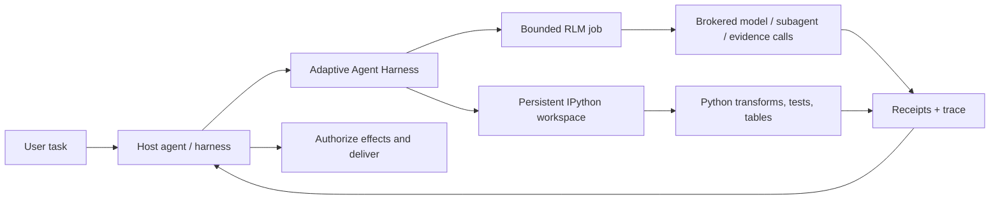

<div align="center">

# Adaptive Agent Harness

### エージェントに、より大きなプロンプトではなく作業台を。

**host が構成する RLM + persistent IPython + durable operations + host-owned authority**

[](https://www.python.org/)
[](https://modelcontextprotocol.io/)
[](https://github.com/phenomenoner/adaptive-agent-harness/releases/tag/v0.4.0a5)
[](../../LICENSE)
[](#プロジェクトのステータス)

[**クイックスタート**](#クイックスタート) · [**なぜ RLM + IPython なのか？**](#なぜ-rlm--ipython-なのか) · [**得られるもの**](#得られるもの) · [**アーキテクチャ**](#アーキテクチャ) · [**技術ステータス**](../../TECHNICAL-STATUS.md)

</div>

[English](../../README.md) · [**繁中**](README.zh-TW.md) · [简中](README.zh-CN.md) · [Español](README.es.md) · [Português](README.pt-BR.md) · [Français](README.fr.md) · [Deutsch](README.de.md) · [日本語](README.ja.md) · [한국어](README.ko.md) · [Русский](README.ru.md) · [العربية](README.ar.md) · [Italiano](README.it.md) · [Tiếng Việt](README.vi.md) · [ไทย](README.th.md) · [Čeština](README.cs.md) · [Suomi](README.fi.md) · [Norsk](README.no.md) · [Lietuvių](README.lt.md)

---

## 30 秒でわかること

多くのエージェントは、コストが高く忘れやすい一つのインターフェース、つまりプロンプトだけで大きな問題を解くよう求められます。

**Adaptive Agent Harness は、その代わりにプログラム可能な作業台を提供します。**host が構成する二つの sibling surfaces を並列に使えます。状態を持つ計算のための persistent IPython workspaces と、broker を介した evidence と model calls のための bounded RLM jobs です。durable receipts と小さな MCP surface によって、どちらも統制可能で、再接続できます。

現在の公開 alpha は、IPython workspace の内部で RLM job を実行したり、両者の間で state を自動共有したり**しません**。選択した evidence、values、artifacts の明示的な受け渡しは host が担います。

次のような能力を必要とするエージェントのための、実用的な基盤になります。

- 単一の context window より大きな入力について推論する；
- 繰り返されるツール呼び出しの往復を、簡潔な Python プログラムに変える；
- 変数、テーブル、ヘルパー関数、証拠をステップ間で保持する；
- フロントエンドが切断されても、それをキャンセルと取り違えずに処理を続ける；
- receipt に裏付けられた確実な境界からだけ再開する；
- 最終的な権限、認証情報、effect、配信を host に委ねる。

Python ディストリビューションの現在の名称は **`adaptive-agent-runtime`** です。この repository は **Adaptive Agent Harness** という名称で、その公開プロジェクトホームになっています。

---

## RLM とは？

**Recursive Language Model (RLM)** は、長いプロンプトや corpus を外部環境にあるデータとして扱います。すべてをモデルのアクティブな context に押し込む代わりに、モデルは次のようなプログラムを書けます。

1. データを調べる；
2. データをフィルター、分割、結合、ランキング、要約する；
3. 選択した断片に対してモデルまたはサブエージェントを呼び出す；
4. 返された証拠を組み合わせる；
5. 明示的な制限内で繰り返す。

重要なのは「無限再帰」ではありません。**プログラムによる推論時スケーリング（programmatic inference-time scaling）**です。価値を生む箇所にモデル呼び出しを使い、それ以外は通常の計算で処理します。

簡単なメンタルモデル：

```text
Traditional long-context agent
  prompt -> one model call -> more prompt -> another model call

RLM-style agent
  long input -> Python examines it -> selected model/subagent calls
             -> Python combines evidence -> bounded answer + trace
```

この用語は、Zhang、Kraska、Khattab による [Recursive Language Models](https://arxiv.org/abs/2512.24601) の研究に由来します。Adaptive Agent Harness は**制限付きで broker を介する RLM runtime**を実装します。すべての workload に再帰が必要だとも、呼び出しを増やせば自動的により良い回答になるとも主張しません。

---

## なぜ IPython なのか？

長時間動作するエージェントには、データについて話すだけでなく、**データとともに**考える場所も必要です。IPython は、RLM surface を補完する独立した永続計算ワークスペースを提供します。

- 変数が実行ステップをまたいで利用可能なままになる；
- DataFrames、配列、解析済みドキュメント、グラフの結果を直接調べられる；
- ヘルパー関数で、繰り返しのツール呼び出しループを置き換えられる；
- モデルが仮説をテストし、結果を調べ、次のステップを改良できる；
- 簡潔な参照を context に残しつつ、完全なデータをワークスペースに置いておける；
- 任意の生きた Python オブジェクトが portable であるかのように扱わず、選択した JSON-like state を checkpoint できる。

チャットトランスクリプトは、何が話されたかの記録です。**IPython ワークスペースは、何が計算されたかの作業集合です。**

この違いは、長期的な研究、コードベース調査、データ調査、評価、そしてエージェントが同じ資料を何度も読み直してしまうあらゆるタスクで重要になります。

---

## なぜ RLM × IPython なのか？

ここでいう「×」は **host composition** を意味し、in-process の RLM/workspace binding ではありません。それぞれの sibling surface が異なる失敗モードを担当します。

| レイヤー | 貢献するもの |
|---|---|
| **RLM** | 大きな問題をどう分解するか、どこで制限付きのモデル／サブエージェント呼び出しが役立つかを決める。 |
| **IPython** | ライブワークスペースで、ループ、結合、フィルター、ランキング、テスト、状態を持つ調査を実行する。 |
| **Adaptive Agent Harness** | durable な operation identity、grant、budget、receipt、artifact、recovery policy、host-neutral な MCP access を追加する。 |
| **Your host agent** | identity、provider credentials、approval、privileged effects、acceptance、最終 delivery を管理する。 |

host は、選択した evidence、values、artifacts を surface 間で明示的に渡すことで両者を組み合わせられます。暗黙の shared namespace はなく、自動の RLM-to-IPython execution path もありません。



統制ルールは意図的に単純です。

> **host は sibling surfaces を明示的に構成します。Python はワークスペース言語であり、host が authority boundary であり続けます。**

---

## 得られるもの

### プログラム可能なエージェント作業台

- 永続的な plain-Python および IPython ワークスペース；
- generation と revision のチェックを備えた制限付きコード実行；
- デフォルト runtime で NumPy と pandas を利用可能；
- 明示的な除外を伴う決定的な JSON-subset checkpoints；
- より大きい、または inline ではない結果を artifact-backed に扱う仕組み。

### broker を介する RLM エンジン

- 永続化された RLM jobs、steps、usage、terminal results；
- 明示的な model-request、subagent、artifact、evidence broker contracts；
- operation ごとの wall-time、model-call、token、child-operation、artifact budgets；
- 「ツールはたぶん実行された」という状態ではなく、保持された handles と receipts；
- 呼び出しが開始された可能性があるのに authoritative receipt がない場合の reconciliation。

### Durable operations

- attempts、workers、leases、frontend connections とは分離された、安定した論理 operation IDs；
- 一つの MCP request を越えて存続できる accepted work；
- cursor で読める events、status、cancel、reconcile operations；
- ephemeral な認証済み frontends を持つ durable supervisor；
- PID だけの ownership ではなく、正確な process-start identity；
- deadline、cancellation、累積 usage を維持する successor attempts。

### Portable contracts

- 現在の v7 surface にある 30 MCP tools；
- versioned schemas と digest-bound assets；
- Codex と Hermes profiles 用に bundled された operation guidance；
- development と conformance testing のための deterministic reference brokers；
- AHC、Prime Agent、NOOA を必要としない host-neutral boundaries。

---

## 得意な用途

Adaptive Agent Harness は次の用途に適しています。

- **長文書の研究**——検索、分割、比較、再帰的な証拠の統合；
- **コードベース調査**——symbol sets、call paths、test evidence、candidate changes を保持；
- **データ分析**——自然言語の質問と DataFrame 操作を行き来する；
- **evaluation pipelines**——inputs、scores、receipts、artifacts を一つの operation に結び付ける；
- **agent infrastructure experiments**——第二の user-facing agent OS を構築せずに、durable execution と recovery をテストする；
- **controlled worker integration**——より高機能な workers を明示的な budgets、handles、host acceptance の背後に置く。

これは意図的に、完全な autonomous coding agent より狭いものです。すでに orchestrator があり、その下に信頼できる computation and evidence plane が必要な場合に役立ちます。

---

## 他の RLM プロジェクトとの関係

公開された取り組みから学んでいますが、プロジェクト同士が置き換え可能だとは考えていません。

- **[Prime Agent](https://github.com/PrimeIntellect-ai/prime-agent)** は、永続的な IPython 環境、プログラムによるツール利用、ネイティブ child agents、daemon-backed continuity の製品価値を示します。Prime はより完全な coding/research agent experience です。Adaptive Agent Harness はより狭い runtime/control layer であり、Prime のような worker を補完できますが、置き換えるものではありません。
- **[NVIDIA Object Oriented Agents (NOOA)](https://github.com/NVIDIA-NeMo/labs-OO-Agents)** は、Python-native で typed な agent capabilities の object model と CodeAct-style orchestration を示します。ここで NOOA は設計上の入力にすぎず、bundled NOOA adapter や dependency はありません。
- **[Recursive Language Models](https://arxiv.org/abs/2512.24601)** は中核となる推論パラダイムを提供します。長い context を外部環境として扱い、モデルがプログラムによって調べ、再帰的に問い合わせられるようにします。

より詳しい設計上の理由と source notes は、[なぜ RLM + IPython なのか](../../docs/WHY-RLM-AND-IPYTHON.md) を参照してください。

---

## クイックスタート

> **公開 alpha：** pinned tag を使い、host が返す capabilities を調べ、disposable workspaces から始めてください。このプロジェクトはモデルが作成した Python を実行するものであり、**security sandbox ではありません**。

### 最新の公開 tag からインストール

```bash
uv tool install --force \
  "git+https://github.com/phenomenoner/adaptive-agent-harness.git@v0.4.0a5"
```

### Codex App のセットアップ

```bash
aar-codex-setup
```

setup receipt が設定変更を示した場合は Codex App を再起動し、新しい task で `aar_capabilities` を呼び出してください。

### source から開発

```bash
git clone https://github.com/phenomenoner/adaptive-agent-harness.git
cd adaptive-agent-harness
uv sync --locked
uv run aar-contract verify
uv run pytest -q
```

### MCP workflow を始める

1. `aar_capabilities` を呼び出し、返された runtime generation と capability digest に bind します。
2. workspace を作成または attach するか、制限付きの `rlm.execute` operation を submit します。
3. 返された operation handle を保持します。
4. 必要に応じて、新しい認証済み接続から status／events を読み取ります。
5. effect のような形を持つ work を retry する前に、不確実性を reconcile します。

詳細な install と host notes：

- [Codex のインストール](../../docs/CODEX-INSTALL.md)
- [Host compatibility](../../HOST-COMPATIBILITY.md)
- [アーキテクチャ](../../ARCHITECTURE.md)
- [Operation skill](../../skills/aar-operations/SKILL.md)
- [Technical verification status](../../TECHNICAL-STATUS.md)

---

## アーキテクチャ

Adaptive Agent Harness は small-waist design に従います。

```text
Host / orchestrator
  ├─ owns identity, provider credentials, approvals, effects, delivery
  └─ connects through MCP or a native adapter
          |
          v
Adaptive Agent Harness
  ├─ operation registry + event log + receipts
  ├─ bounded RLM engine + broker journal
  ├─ programmable workspace manager
  ├─ durable supervisor + exact worker identity
  ├─ checkpoints, artifacts, assets, export/import
  └─ capability, grant, budget, deadline, and generation fencing
          |
          v
Plain Python / IPython workers and host-authorized brokers
```

MCP frontend は意図的に交換可能です。continuity database や worker lifecycle を所有するのではなく、それらは durable supervisor が管理します。

---

## プロジェクトのステータス

現在の公開 alpha：**`0.4.0a5`**。

> **Translation status:** the overview below retains the `v0.3.0a1` public baseline as historical
> context. For `v0.4.0a5` receipt-backed model routing, current verification, and exact release
> boundaries, read the canonical English [release notes](../RELEASE-v0.4.0a5.md) and
> [model-routing guide](../MODEL-ROUTING-AND-EVALUATION.md).


この公開 candidate から再現した項目：

- Python 3.11 から 3.14 までの coverage；
- 30-tool MCP v7 surface；
- v5 までの additive SQLite schema；
- repository 全体の実行：**249 passed, 1 platform-gated skip**；
- Linux/WSL での clean exact-wheel supervisor/frontend probe；
- durable supervisor、frontend replacement、process-loss、stale-writer、receipt-reuse、policy-bound RLM successor scenarios。

以前の native-Windows および installed-Hermes compatibility rows は、**maintainer-reported historical context** として保持されます。それらを裏付ける host receipts はこの公開 repository に含まれていないため、これらの rows はこの tree から独立して監査できず、public source candidate の release criteria でもありません。

未解決の項目：

- より広範な IPython workspace state を新しい generation に portable に自動 restore すること；
- 一般的な external-effect reconciliation adapters；
- multi-tenant security isolation；
- generic exactly-once effects；
- package-registry publication と stable API guarantees。

production claims を行う前に、[TECHNICAL-STATUS.md](../../TECHNICAL-STATUS.md)、[HOST-COMPATIBILITY.md](../../HOST-COMPATIBILITY.md)、 を読んでください。

---

## このプロジェクトが**しない**こと

- **security sandbox ではありません**。
- 設計上、provider credentials を保持**しません**。
- 任意の external effects を実行したり、ユーザーメッセージを自分で配信したり**しません**。
- universal exactly-once semantics を保証**しません**。
- 任意の Python stacks、sockets、generators、native process memory を復活**させません**。
- Prime Agent、NOOA、CodeGraph、Hermes、Codex、AHC を runtime dependency に**しません**。

authority に関する声明は次のとおりです。

> **Adaptive Agent Harness は計算し、提案します。host が承認し、配信します。**

---

## コントリビュート

issues、焦点を絞った pull requests、compatibility reports、再現可能な failure fixtures を歓迎します。まず [CONTRIBUTING.md](../../CONTRIBUTING.md) と [SECURITY.md](../../SECURITY.md) を読んでください。

貢献しやすい領域：

- 追加の host profiles と black-box compatibility rows；
- checkpoint eligibility と exclusion ergonomics；
- broker/effect reconciliation adapters；
- bounded RLM strategies と evidence-heavy benchmarks；
- worker backends と artifact stores；
- ドキュメントと翻訳の修正。

---

## ライセンス

[MIT](../../LICENSE) © 2026 phenomenoner.

---

## 参考資料

- Alex L. Zhang、Tim Kraska、Omar Khattab、[Recursive Language Models](https://arxiv.org/abs/2512.24601)、arXiv:2512.24601。
- [Prime Agent](https://github.com/PrimeIntellect-ai/prime-agent)、Prime Intellect。
- [NVIDIA Object Oriented Agents](https://github.com/NVIDIA-NeMo/labs-OO-Agents)、NVIDIA-NeMo。
- [Model Context Protocol](https://modelcontextprotocol.io/)。
