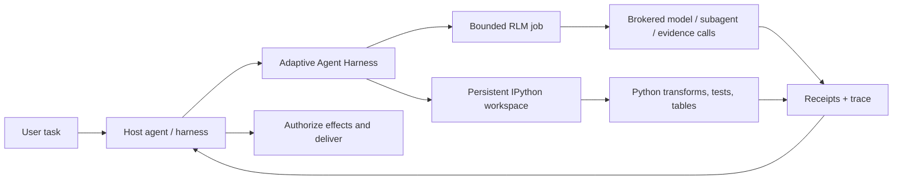

<div align="center">

# Adaptive Agent Harness

### 에이전트에게 더 큰 프롬프트가 아니라 작업대를 제공하세요.

**host가 구성하는 RLM + persistent IPython + durable operations + host-owned authority**

[](https://www.python.org/)
[](https://modelcontextprotocol.io/)
[](https://github.com/phenomenoner/adaptive-agent-harness/releases/tag/v0.4.0a5)
[](../../LICENSE)
[](#프로젝트-상태)

[**빠른 시작**](#빠른-시작) · [**왜 RLM + IPython인가?**](#왜-rlm--ipython인가) · [**얻게 되는 것**](#얻게-되는-것) · [**아키텍처**](#아키텍처) · [**기술 상태**](../../TECHNICAL-STATUS.md)

</div>

[English](../../README.md) · [**繁中**](README.zh-TW.md) · [简中](README.zh-CN.md) · [Español](README.es.md) · [Português](README.pt-BR.md) · [Français](README.fr.md) · [Deutsch](README.de.md) · [日本語](README.ja.md) · [한국어](README.ko.md) · [Русский](README.ru.md) · [العربية](README.ar.md) · [Italiano](README.it.md) · [Tiếng Việt](README.vi.md) · [ไทย](README.th.md) · [Čeština](README.cs.md) · [Suomi](README.fi.md) · [Norsk](README.no.md) · [Lietuvių](README.lt.md)

---

## 30초 요약

대부분의 에이전트는 비싸고 잘 잊는 하나의 인터페이스, 즉 프롬프트만으로 큰 문제를 해결하도록 요구받습니다.

**Adaptive Agent Harness는 대신 프로그래밍 가능한 작업대를 제공합니다.**host가 구성하는 두 개의 sibling surfaces를 나란히 사용할 수 있습니다. 하나는 stateful computation을 위한 persistent IPython workspaces이고, 다른 하나는 brokered evidence와 model calls를 위한 bounded RLM jobs입니다. durable receipts와 작은 MCP surface를 통해 두 표면 모두를 govern하고 다시 연결할 수 있습니다.

현재 public alpha는 IPython workspace 안에서 RLM job을 실행하지 않으며, 두 surface 사이에서 state를 자동으로 공유하지도 않습니다. 선택한 evidence, values 또는 artifacts의 명시적 전달은 host가 담당합니다.

다음과 같은 능력이 필요한 에이전트를 위한 실용적인 기반입니다.

- 하나의 context window보다 큰 입력을 대상으로 추론하기;
- 반복되는 도구 호출 왕복을 간결한 Python 프로그램으로 바꾸기;
- 단계 사이에서 변수, 테이블, 도우미 함수 및 증거를 유지하기;
- 프런트엔드 연결이 끊겨도 이를 취소로 오인하지 않고 계속하기;
- receipt로 뒷받침되는 확실한 경계에서만 재개하기;
- 최종 권한, 자격 증명, 효과 및 전달을 host에 맡기기.

Python 배포판의 현재 이름은 **`adaptive-agent-runtime`**입니다. 이 repository는 **Adaptive Agent Harness**라는 이름으로 그 공개 프로젝트 홈 역할을 합니다.

---

## RLM이란?

**Recursive Language Model (RLM)**은 긴 프롬프트나 corpus를 외부 환경의 데이터로 취급합니다. 모델의 활성 context에 모든 것을 억지로 넣는 대신, 모델은 다음을 수행하는 프로그램을 작성할 수 있습니다.

1. 데이터를 검사하기;
2. 데이터를 필터링, 분할, 조인, 순위화 또는 요약하기;
3. 선택한 조각에 대해 모델 또는 하위 에이전트를 호출하기;
4. 반환된 증거를 결합하기;
5. 명시적인 제한 내에서 반복하기.

중요한 개념은 “무한 재귀”가 아닙니다. **프로그래밍 방식의 추론 시간 확장(programmatic inference-time scaling)**입니다. 가치가 더해지는 곳에 모델 호출을 사용하고, 나머지는 일반 계산으로 처리합니다.

간단한 개념 모델:

```text
Traditional long-context agent
  prompt -> one model call -> more prompt -> another model call

RLM-style agent
  long input -> Python examines it -> selected model/subagent calls
             -> Python combines evidence -> bounded answer + trace
```

이 용어는 Zhang, Kraska, Khattab의 [Recursive Language Models](https://arxiv.org/abs/2512.24601) 연구에서 나왔습니다. Adaptive Agent Harness는 **제한된 broker 기반 RLM runtime**을 구현합니다. 모든 workload에 재귀가 필요하다고 주장하지 않으며, 호출이 많아지면 자동으로 더 나은 답이 나온다고 주장하지도 않습니다.

---

## 왜 IPython인가?

장시간 실행되는 에이전트에는 데이터를 단지 이야기하는 것이 아니라 **데이터와 함께** 생각할 장소도 필요합니다. IPython은 RLM surface를 보완하는 별도의 영속적 계산 workspace를 제공합니다.

- 변수는 실행 단계 사이에서도 계속 사용할 수 있습니다;
- DataFrames, 배열, 구문 분석된 문서 및 그래프 결과를 직접 검사할 수 있습니다;
- 도우미 함수로 반복적인 도구 호출 루프를 대체할 수 있습니다;
- 모델은 가설을 테스트하고, 결과를 검사하고, 다음 단계를 다듬을 수 있습니다;
- 간결한 참조는 context에 남겨 두고 전체 데이터는 작업 공간에 유지할 수 있습니다;
- 임의의 살아 있는 Python 객체가 이식 가능하다고 가장하지 않고, 선택한 JSON-like 상태를 checkpoint할 수 있습니다.

채팅 기록은 무엇을 말했는지에 대한 기록입니다. **IPython 작업 공간은 무엇을 계산했는지에 대한 작업 집합입니다.**

이 차이는 장기 연구, 코드베이스 분석, 데이터 조사, 평가, 그리고 에이전트가 같은 자료를 계속 다시 읽어야 하는 모든 작업에서 중요합니다.

---

## 왜 RLM × IPython인가?

여기서 “×”는 **host composition**을 뜻하며, in-process RLM/workspace binding을 뜻하지 않습니다. 각 sibling surface는 서로 다른 failure mode를 다룹니다.

| 계층 | 기여하는 것 |
|---|---|
| **RLM** | 큰 문제를 어떻게 분해할지, 제한된 모델／하위 에이전트 호출이 어디에서 유용한지 결정합니다. |
| **IPython** | 라이브 작업 공간에서 루프, 조인, 필터, 순위화, 테스트 및 상태를 유지하는 조사를 실행합니다. |
| **Adaptive Agent Harness** | 영속적인 operation identity, grant, budget, receipt, artifact, recovery policy 및 host-neutral MCP access를 추가합니다. |
| **Your host agent** | identity, provider credentials, approval, privileged effects, acceptance 및 최종 delivery를 소유합니다. |

host는 선택한 evidence, values 또는 artifacts를 surface 사이에 명시적으로 전달하여 두 surface를 조합합니다. 암시적 shared namespace는 없으며 자동 RLM-to-IPython execution path도 없습니다.



지배 규칙은 의도적으로 단순합니다.

> **host는 sibling surfaces를 명시적으로 조합합니다. Python은 workspace 언어이며 host는 계속 authority boundary로 남습니다.**

---

## 얻게 되는 것

### 프로그래밍 가능한 에이전트 작업대

- 영속적인 plain-Python 및 IPython 작업 공간;
- generation 및 revision 검사 기능이 있는 제한된 코드 실행;
- 기본 runtime에서 NumPy와 pandas 사용 가능;
- 명시적 제외 항목이 있는 결정론적 JSON-subset checkpoints;
- 더 크거나 inline이 아닌 결과를 artifact로 뒷받침하여 처리.

### broker 기반 RLM 엔진

- 영속화된 RLM jobs, steps, usage 및 terminal results;
- 명시적인 model-request, subagent, artifact 및 evidence broker contracts;
- 작업별 wall-time, model-call, token, child-operation 및 artifact budgets;
- “도구가 아마 실행되었을 것”이 아니라 보존된 handles와 receipts;
- 호출이 시작되었을 수 있지만 권위 있는 receipt가 없을 때의 reconciliation.

### Durable operations

- attempts, workers, leases 및 frontend connections와 분리된 안정적인 논리 operation IDs;
- 하나의 MCP request보다 오래 지속될 수 있는 accepted work;
- cursor로 읽을 수 있는 events, status, cancel 및 reconcile operations;
- 일시적이고 인증된 frontends를 가진 durable supervisor;
- PID만으로 소유권을 판단하지 않고 정확한 process-start identity 사용;
- deadline, cancellation 및 누적 usage를 유지하는 successor attempts.

### Portable contracts

- 현재 v7 surface의 30 MCP tools;
- versioned schemas 및 digest-bound assets;
- Codex 및 Hermes profiles에 포함된 operation guidance;
- 개발 및 conformance testing을 위한 deterministic reference brokers;
- AHC, Prime Agent 또는 NOOA를 요구하지 않는 host-neutral boundaries.

---

## 특히 잘 맞는 분야

Adaptive Agent Harness는 다음에 적합합니다.

- **긴 문서 연구**——검색, 조각내기, 비교 및 증거의 재귀적 종합;
- **코드베이스 조사**——symbol sets, call paths, test evidence 및 candidate changes 유지;
- **데이터 분석**——자연어 질문과 DataFrame 작업 사이를 오가기;
- **evaluation pipelines**——inputs, scores, receipts 및 artifacts를 하나의 operation에 묶기;
- **agent infrastructure experiments**——두 번째 사용자 대상 agent OS를 만들지 않고 durable execution과 recovery를 테스트하기;
- **controlled worker integration**——더 풍부한 workers를 명시적인 budgets, handles 및 host acceptance 뒤에 배치하기.

이는 완전한 autonomous coding agent보다 의도적으로 범위가 좁습니다. 이미 orchestrator가 있고 그 아래에 신뢰할 수 있는 computation and evidence plane이 필요할 때 유용합니다.

---

## 다른 RLM 프로젝트와의 관계

공개된 작업에서 배웠지만, 프로젝트들이 서로 교체 가능하다고 가장하지는 않습니다.

- **[Prime Agent](https://github.com/PrimeIntellect-ai/prime-agent)**는 영속적인 IPython 환경, 프로그래밍 방식의 도구 사용, 네이티브 child agents 및 daemon-backed continuity의 제품 가치를 보여 줍니다. Prime은 더 완전한 coding/research agent 경험입니다. Adaptive Agent Harness는 더 좁은 runtime/control layer이며 Prime과 같은 worker를 보완할 수 있지만 대체하지는 않습니다.
- **[NVIDIA Object Oriented Agents (NOOA)](https://github.com/NVIDIA-NeMo/labs-OO-Agents)**는 Python-native typed agent capabilities object model과 CodeAct-style orchestration을 보여 줍니다. 여기서 NOOA는 설계 입력일 뿐이며, bundled NOOA adapter나 dependency는 없습니다.
- **[Recursive Language Models](https://arxiv.org/abs/2512.24601)**는 핵심 추론 패러다임을 제공합니다. 긴 context를 외부 환경으로 취급하고 모델이 프로그래밍 방식으로 검사하고 재귀적으로 질의하도록 합니다.

더 깊은 설계 근거와 source notes는 [왜 RLM + IPython인가](../../docs/WHY-RLM-AND-IPYTHON.md)를 참조하세요.

---

## 빠른 시작

> **공개 alpha:** pinned tag를 사용하고 host가 반환하는 capabilities를 검사하며 disposable workspaces부터 시작하세요. 이 프로젝트는 모델이 작성한 Python을 실행하며 **security sandbox가 아닙니다**.

### 최신 공개 tag에서 설치

```bash
uv tool install --force \
  "git+https://github.com/phenomenoner/adaptive-agent-harness.git@v0.4.0a5"
```

### Codex App 설정

```bash
aar-codex-setup
```

setup receipt에 구성이 변경되었다고 표시되면 Codex App을 다시 시작한 뒤 새 task에서 `aar_capabilities`를 호출하세요.

### source에서 개발

```bash
git clone https://github.com/phenomenoner/adaptive-agent-harness.git
cd adaptive-agent-harness
uv sync --locked
uv run aar-contract verify
uv run pytest -q
```

### MCP workflow로 시작

1. `aar_capabilities`를 호출하고 반환된 runtime generation 및 capability digest에 bind합니다.
2. workspace를 생성하거나 attach하거나, 제한된 `rlm.execute` operation을 submit합니다.
3. 반환된 operation handle을 유지합니다.
4. 필요할 때 새로운 권한 부여 연결에서 status／events를 읽습니다.
5. effect 형태의 작업을 retry하기 전에 불확실성을 reconcile합니다.

자세한 install 및 host notes:

- [Codex 설치](../../docs/CODEX-INSTALL.md)
- [Host compatibility](../../HOST-COMPATIBILITY.md)
- [아키텍처](../../ARCHITECTURE.md)
- [Operation skill](../../skills/aar-operations/SKILL.md)
- [Technical verification status](../../TECHNICAL-STATUS.md)

---

## 아키텍처

Adaptive Agent Harness는 small-waist design을 따릅니다.

```text
Host / orchestrator
  ├─ owns identity, provider credentials, approvals, effects, delivery
  └─ connects through MCP or a native adapter
          |
          v
Adaptive Agent Harness
  ├─ operation registry + event log + receipts
  ├─ bounded RLM engine + broker journal
  ├─ programmable workspace manager
  ├─ durable supervisor + exact worker identity
  ├─ checkpoints, artifacts, assets, export/import
  └─ capability, grant, budget, deadline, and generation fencing
          |
          v
Plain Python / IPython workers and host-authorized brokers
```

MCP frontend는 의도적으로 교체 가능합니다. continuity database나 worker lifecycle을 소유하지 않으며, durable supervisor가 이를 담당합니다.

---

## 프로젝트 상태

현재 공개 alpha: **`0.4.0a5`**.

> **Translation status:** the overview below retains the `v0.3.0a1` public baseline as historical
> context. For `v0.4.0a5` receipt-backed model routing, current verification, and exact release
> boundaries, read the canonical English [release notes](../RELEASE-v0.4.0a5.md) and
> [model-routing guide](../MODEL-ROUTING-AND-EVALUATION.md).


이 public candidate에서 재현한 항목:

- Python 3.11부터 3.14까지의 coverage;
- 30-tool MCP v7 surface;
- v5까지의 additive SQLite schema;
- 전체 repository 실행: **249 passed, 1 platform-gated skip**;
- Linux/WSL에서 clean exact-wheel supervisor/frontend probe;
- durable supervisor, frontend replacement, process-loss, stale-writer, receipt-reuse 및 policy-bound RLM successor scenarios.

이전 native-Windows 및 installed-Hermes compatibility rows는 **maintainer-reported historical context**로 유지됩니다. 이를 뒷받침하는 host receipts는 이 public repository에 포함되어 있지 않으므로, 이러한 rows는 이 tree에서 독립적으로 감사할 수 없으며 public source candidate의 release criteria도 아닙니다.

아직 열려 있는 항목:

- 더 광범위한 IPython workspace state를 새 generation으로 portable하게 자동 restoration;
- general external-effect reconciliation adapters;
- multi-tenant security isolation;
- generic exactly-once effects;
- package-registry publication 및 stable API guarantees.

production claims를 하기 전에 [TECHNICAL-STATUS.md](../../TECHNICAL-STATUS.md), [HOST-COMPATIBILITY.md](../../HOST-COMPATIBILITY.md), 를 읽으세요.

---

## 이 프로젝트가 **하지 않는 것**

- **security sandbox가 아닙니다.**
- 설계상 provider credentials를 보유**하지 않습니다**.
- 임의의 external effects를 실행하거나 사용자 메시지를 스스로 전달**하지 않습니다**.
- universal exactly-once semantics를 약속**하지 않습니다**.
- 임의의 Python stacks, sockets, generators 또는 native process memory를 되살리**지 않습니다**.
- Prime Agent, NOOA, CodeGraph, Hermes, Codex 또는 AHC를 runtime dependency로 만들**지 않습니다**.

권한에 관한 문장은 다음과 같습니다.

> **Adaptive Agent Harness는 계산하고 제안합니다. host가 승인하고 전달합니다.**

---

## 기여하기

issues, 집중된 pull requests, compatibility reports 및 재현 가능한 failure fixtures를 환영합니다. 먼저 [CONTRIBUTING.md](../../CONTRIBUTING.md)와 [SECURITY.md](../../SECURITY.md)를 읽어 주세요.

기여하기 좋은 영역:

- 추가 host profiles 및 black-box compatibility rows;
- checkpoint eligibility 및 exclusion ergonomics;
- broker/effect reconciliation adapters;
- bounded RLM strategies 및 evidence-heavy benchmarks;
- worker backends 및 artifact stores;
- 문서 및 번역 수정.

---

## 라이선스

[MIT](../../LICENSE) © 2026 phenomenoner.

---

## 참고 자료

- Alex L. Zhang, Tim Kraska 및 Omar Khattab, [Recursive Language Models](https://arxiv.org/abs/2512.24601), arXiv:2512.24601.
- [Prime Agent](https://github.com/PrimeIntellect-ai/prime-agent), Prime Intellect.
- [NVIDIA Object Oriented Agents](https://github.com/NVIDIA-NeMo/labs-OO-Agents), NVIDIA-NeMo.
- [Model Context Protocol](https://modelcontextprotocol.io/).
