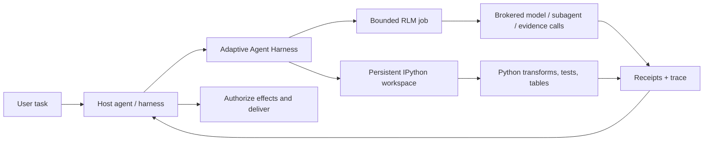

<div align="center">

> **`0.6.0a0`** public alpha · [`phenomenoner/adaptive-agent-harness@v0.6.0a0`](https://github.com/phenomenoner/adaptive-agent-harness/releases/tag/v0.6.0a0)

# Adaptive Agent Harness

### Suteikite agentams darbo aplinką — ne tik didesnį promptą.

**Hosto komponuojamas RLM + išliekantis IPython + patvarios operacijos + hosto valdoma kontrolė**

[](https://www.python.org/)
[](https://modelcontextprotocol.io/)
[](https://github.com/phenomenoner/adaptive-agent-harness/releases/tag/v0.6.0a0)
[](../../LICENSE)
[](#projekto-būsena)

[**Greitoji pradžia**](#greitoji-pradžia) · [**Kodėl RLM + IPython?**](#kodėl-rlm--ipython) · [**Ką gaunate**](#ką-gaunate) · [**Architektūra**](#architektūra) · [**Techninė būsena**](../../TECHNICAL-STATUS.md)

</div>

[English](../../README.md) · [**繁中**](README.zh-TW.md) · [简中](README.zh-CN.md) · [Español](README.es.md) · [Português](README.pt-BR.md) · [Français](README.fr.md) · [Deutsch](README.de.md) · [日本語](README.ja.md) · [한국어](README.ko.md) · [Русский](README.ru.md) · [العربية](README.ar.md) · [Italiano](README.it.md) · [Tiếng Việt](README.vi.md) · [ไทย](README.th.md) · [Čeština](README.cs.md) · [Suomi](README.fi.md) · [Norsk](README.no.md) · [Lietuvių](README.lt.md)

---

## Atsakymas per 30 sekundžių

Daugumos agentų prašoma spręsti dideles problemas naudojant vieną brangią ir greitai užmirštančią sąsają: promptą.

**Adaptive Agent Harness vietoj to suteikia programuojamą darbo aplinką.** Hostas gali komponuoti ir greta naudoti du gretimus paviršius: išliekančias IPython darbo sritis skaičiavimams su būsena ir ribotas RLM užduotis per brokerį gaunamiems įrodymams bei modelio iškvietimams. Patvarūs kvitai ir nedidelis MCP paviršius leidžia abi valdyti ir pasiekti vėl prisijungus.

Dabartinė viešoji alfa **nevykdo RLM užduoties IPython darbo srityje ir automatiškai nesidalija būsena tarp jų**. Hostas pats aiškiai perduoda pasirinktus įrodymus, reikšmes ar artefaktus.

Tai praktinis pagrindas agentams, kuriems reikia:

- samprotauti apie įvestis, didesnes už vieną konteksto langą;
- pasikartojantį įrankių iškvietimų triukšmą paversti kompaktiškomis Python programomis;
- tarp žingsnių išlaikyti kintamuosius, lenteles, pagalbines funkcijas ir įrodymus;
- išgyventi frontend'o atsijungimą nesupainiojant jo su atšaukimu;
- tęsti darbą tik nuo tikros, kvitu patvirtintos ribos;
- galutinį autoritetą, kredencialus, efektus ir pristatymą palikti hostui.

Python distribucija šiuo metu vadinama **`adaptive-agent-runtime`**. Ši saugykla yra viešieji projekto namai, naudojantys pavadinimą **Adaptive Agent Harness**.

---

## Kas yra RLM?

**Rekursyvusis kalbos modelis (Recursive Language Model, RLM)** ilgą promptą arba korpusą traktuoja kaip duomenis išorinėje aplinkoje. Užuot suspaudęs viską į aktyvų modelio kontekstą, modelis gali rašyti programas, kurios:

1. tiria duomenis;
2. juos filtruoja, skaido, jungia, rikiuoja arba apibendrina;
3. parinktoms ištraukoms iškviečia modelį arba subagentą;
4. sujungia grąžintus įrodymus;
5. kartoja tai neperžengdamos aiškiai nustatytų ribų.

Svarbiausia čia ne „begalinė rekursija“, o **programinis mastelio keitimas išvedimo metu**: skirti modelio iškvietimus ten, kur jie suteikia vertę, o visur kitur naudoti įprastus skaičiavimus.

Paprastas mąstymo modelis:

```text
Traditional long-context agent
  prompt -> one model call -> more prompt -> another model call

RLM-style agent
  long input -> Python examines it -> selected model/subagent calls
             -> Python combines evidence -> bounded answer + trace
```

Šis terminas kilo iš Zhang, Kraska ir Khattab darbo [Recursive Language Models](https://arxiv.org/abs/2512.24601). Adaptive Agent Harness įgyvendina **ribotą, per brokerį valdomą RLM vykdymo aplinką**; jis neteigia, kad kiekvienam darbo krūviui reikia rekursijos arba kad daugiau iškvietimų automatiškai duoda geresnį atsakymą.

---

## Kodėl IPython?

Ilgai veikiantiems agentams taip pat reikia vietos mąstyti **su duomenimis**, o ne tik apie juos kalbėti. IPython papildo RLM paviršių, suteikdamas hostui atskirą išliekančią skaičiavimo darbo sritį:

- kintamieji lieka pasiekiami tarp vykdymo žingsnių;
- DataFrame, masyvus, išanalizuotus dokumentus ir grafų rezultatus galima tikrinti tiesiogiai;
- pagalbinės funkcijos gali pakeisti pasikartojančius įrankių iškvietimų ciklus;
- modelis gali patikrinti hipotezę, ištirti rezultatą ir patikslinti kitą žingsnį;
- kompaktiškos nuorodos gali likti kontekste, o visi duomenys — darbo srityje;
- pasirinktą JSON panašią būseną galima išsaugoti kontroliniame taške, neapsimetant, kad bet kokie gyvi Python objektai yra perkeliami.

Pokalbio transkriptas yra to, kas buvo pasakyta, įrašas. **IPython darbo sritis yra to, kas buvo apskaičiuota, darbinis rinkinys.**

Šis skirtumas svarbus atliekant ilgus tyrimus, analizuojant kodų bazę ar duomenis, vykdant vertinimo konvejerius ir atliekant bet kokią užduotį, kai agentui kitu atveju tektų vis iš naujo skaityti tą pačią medžiagą.

---

## Kodėl RLM × IPython?

Čia „ד reiškia **hosto kompoziciją**, o ne RLM ir darbo srities susiejimą viename procese. Kiekvienas gretimas paviršius sprendžia skirtingą gedimo režimą:

| Sluoksnis | Ką jis suteikia |
|---|---|
| **RLM** | Nusprendžia, kaip išskaidyti didelę problemą ir kur naudingi riboti modelio / subagento iškvietimai. |
| **IPython** | Gyvoje darbo srityje vykdo ciklus, sujungimus, filtravimą, rikiavimą, testus ir būseną išlaikantį tyrimą. |
| **Adaptive Agent Harness** | Prideda patvarią operacijos tapatybę, leidimus, biudžetus, kvitus, artefaktus, atkūrimo politiką ir hostui neutralią MCP prieigą. |
| **Jūsų hosto agentas** | Valdo tapatybę, teikėjo kredencialus, patvirtinimą, privilegijuotus efektus, priėmimą ir galutinį pristatymą. |

Hostas gali juos komponuoti, aiškiai perduodamas tarp paviršių pasirinktus įrodymus, reikšmes ar artefaktus. Nėra nei numanomos bendros vardų srities, nei automatinio RLM vykdymo kelio į IPython.



Pagrindinė taisyklė sąmoningai paprasta:

> **Hostas aiškiai komponuoja gretimus paviršius; Python yra darbo srities kalba, o hostas išlieka autoriteto riba.**

---

## Ką gaunate

### Programuojama agento darbo sritis

- išliekančias plain-Python ir IPython darbo sritis;
- ribotą kodo vykdymą su generacijos ir revizijos patikromis;
- NumPy ir pandas pasiekiami numatytojoje vykdymo aplinkoje;
- deterministinius JSON poaibio kontrolinius taškus su aiškiai nurodytomis išimtimis;
- didesnių arba neįterpiamų rezultatų tvarkymą naudojant artefaktus.

### Per brokerį valdomas RLM variklis

- išsaugotas RLM užduotis, žingsnius, naudojimo duomenis ir galutinius rezultatus;
- aiškius modelio užklausų, subagentų, artefaktų ir įrodymų brokerio kontraktus;
- kiekvienos operacijos vykdymo laiko, modelio iškvietimų, žetonų, antrinių operacijų ir artefaktų biudžetus;
- išlaikomus deskriptorius ir kvitus vietoj „įrankis tikriausiai suveikė“;
- sutikrinimą, kai iškvietimas galėjo prasidėti, tačiau nėra autoritetingo kvito.

### Patvarios operacijos

- stabilius loginius operacijų ID, atskirtus nuo bandymų, darbuotojų, nuomų ir frontend'o ryšių;
- priimtą darbą, galintį tęstis po vienos MCP užklausos;
- pagal kursorių skaitomus įvykius, būsenos, atšaukimo ir sutikrinimo operacijas;
- patvarų prižiūrėtoją su trumpalaikiais autentifikuotais frontend'ais;
- tikslią proceso paleidimo tapatybę vietoj nuosavybės nustatymo vien pagal PID;
- įpėdinių bandymus, išlaikančius terminą, atšaukimą ir sukauptą naudojimą.

### Perkeliami kontraktai

- 30 MCP įrankių dabartiniame v7 paviršiuje;
- versijuojamas schemas ir su digestu susietus aktyvus;
- integruotus operacijų nurodymus Codex ir Hermes profiliams;
- deterministinius etaloninius brokerius kūrimui ir atitikties tikrinimui;
- hostui neutralias ribas, kurioms nereikia AHC, Prime Agent ar NOOA.

---

## Kur jis ypač praverčia

Adaptive Agent Harness ypač tinka:

- **ilgų dokumentų tyrimui** — paieškai, skaidymui, lyginimui ir rekursiniam įrodymų sintezavimui;
- **kodų bazės tyrimui** — simbolių rinkiniams, iškvietimų keliams, testų įrodymams ir kandidatiniams pakeitimams išlaikyti;
- **duomenų analizei** — pereiti nuo klausimų natūraliąja kalba prie DataFrame operacijų;
- **vertinimo konvejeriams** — susieti įvestis, balus, kvitus ir artefaktus su viena operacija;
- **agentų infrastruktūros eksperimentams** — išbandyti patvarų vykdymą ir atkūrimą nekuriant antros naudotojui skirtos agentų OS;
- **kontroliuojamai darbuotojų integracijai** — sudėti sudėtingesnius darbuotojus už aiškių biudžetų, deskriptorių ir hosto priėmimo ribos.

Jis sąmoningai siauresnis už visavertį autonominį kodavimo agentą. Tai naudinga, jei jau turite orkestratorių ir po juo reikia patikimo skaičiavimo bei įrodymų sluoksnio.

---

## Kaip tai susiję su kitais RLM projektais

Mokėmės iš viešai prieinamų darbų, neapsimesdami, kad projektai yra pakeičiami vienas kitu:

- **[Prime Agent](https://github.com/PrimeIntellect-ai/prime-agent)** parodo nuolatinės IPython aplinkos, programinio įrankių naudojimo, vietinių vaikinių agentų ir demonu grindžiamo tęstinumo produkto vertę. Prime yra išsamesnė kodavimo ir tyrimų agento patirtis. Adaptive Agent Harness yra siauresnis vykdymo ir valdymo sluoksnis, todėl gali papildyti tokį darbuotoją kaip Prime, o ne jį pakeisti.
- **[NVIDIA Object Oriented Agents (NOOA)](https://github.com/NVIDIA-NeMo/labs-OO-Agents)** parodo Python prigimtinį, tipizuotą agentų gebėjimų objektinį modelį ir CodeAct stiliaus orkestravimą. NOOA čia yra tik projektavimo įvestis: nėra pateikiamo NOOA adapterio ar priklausomybės.
- **[Recursive Language Models](https://arxiv.org/abs/2512.24601)** pateikia pagrindinę išvedimo paradigmą: ilgą kontekstą laikyti išorine aplinka, kurią modelis gali programiškai tirti ir rekursyviai užklausti.

Išsamesnį projektavimo pagrindimą ir šaltinių pastabas rasite [Why RLM + IPython](../../docs/WHY-RLM-AND-IPYTHON.md).

---

## Greitoji pradžia

> **Viešoji alfa:** naudokite prisegtą žymą, peržiūrėkite savo hosto grąžinamas galimybes ir pradėkite nuo vienkartinių darbo sričių. Šis projektas vykdo modelio parašytą Python kodą ir **nėra saugumo smėlio dėžė**.

### Diegimas iš naujausios viešos žymos

```bash
uv tool install --force \
  "git+https://github.com/phenomenoner/adaptive-agent-harness.git@v0.6.0a0"
```

### Codex App sąranka

```bash
aar-codex-setup
```

Perkraukite Codex Desktop, jei sąrankos kvite nurodyta `restart_required: true`; po rankinio pritaikymo išsaugokite kvitą `restart_required_after_manual_apply: true`; vėlesnis no-op kvitas su `restart_required: false` nepanaikina būtinybės paleisti iš naujo. Tada naujoje užduotyje iškvieskite `aar_capabilities`.

### Kūrimas iš šaltinio

```bash
git clone https://github.com/phenomenoner/adaptive-agent-harness.git
cd adaptive-agent-harness
uv sync --locked
uv run aar-contract verify
uv run pytest -q
```

### Pradžia su MCP darbo eiga

1. Iškvieskite `aar_capabilities` ir susiekite grąžintą vykdymo aplinkos generaciją bei galimybių santrauką.
2. Sukurkite darbo sritį arba prie jos prisijunkite, arba pateikite ribotą `rlm.execute` operaciją.
3. Išsaugokite grąžintą operacijos deskriptorių.
4. Prireikus iš naujo autorizuotu ryšiu skaitykite būseną ir įvykius.
5. Prieš kartodami efektų pobūdžio darbą, sutikrinkite neapibrėžtumą.

Išsami diegimo ir hosto informacija:

- [Codex diegimas](../../docs/CODEX-INSTALL.md)
- [Hosto suderinamumas](../../HOST-COMPATIBILITY.md)
- [Architektūra](../../ARCHITECTURE.md)
- [Operacijų įgūdis](../../skills/aar-operations/SKILL.md)
- [Techninės patikros būsena](../../TECHNICAL-STATUS.md)

---

## Architektūra

Adaptive Agent Harness laikosi mažosios juosmens architektūros:

```text
Host / orchestrator
  ├─ owns identity, provider credentials, approvals, effects, delivery
  └─ connects through MCP or a native adapter
          |
          v
Adaptive Agent Harness
  ├─ operation registry + event log + receipts
  ├─ bounded RLM engine + broker journal
  ├─ programmable workspace manager
  ├─ durable supervisor + exact worker identity
  ├─ checkpoints, artifacts, assets, export/import
  └─ capability, grant, budget, deadline, and generation fencing
          |
          v
Plain Python / IPython workers and host-authorized brokers
```

MCP frontend'as sąmoningai pakeičiamas. Jis nevaldo tęstinumo duomenų bazės ar darbuotojo gyvavimo ciklo; tuo rūpinasi patvarus prižiūrėtojas.

---

## Projekto būsena

Dabartinė viešoji alfa: **`0.6.0a0`**.

> **Translation status:** the overview below retains the `v0.3.0a1` public baseline as historical
> context. For `v0.6.0a0` receipt-backed model routing, current verification, and exact release
> boundaries, read the canonical English [release notes](../RELEASE-v0.6.0a0.md) and
> [model-routing guide](../MODEL-ROUTING-AND-EVALUATION.md).


Current `v0.6.0a0` public release evidence:

- Python 3.11–3.14 palaikymas;
- 38-tool MCP v8 executable surface (frozen 30-tool MCP v7 prefix + exact 8-tool successor suffix);
- papildanti SQLite schema iki v5;
- full repository run: **743 passed, 5 platform-gated skips, 1 existing MCP Sampling deprecation warning**;
- švarus exact-wheel supervisor/frontend bandymas Linux/WSL aplinkoje;
- patvaraus prižiūrėtojo, frontend'o pakeitimo, proceso praradimo, pasenusio rašytojo, kvito pakartotinio panaudojimo ir su politika susieto RLM įpėdinio scenarijai.

Ankstesnės native-Windows ir įdiegto Hermes suderinamumo eilutės išlaikomos kaip
**prižiūrėtojų pateiktas istorinis kontekstas**. Jas pagrindžiantys hosto kvitai į šią
viešąją saugyklą neįtraukti, todėl šių eilučių negalima nepriklausomai audituoti iš šio medžio ir jos nėra viešojo šaltinio kandidato
išleidimo kriterijai.

Dar atvira:

- platesnės IPython darbo srities būsenos automatinis perkėlimas į naują generaciją;
- bendri išorinių efektų sutikrinimo adapteriai;
- kelių nuomininkų saugumo izoliacija;
- bendrieji tiksliai vieną kartą atliekami efektai;
- publikavimas paketų registre ir stabilios API garantijos.

Prieš teikdami gamybinius teiginius perskaitykite [TECHNICAL-STATUS.md](../../TECHNICAL-STATUS.md), [HOST-COMPATIBILITY.md](../../HOST-COMPATIBILITY.md) ir .

---

## Ko šis projektas **nedaro**

- Jis **nėra saugumo smėlio dėžė**.
- Jis pagal projektą **nelaiko jūsų teikėjo kredencialų**.
- Jis **nevykdo savavališkų išorinių efektų ir pats nepristato naudotojų žinučių**.
- Jis **nežada universalios tiksliai vieną kartą vykdomų operacijų semantikos**.
- Jis **neatkuria savavališkų Python stekų, lizdų, generatorių ar savosios proceso atminties**.
- Jis **nepaverčia Prime Agent, NOOA, CodeGraph, Hermes, Codex ar AHC vykdymo aplinkos priklausomybe**.

Autoriteto teiginys:

> **Adaptive Agent Harness skaičiuoja ir siūlo. Hostas autorizuoja ir pristato.**

---

## Prisidėjimas

Laukiame problemų, kryptingų pull request'ų, suderinamumo ataskaitų ir atkuriamų gedimų fikstūrų. Pirmiausia perskaitykite [CONTRIBUTING.md](../../CONTRIBUTING.md) ir [SECURITY.md](../../SECURITY.md).

Naudingos indėlio sritys:

- papildomi hosto profiliai ir juodosios dėžės suderinamumo eilutės;
- kontrolinių taškų tinkamumo ir išimčių ergonomikos tobulinimas;
- brokerio / efektų sutikrinimo adapteriai;
- ribotos RLM strategijos ir įrodymais paremti etalonai;
- darbuotojų backend'ai ir artefaktų saugyklos;
- dokumentacijos ir vertimų pataisymai.

---

## Licencija

[MIT](../../LICENSE) © 2026 phenomenoner.

---

## Nuorodos

- Alex L. Zhang, Tim Kraska ir Omar Khattab, [Recursive Language Models](https://arxiv.org/abs/2512.24601), arXiv:2512.24601.
- [Prime Agent](https://github.com/PrimeIntellect-ai/prime-agent), Prime Intellect.
- [NVIDIA Object Oriented Agents](https://github.com/NVIDIA-NeMo/labs-OO-Agents), NVIDIA-NeMo.
- [Model Context Protocol](https://modelcontextprotocol.io/).
