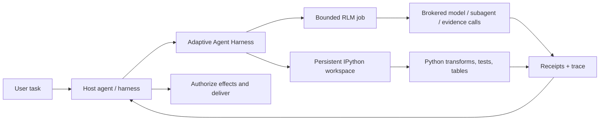

<div align="center">

# Adaptive Agent Harness

### Gi agentene en arbeidsbenk – ikke bare en større prompt.

**Vertsammensatt RLM + vedvarende IPython + varige operasjoner + vertens myndighet**

[](https://www.python.org/)
[](https://modelcontextprotocol.io/)
[](https://github.com/phenomenoner/adaptive-agent-harness/releases/tag/v0.4.0a0)
[](../../LICENSE)
[](#prosjektstatus)

[**Hurtigstart**](#hurtigstart) · [**Hvorfor RLM + IPython?**](#hvorfor-rlm--ipython) · [**Dette får du**](#dette-får-du) · [**Arkitektur**](#arkitektur) · [**Teknisk status**](../../TECHNICAL-STATUS.md)

</div>

[English](../../README.md) · [**繁中**](README.zh-TW.md) · [简中](README.zh-CN.md) · [Español](README.es.md) · [Português](README.pt-BR.md) · [Français](README.fr.md) · [Deutsch](README.de.md) · [日本語](README.ja.md) · [한국어](README.ko.md) · [Русский](README.ru.md) · [العربية](README.ar.md) · [Italiano](README.it.md) · [Tiếng Việt](README.vi.md) · [ไทย](README.th.md) · [Čeština](README.cs.md) · [Suomi](README.fi.md) · [Norsk](README.no.md) · [Lietuvių](README.lt.md)

---

## Det korte svaret på 30 sekunder

De fleste agenter blir bedt om å løse store problemer med ett dyrt grensesnitt som glemmer: prompten.

**Adaptive Agent Harness gir dem i stedet en programmerbar arbeidsbenk.** En vert kan bruke to vertsammensatte sibling surfaces side om side: vedvarende IPython-arbeidsområder for tilstandsbasert beregning og avgrensede RLM-jobber for meglet evidens og modellkall. Varige kvitteringer og en liten MCP-overflate gjør begge styrbare og mulige å koble til igjen.

Den nåværende offentlige alfaen **kjører ikke en RLM-jobb inne i et IPython-arbeidsområde og deler ikke tilstand mellom dem automatisk.** Verten må eksplisitt overføre utvalgt evidens, verdier eller artefakter.

Resultatet er et praktisk grunnlag for agenter som må:

- resonnere over inndata som er større enn ett kontekstvindu;
- gjøre gjentatt støy fra verktøykall om til kompakte Python-programmer;
- holde variabler, tabeller, hjelpefunksjoner og evidens tilgjengelig på tvers av trinn;
- tåle at frontend-tilkoblingen faller ut uten å forveksle det med kansellering;
- bare fortsette fra en bestemt, kvitteringsunderbygd grense;
- la verten beholde endelig myndighet over legitimasjon, effekter og levering.

Python-distribusjonen heter for øyeblikket **`adaptive-agent-runtime`**. Dette repositoriet er prosjektets offentlige hjem under navnet **Adaptive Agent Harness**.

---

## Hva er en RLM?

En **Recursive Language Model (RLM)** behandler en lang prompt eller et korpus som data i et eksternt miljø. I stedet for å presse alt inn i modellens aktive kontekst kan modellen skrive programmer som:

1. undersøker dataene;
2. filtrerer, deler opp, slår sammen, rangerer eller oppsummerer dem;
3. kaller en modell eller subagent på utvalgte deler;
4. kombinerer den returnerte evidensen;
5. gjentar dette innenfor eksplisitte grenser.

Det viktige er ikke «uendelig rekursjon». Det er **programmatisk skalering ved inferens**: bruk modellkall der de gir verdi, og vanlig beregning ellers.

Begrepet kommer fra arbeidet [Recursive Language Models](https://arxiv.org/abs/2512.24601) av Zhang, Kraska og Khattab. Adaptive Agent Harness implementerer en **avgrenset, meglet RLM-runtime**; det påstår ikke at alle arbeidsbelastninger trenger rekursjon, eller at flere kall automatisk gir et bedre svar.

En enkel mental modell:

```text
Traditional long-context agent
  prompt -> one model call -> more prompt -> another model call

RLM-style agent
  long input -> Python examines it -> selected model/subagent calls
             -> Python combines evidence -> bounded answer + trace
```

---

## Hvorfor IPython?

Langvarige agenter trenger også et sted å tenke **med data**, ikke bare snakke om dem. IPython utfyller RLM-flaten ved å gi verten et separat, vedvarende beregningsarbeidsområde:

- variabler forblir tilgjengelige på tvers av kjøringstrinn;
- DataFrames, tabeller, analyserte dokumenter og grafresultater kan undersøkes direkte;
- hjelpefunksjoner kan erstatte gjentatte løkker med verktøykall;
- modellen kan teste en hypotese, undersøke resultatet og forbedre neste trinn;
- kompakte referanser kan bli i konteksten mens alle dataene forblir i arbeidsområdet;
- utvalgt JSON-lignende tilstand kan checkpointes uten å late som vilkårlige aktive Python-objekter er flyttbare.

En chatutskrift er en oversikt over det som ble sagt. **Et IPython-arbeidsområde er et arbeidssett over det som er beregnet.**

Dette skillet er viktig for langvarig forskning, analyse av kodebaser, datagransking, evaluering og alle oppgaver der agenten ellers stadig måtte lese det samme materialet på nytt.

---

## Hvorfor RLM × IPython?

Her betyr «×» **vertskomposisjon**, ikke en RLM-/arbeidsområdeforbindelse i samme prosess. Hver sibling surface dekker en annen feilmodus:

| Lag | Dette bidrar den med |
|---|---|
| **RLM** | Bestemmer hvordan et stort problem skal brytes ned, og hvor avgrensede modell-/subagentkall er nyttige. |
| **IPython** | Kjører løkker, sammenføyninger, filtrering, rangering, tester og tilstandsbevisst gransking i et aktivt arbeidsområde. |
| **Adaptive Agent Harness** | Legger til varig operasjonsidentitet, grants, budsjetter, kvitteringer, artefakter, gjenopprettingspolicy og vertsnøytral MCP-tilgang. |
| **Din vertagent** | Eier identitet, leverandørlegitimasjon, godkjenning, privilegerte effekter, aksept og endelig levering. |

En vert kan sette dem sammen ved å overføre utvalgt, eksplisitt evidens, verdier eller artefakter mellom flatene. Det finnes ikke noe implisitt delt navnerom eller noen automatisk RLM-til-IPython-kjøringsbane.



De styrende reglene er med vilje enkle:

> **Verten setter sibling surfaces sammen eksplisitt; Python er et arbeidsområdespråk, og verten forblir myndighetsgrensen.**

---

## Dette får du

### En programmerbar agentarbeidsbenk

- vedvarende plain-Python- og IPython-arbeidsområder;
- avgrenset kodekjøring med generasjons- og revisjonssjekker;
- NumPy og pandas tilgjengelig i standard-runtime;
- deterministiske JSON-subsett-checkpointer med eksplisitte unntak;
- artefaktbasert håndtering av større resultater eller resultater som ikke kan legges inline.

### En meglet RLM-motor

- lagrede RLM-jobber, trinn, bruk og terminalresultater;
- eksplisitte brokerkontrakter for modellforespørsler, subagenter, artefakter og evidens;
- budsjetter per operasjon for veggtid, modellkall, token, underoperasjoner og artefakter;
- beholdte handlere og kvitteringer i stedet for «verktøyet kjørte nok»;
- avstemming når et kall kan ha startet, men ingen autoritativ kvittering finnes.

### Varige operasjoner

- stabile logiske operasjons-ID-er som er adskilt fra forsøk, workere, leases og frontend-tilkoblinger;
- akseptert arbeid som kan leve lenger enn én MCP-forespørsel;
- kursorlesbare hendelser samt operasjoner for status, kansellering og avstemming;
- en varig supervisor med kortlivede, autentiserte frontender;
- eksakt identitet ved prosessoppstart i stedet for eierskap basert bare på PID;
- etterfølgerforsøk som bevarer tidsfrist, kansellering og kumulativ bruk.

### Porterbare kontrakter

- 30 MCP-verktøy i dagens v7-grensesnitt;
- versjonerte skjemaer og digest-bundne assets;
- medfølgende operasjonsveiledning for Codex- og Hermes-profiler;
- deterministiske referansebrokere for utvikling og samsvarstesting;
- vertsnøytrale grenser som ikke krever AHC, Prime Agent eller NOOA.

---

## Hvor det passer best

Adaptive Agent Harness passer godt til:

- **forskning i lange dokumenter** — søke, dele opp, sammenligne og syntetisere evidens rekursivt;
- **undersøkelser av kodebaser** — beholde symbolsett, kallstier, testbevis og kandidatendringer;
- **dataanalyse** — gå mellom spørsmål i naturlig språk og DataFrame-operasjoner;
- **evalueringspipelines** — knytte inndata, skårer, kvitteringer og artefakter til én operasjon;
- **eksperimenter med agentinfrastruktur** — teste varig kjøring og gjenoppretting uten å bygge et nytt brukerrettet agent-OS;
- **kontrollert worker-integrasjon** — plassere rikere workere bak eksplisitte budsjetter, handlere og vertens aksept.

Det er med vilje smalere enn en fullstendig autonom kodeagent. Det er nyttig når du allerede har en orkestrator og trenger et pålitelig beregnings- og evidensplan under den.

---

## Hvordan dette henger sammen med andre RLM-prosjekter

Vi har lært av offentlig arbeid uten å late som prosjektene kan byttes ut med hverandre:

- **[Prime Agent](https://github.com/PrimeIntellect-ai/prime-agent)** viser produktverdien av et vedvarende IPython-miljø, programmatisk verktøybruk, innebygde barneagenter og daemonbasert kontinuitet. Prime er en mer komplett kode- og forskningsagentopplevelse. Adaptive Agent Harness er det smalere runtime-/kontrollaget og kan utfylle en worker som Prime i stedet for å erstatte den.
- **[NVIDIA Object Oriented Agents (NOOA)](https://github.com/NVIDIA-NeMo/labs-OO-Agents)** viser en Python-nativ, typet objektmodell for agentegenskaper og orkestrering i CodeAct-stil. NOOA er bare et designinnspill her: det følger ikke med noen NOOA-adapter eller -avhengighet.
- **[Recursive Language Models](https://arxiv.org/abs/2512.24601)** gir det grunnleggende inferensparadigmet: behandle lang kontekst som et eksternt miljø som modellen kan undersøke programmatisk og spørre rekursivt.

Se [Hvorfor RLM + IPython](../../docs/WHY-RLM-AND-IPYTHON.md) for en dypere begrunnelse av designet og kildehenvisninger.

---

## Hurtigstart

> **Offentlig alfa:** bruk en fastlåst tagg, inspiser capabilities som verten returnerer, og start med arbeidsområder som kan kastes. Dette prosjektet kjører Python skrevet av modellen og er **ikke en sikkerhetssandkasse**.

### Installer fra den nyeste offentlige taggen

```bash
uv tool install --force \
  "git+https://github.com/phenomenoner/adaptive-agent-harness.git@v0.4.0a0"
```

### Sett opp Codex App

```bash
aar-codex-setup
```

Start Codex App på nytt hvis oppsettskvitteringen sier at konfigurasjonen er endret, og kall deretter `aar_capabilities` i en ny oppgave.

### Utvikle fra kildekode

```bash
git clone https://github.com/phenomenoner/adaptive-agent-harness.git
cd adaptive-agent-harness
uv sync --locked
uv run aar-contract verify
uv run pytest -q
```

### Start med MCP-arbeidsflyten

1. Kall `aar_capabilities` og bind deg til runtime-generasjonen og capability-digestet som returneres.
2. Opprett eller koble til et arbeidsområde, eller send inn en avgrenset `rlm.execute`-operasjon.
3. Ta vare på operasjonshandleren som returneres.
4. Les status/hendelser fra en ny autorisert tilkobling ved behov.
5. Avstem usikkerhet før du prøver på nytt arbeid som kan ha effekt.

Detaljerte installasjons- og vertnotater:

- [Codex-installasjon](../../docs/CODEX-INSTALL.md)
- [Vertskompatibilitet](../../HOST-COMPATIBILITY.md)
- [Arkitektur](../../ARCHITECTURE.md)
- [Operasjonsskill](../../skills/aar-operations/SKILL.md)
- [Teknisk verifikasjonsstatus](../../TECHNICAL-STATUS.md)

---

## Arkitektur

Adaptive Agent Harness følger et small-waist-design:

```text
Host / orchestrator
  ├─ owns identity, provider credentials, approvals, effects, delivery
  └─ connects through MCP or a native adapter
          |
          v
Adaptive Agent Harness
  ├─ operation registry + event log + receipts
  ├─ bounded RLM engine + broker journal
  ├─ programmable workspace manager
  ├─ durable supervisor + exact worker identity
  ├─ checkpoints, artifacts, assets, export/import
  └─ capability, grant, budget, deadline, and generation fencing
          |
          v
Plain Python / IPython workers and host-authorized brokers
```

MCP-frontenden kan byttes ut med vilje. Den eier ikke kontinuitetsdatabasen eller worker-livssyklusen; det gjør den varige supervisoren.

---

## Prosjektstatus

Gjeldende offentlige alfa: **`0.4.0a0`**.

> **Translation status:** the overview below retains the `v0.3.0a1` public baseline as historical
> context. For `v0.4.0a0` receipt-backed model routing, current verification, and exact release
> boundaries, read the canonical English [release notes](../RELEASE-v0.4.0a0.md) and
> [model-routing guide](../MODEL-ROUTING-AND-EVALUATION.md).


Reprodusert fra denne offentlige kandidaten:

- dekning for Python 3.11 til 3.14;
- MCP v7-overflate med 30 verktøy;
- additivt SQLite-skjema gjennom v5;
- full kjøring av repositoriet: **249 bestått, 1 plattformstyrt hoppet over**;
- en ren exact-wheel supervisor/frontend-probe på Linux/WSL;
- scenarier for varig supervisor, frontend-erstatning, prosesstap, utdatert skriver, gjenbruk av kvitteringer og policybundne RLM-etterfølgerforsøk.

Tidligere kompatibilitetsrader for nativ Windows og installert Hermes beholdes som **historisk kontekst rapportert av vedlikeholderne**. De støttende host receipts er ikke med i dette offentlige repositoriet, så radene kan ikke revideres uavhengig fra dette treet og er ikke releasekriterier for den offentlige source-kandidaten.

Fortsatt åpent:

- portabel, automatisk gjenoppretting av mer omfattende IPython-arbeidsområdetilstand til en ny generasjon;
- generelle adaptere for avstemming av eksterne effekter;
- sikker isolasjon for flere leietakere;
- generiske exactly-once-effekter;
- publisering til pakkeregister og stabile API-garantier.

Les [TECHNICAL-STATUS.md](../../TECHNICAL-STATUS.md), [HOST-COMPATIBILITY.md](../../HOST-COMPATIBILITY.md) før du kommer med påstander om produksjonsbruk.

---

## Dette prosjektet **gjør ikke**

- Det er **ikke en sikkerhetssandkasse**.
- Det oppbevarer ikke leverandørens legitimasjon med hensikt.
- Det utfører ikke vilkårlige eksterne effekter og leverer ikke brukermeldinger på egen hånd.
- Det lover ikke universell exactly-once-semantikk.
- Det gjenoppliver ikke vilkårlige Python-stakker, sokler, generatorer eller opprinnelig prosessminne.
- Det gjør ikke Prime Agent, NOOA, CodeGraph, Hermes, Codex eller AHC til en runtime-avhengighet.

Myndighetserklæringen er:

> **Adaptive Agent Harness beregner og foreslår. Verten godkjenner og leverer.**

---

## Bidra

Issues, fokuserte pull requests, kompatibilitetsrapporter og reproduserbare feil-fixtures er velkomne. Les [CONTRIBUTING.md](../../CONTRIBUTING.md) og [SECURITY.md](../../SECURITY.md) først.

Nyttige bidragsområder:

- flere vertsprofiler og black-box-kompatibilitetsrader;
- checkpoint-kvalifisering og ergonomi for unntak;
- adaptere for avstemming av broker/effekt;
- avgrensede RLM-strategier og evidenstunge benchmarker;
- worker-backender og artefaktlagre;
- rettelser i dokumentasjon og oversettelser.

---

## Lisens

[MIT](../../LICENSE) © 2026 phenomenoner.

---

## Referanser

- Alex L. Zhang, Tim Kraska og Omar Khattab, [Recursive Language Models](https://arxiv.org/abs/2512.24601), arXiv:2512.24601.
- [Prime Agent](https://github.com/PrimeIntellect-ai/prime-agent), Prime Intellect.
- [NVIDIA Object Oriented Agents](https://github.com/NVIDIA-NeMo/labs-OO-Agents), NVIDIA-NeMo.
- [Model Context Protocol](https://modelcontextprotocol.io/).
