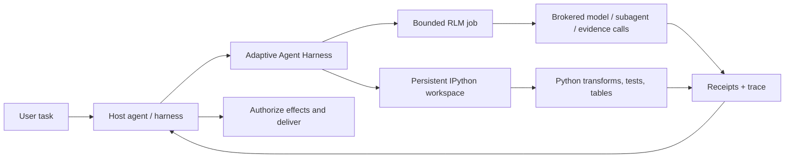

<div align="center">

# Adaptive Agent Harness

### Dê aos agentes uma bancada de trabalho — não apenas um prompt maior.

**RLM composto pelo host + IPython persistente + operações duráveis + autoridade do host**

[](https://www.python.org/)
[](https://modelcontextprotocol.io/)
[](https://github.com/phenomenoner/adaptive-agent-harness/releases/tag/v0.3.0a0)
[](../../LICENSE)
[](#status-do-projeto)

[**Início rápido**](#início-rápido) · [**Por que RLM + IPython?**](#por-que-rlm--ipython) · [**O que você recebe**](#o-que-você-recebe) · [**Arquitetura**](#arquitetura) · [**Status técnico**](../../TECHNICAL-STATUS.md)

</div>

[**繁中**](README.zh-TW.md) · [English](../../README.md) · [简中](README.zh-CN.md) · [Español](README.es.md) · [Português](README.pt-BR.md) · [Français](README.fr.md) · [Deutsch](README.de.md) · [日本語](README.ja.md) · [한국어](README.ko.md) · [Русский](README.ru.md) · [العربية](README.ar.md) · [Italiano](README.it.md) · [Tiếng Việt](README.vi.md) · [ไทย](README.th.md) · [Čeština](README.cs.md) · [Suomi](README.fi.md) · [Norsk](README.no.md) · [Lietuvių](README.lt.md)

> O README canônico está em inglês. O seletor de idiomas coloca intencionalmente o chinês tradicional em primeiro lugar.

---

## A resposta em 30 segundos

A maioria dos agentes precisa resolver problemas grandes usando uma única interface cara e esquecida: o prompt.

**O Adaptive Agent Harness oferece a eles uma bancada de trabalho programável.** Um host pode usar duas superfícies irmãs lado a lado: workspaces IPython persistentes para computação com estado e jobs RLM limitados para evidências intermediadas por broker e chamadas de modelo. Recibos duráveis e uma pequena superfície MCP tornam ambas governáveis e reconectáveis.

A alfa pública atual **não** executa um job RLM dentro de um workspace IPython nem compartilha estado entre eles automaticamente. O host deve transferir explicitamente as evidências, os valores ou os artefatos selecionados.

O resultado é uma base prática para agentes que precisam:

- raciocinar sobre entradas maiores que uma única janela de contexto;
- transformar o ruído repetitivo de chamadas de ferramentas em programas Python compactos;
- manter variáveis, tabelas, funções auxiliares e evidências disponíveis entre as etapas;
- sobreviver à desconexão do frontend sem confundi-la com cancelamento;
- retomar somente a partir de uma fronteira certa e respaldada por recibo;
- deixar a autoridade final, as credenciais, os efeitos e a entrega com o host.

A distribuição Python atualmente se chama **`adaptive-agent-runtime`**. Este repositório é sua casa pública sob o nome **Adaptive Agent Harness**.

---

## O que é um RLM?

Um **Recursive Language Model (RLM)** trata um prompt ou corpus longo como dados em um ambiente externo. Em vez de espremer tudo para dentro do contexto ativo do modelo, o modelo pode escrever programas que:

1. inspecionem os dados;
2. filtrem, dividam, unam, classifiquem ou resumam os dados;
3. chamem um modelo ou subagente sobre recortes selecionados;
4. combinem as evidências retornadas;
5. repitam dentro de limites explícitos.

A ideia importante não é “recursão infinita”. É o **escalonamento programático no tempo de inferência**: gastar chamadas de modelo onde elas agregam valor e usar computação comum em todo o restante.

Um modelo mental simples:

```text
Traditional long-context agent
  prompt -> one model call -> more prompt -> another model call

RLM-style agent
  long input -> Python examines it -> selected model/subagent calls
             -> Python combines evidence -> bounded answer + trace
```

O termo vem do trabalho [Recursive Language Models](https://arxiv.org/abs/2512.24601) de Zhang, Kraska e Khattab. O Adaptive Agent Harness implementa um **runtime RLM limitado e intermediado**; ele não afirma que toda carga de trabalho precisa de recursão nem que mais chamadas produzem automaticamente uma resposta melhor.

---

## Por que IPython?

Agentes de longa duração também precisam de um lugar para pensar **com dados**, não apenas falar sobre eles. O IPython complementa a superfície RLM ao oferecer ao host um espaço de trabalho computacional persistente e separado:

- as variáveis permanecem disponíveis entre as etapas de execução;
- DataFrames, arrays, documentos analisados e resultados de grafos podem ser inspecionados diretamente;
- funções auxiliares podem substituir loops repetitivos de chamadas de ferramentas;
- o modelo pode testar uma hipótese, inspecionar o resultado e refinar a próxima etapa;
- referências compactas podem permanecer no contexto enquanto os dados completos continuam no espaço de trabalho;
- um estado selecionado semelhante a JSON pode ser salvo em checkpoints sem fingir que objetos Python vivos arbitrários são portáteis.

Uma transcrição de chat é um registro do que foi dito. **Um espaço de trabalho IPython é o conjunto de trabalho do que foi calculado.**

Essa distinção importa para pesquisas longas, análise de bases de código, investigação de dados, avaliação e qualquer tarefa em que o agente, de outra forma, continuaria relendo o mesmo material.

---

## Por que RLM × IPython?

Aqui, “×” significa **composição pelo host**, não uma vinculação RLM/workspace no mesmo processo. Cada superfície irmã cobre um modo de falha diferente:

| Camada | O que ela oferece |
|---|---|
| **RLM** | Decide como decompor um problema grande e onde chamadas limitadas de modelo/subagente são úteis. |
| **IPython** | Executa loops, joins, filtros, classificações, testes e investigação com estado em um espaço de trabalho ativo. |
| **Adaptive Agent Harness** | Acrescenta identidade de operação durável, grants, orçamentos, recibos, artefatos, política de recuperação e acesso MCP neutro em relação ao host. |
| **Seu agente host** | É responsável pela identidade, credenciais do provedor, aprovação, efeitos privilegiados, aceitação e entrega final. |

Um host pode compô-las passando evidências ou artefatos selecionados e explícitos entre as superfícies. Não existe namespace compartilhado implícito nem caminho automático de execução de RLM para IPython.



As regras orientadoras são deliberadamente simples:

> **O host compõe explicitamente as superfícies irmãs; Python é a linguagem do workspace, e o host continua sendo a fronteira de autoridade.**

---

## O que você recebe

### Uma bancada de trabalho de agente programável

- espaços de trabalho persistentes de Python simples e IPython;
- execução de código limitada com verificações de geração e revisão;
- NumPy e pandas disponíveis no runtime padrão;
- checkpoints determinísticos de subconjunto JSON com exclusões explícitas;
- tratamento baseado em artefatos para resultados maiores ou que não cabem inline.

### Um mecanismo RLM intermediado

- jobs RLM persistidos, etapas, uso e resultados terminais;
- contratos explícitos de broker para solicitações de modelo, subagentes, artefatos e evidências;
- orçamentos por operação para tempo de parede, chamadas de modelo, tokens, operações filhas e artefatos;
- handles e recibos retidos em vez de “a ferramenta provavelmente executou”;
- reconciliação quando uma chamada pode ter começado, mas não existe um recibo autoritativo.

### Operações duráveis

- IDs lógicos de operação estáveis, separados de tentativas, workers, leases e conexões do frontend;
- trabalho aceito que pode sobreviver a uma única solicitação MCP;
- eventos legíveis por cursor e operações de status, cancelamento e reconciliação;
- um supervisor durável com frontends efêmeros autenticados;
- identidade exata de início de processo em vez de propriedade baseada somente em PID;
- tentativas sucessoras que preservam prazo, cancelamento e uso acumulado.

### Contratos portáteis

- 30 ferramentas MCP na superfície v7 atual;
- esquemas versionados e ativos vinculados a digest;
- orientação de operações incluída para perfis Codex e Hermes;
- brokers de referência determinísticos para desenvolvimento e testes de conformidade;
- fronteiras neutras em relação ao host que não exigem AHC, Prime Agent ou NOOA.

---

## Onde ele se destaca

O Adaptive Agent Harness é especialmente adequado para:

- **pesquisa de documentos longos** — buscar, dividir, comparar e sintetizar evidências recursivamente;
- **investigação de bases de código** — manter conjuntos de símbolos, caminhos de chamadas, evidências de testes e alterações candidatas;
- **análise de dados** — passar de perguntas em linguagem natural para operações com DataFrame;
- **pipelines de avaliação** — manter entradas, pontuações, recibos e artefatos vinculados a uma operação;
- **experimentos de infraestrutura de agentes** — testar execução durável e recuperação sem construir um segundo sistema operacional de agentes voltado ao usuário;
- **integração controlada de workers** — colocar workers mais ricos atrás de orçamentos, handles e aceitação explícita do host.

Ele é intencionalmente mais estreito do que um agente de programação autônomo completo. Isso é útil quando você já tem um orquestrador e precisa de uma camada confiável de computação e evidências por baixo dele.

---

## Como ele se relaciona com outros projetos RLM

Aprendemos com trabalhos públicos sem fingir que os projetos são intercambiáveis:

- **[Prime Agent](https://github.com/PrimeIntellect-ai/prime-agent)** demonstra o valor de produto de um ambiente IPython persistente, uso programático de ferramentas, agentes filhos nativos e continuidade apoiada por daemon. O Prime é uma experiência mais completa de agente de programação/pesquisa. O Adaptive Agent Harness é a camada mais estreita de runtime/controle e pode complementar um worker como o Prime, em vez de substituí-lo.
- **[NVIDIA Object Oriented Agents (NOOA)](https://github.com/NVIDIA-NeMo/labs-OO-Agents)** demonstra um modelo de objetos tipado e nativo de Python para capacidades de agentes e orquestração no estilo CodeAct. Aqui, NOOA é apenas uma referência de design: não há adaptador nem dependência NOOA incluídos.
- **[Recursive Language Models](https://arxiv.org/abs/2512.24601)** fornece o paradigma central de inferência: tratar o contexto longo como um ambiente externo que o modelo pode inspecionar e consultar recursivamente de forma programática.

Veja [Por que RLM + IPython](../../docs/WHY-RLM-AND-IPYTHON.md) para a justificativa de design mais profunda e as notas das fontes.

---

## Início rápido

> **Alfa pública:** use uma tag fixada, inspecione as capacidades retornadas pelo seu host e comece com espaços de trabalho descartáveis. Este projeto executa Python escrito pelo modelo e **não é um sandbox de segurança**.

### Instalar a partir da primeira tag pública

```bash
uv tool install --force \
  "git+https://github.com/phenomenoner/adaptive-agent-harness.git@v0.3.0a0"
```

### Configuração do Codex App

```bash
aar-codex-setup
```

Reinicie o Codex App se o recibo de configuração disser que a configuração mudou e, em seguida, chame `aar_capabilities` em uma tarefa nova.

### Desenvolver a partir do código-fonte

```bash
git clone https://github.com/phenomenoner/adaptive-agent-harness.git
cd adaptive-agent-harness
uv sync --locked
uv run aar-contract verify
uv run pytest -q
```

### Começar pelo fluxo de trabalho MCP

1. Chame `aar_capabilities` e vincule-se à geração do runtime e ao digest de capacidades retornados.
2. Crie ou anexe um workspace, ou envie uma operação `rlm.execute` limitada.
3. Mantenha o handle de operação retornado.
4. Leia status/eventos de uma conexão nova e autorizada quando necessário.
5. Reconcilie a incerteza antes de tentar novamente qualquer trabalho com formato de efeito.

Notas detalhadas de instalação e do host:

- [Instalação do Codex](../../docs/CODEX-INSTALL.md)
- [Compatibilidade do host](../../HOST-COMPATIBILITY.md)
- [Arquitetura](../../ARCHITECTURE.md)
- [Skill de operações](../../skills/aar-operations/SKILL.md)
- [Status da verificação técnica](../../TECHNICAL-STATUS.md)

---

## Arquitetura

O Adaptive Agent Harness segue um design de cintura estreita:

```text
Host / orchestrator
  ├─ owns identity, provider credentials, approvals, effects, delivery
  └─ connects through MCP or a native adapter
          |
          v
Adaptive Agent Harness
  ├─ operation registry + event log + receipts
  ├─ bounded RLM engine + broker journal
  ├─ programmable workspace manager
  ├─ durable supervisor + exact worker identity
  ├─ checkpoints, artifacts, assets, export/import
  └─ capability, grant, budget, deadline, and generation fencing
          |
          v
Plain Python / IPython workers and host-authorized brokers
```

O frontend MCP é deliberadamente substituível. Ele não é dono do banco de dados de continuidade nem do ciclo de vida do worker; o supervisor durável é.

---

## Status do projeto

Alfa pública atual: **`0.3.0a0`**.

Reproduzido a partir deste candidato público:

- cobertura de Python 3.11 a 3.14;
- superfície MCP v7 com 30 ferramentas;
- esquema SQLite aditivo até v5;
- execução completa do repositório: **245 aprovados, 1 ignorado por condição de plataforma**;
- uma sondagem limpa do supervisor/frontend com wheel exato no Linux/WSL;
- supervisor durável, substituição do frontend, perda de processo, gravador obsoleto, reutilização de recibos e cenários de sucessores RLM vinculados a políticas;

Os registros de compatibilidade anteriores do Windows nativo e do Hermes instalado são mantidos como **contexto histórico relatado pelos mantenedores**. Os recibos do host que os sustentam não estão incluídos neste repositório público; portanto, esses registros não podem ser auditados de forma independente a partir desta árvore e não são critérios de release para o candidato de código-fonte público.

Ainda em aberto:

- restauração automática portátil de um estado mais amplo do workspace IPython em uma nova geração;
- adaptadores gerais para reconciliação de efeitos externos;
- isolamento de segurança multi-tenant;
- efeitos genéricos exatamente uma vez;
- publicação em registro de pacotes e garantias de API estáveis.

Leia [TECHNICAL-STATUS.md](../../TECHNICAL-STATUS.md), [HOST-COMPATIBILITY.md](../../HOST-COMPATIBILITY.md) e [WAL.md](../../WAL.md) antes de fazer afirmações de produção.

---

## O que este projeto **não** faz

- **Não** é um sandbox de segurança.
- **Não** mantém suas credenciais de provedor por design.
- **Não** executa efeitos externos arbitrários nem entrega mensagens de usuário por conta própria.
- **Não** promete semântica universal de execução exatamente uma vez.
- **Não** ressuscita pilhas Python arbitrárias, sockets, geradores ou memória de processos nativos.
- **Não** transforma Prime Agent, NOOA, CodeGraph, Hermes, Codex ou AHC em dependência de runtime.

A declaração de autoridade é:

> **O Adaptive Agent Harness calcula e propõe. O host autoriza e entrega.**

---

## Contribuição

Issues, pull requests focados, relatos de compatibilidade e fixtures reproduzíveis de falhas são bem-vindos. Leia primeiro [CONTRIBUTING.md](../../CONTRIBUTING.md) e [SECURITY.md](../../SECURITY.md).

Áreas úteis para contribuição:

- perfis de host adicionais e linhas de compatibilidade de caixa-preta;
- elegibilidade de checkpoints e ergonomia das exclusões;
- adaptadores de reconciliação de broker/efeito;
- estratégias RLM limitadas e benchmarks com muitas evidências;
- backends de workers e armazenamentos de artefatos;
- correções de documentação e traduções.

---

## Licença

[MIT](../../LICENSE) © 2026 phenomenoner.

---

## Referências

- Alex L. Zhang, Tim Kraska e Omar Khattab, [Recursive Language Models](https://arxiv.org/abs/2512.24601), arXiv:2512.24601.
- [Prime Agent](https://github.com/PrimeIntellect-ai/prime-agent), Prime Intellect.
- [NVIDIA Object Oriented Agents](https://github.com/NVIDIA-NeMo/labs-OO-Agents), NVIDIA-NeMo.
- [Model Context Protocol](https://modelcontextprotocol.io/).
