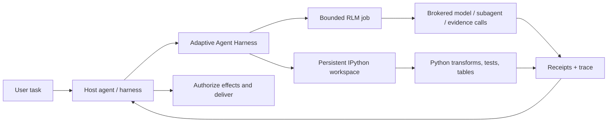

<div align="center">

> **`0.6.0a1`** public alpha · [`phenomenoner/adaptive-agent-harness@v0.6.0a1`](https://github.com/phenomenoner/adaptive-agent-harness/releases/tag/v0.6.0a1)

# Adaptive Agent Harness

### Дайте агентам рабочую среду — а не просто более длинный промпт.

**RLM, скомпонованный хостом + постоянный IPython + долговечные операции + полномочия у хоста**

[](https://www.python.org/)
[](https://modelcontextprotocol.io/)
[](https://github.com/phenomenoner/adaptive-agent-harness/releases/tag/v0.6.0a1)
[](../../LICENSE)
[](#статус-проекта)

[**Быстрый старт**](#быстрый-старт) · [**Зачем RLM + IPython?**](#зачем-rlm--ipython) · [**Что вы получаете**](#что-вы-получаете) · [**Архитектура**](#архитектура) · [**Технический статус**](../../TECHNICAL-STATUS.md)

</div>

[English](../../README.md) · [**繁中**](README.zh-TW.md) · [简中](README.zh-CN.md) · [Español](README.es.md) · [Português](README.pt-BR.md) · [Français](README.fr.md) · [Deutsch](README.de.md) · [日本語](README.ja.md) · [한국어](README.ko.md) · [Русский](README.ru.md) · [العربية](README.ar.md) · [Italiano](README.it.md) · [Tiếng Việt](README.vi.md) · [ไทย](README.th.md) · [Čeština](README.cs.md) · [Suomi](README.fi.md) · [Norsk](README.no.md) · [Lietuvių](README.lt.md)

---

## Ответ за 30 секунд

Большинство агентов должны решать большие задачи через один дорогой интерфейс, который быстро забывает контекст: промпт.

**Adaptive Agent Harness вместо этого даёт им программируемую рабочую среду.** Хост может скомпоновать и использовать бок о бок две соседние поверхности: постоянные рабочие области IPython для вычислений с состоянием и ограниченные задания RLM для брокерской работы со свидетельствами и вызовами моделей. Долговечные квитанции и небольшой интерфейс MCP делают обе поверхности управляемыми и доступными после переподключения.

Текущая публичная альфа-версия **не выполняет задание RLM внутри рабочей области IPython и не разделяет состояние между ними автоматически**. Хост сам явно передаёт выбранные свидетельства, значения или артефакты.

В результате получается практическая основа для агентов, которым нужно:

- рассуждать над входными данными, превышающими одно контекстное окно;
- превращать повторяющуюся болтовню вызовов инструментов в компактные программы Python;
- сохранять переменные, таблицы, вспомогательные функции и свидетельства между шагами;
- переживать отключение фронтенда, не путая его с отменой;
- возобновлять работу только с достоверной границы, подтверждённой квитанцией;
- оставлять окончательные полномочия, учётные данные, эффекты и доставку за хостом.

Дистрибутив Python сейчас называется **`adaptive-agent-runtime`**. Этот репозиторий — его публичный дом проекта под названием **Adaptive Agent Harness**.

---

## Что такое RLM?

**Рекурсивная языковая модель (Recursive Language Model, RLM)** рассматривает длинный промпт или корпус как данные во внешней среде. Вместо того чтобы втискивать всё в активный контекст модели, модель может писать программы, которые:

1. исследуют данные;
2. фильтруют, разделяют, объединяют, ранжируют или обобщают их;
3. вызывают модель или субагента для выбранных фрагментов;
4. объединяют возвращённые свидетельства;
5. повторяют эти действия в явных пределах.

Важно здесь не «бесконечная рекурсия», а **программируемое масштабирование во время вывода**: тратить вызовы модели там, где они приносят пользу, а везде остальном использовать обычные вычисления.

Простая мысленная модель:

```text
Traditional long-context agent
  prompt -> one model call -> more prompt -> another model call

RLM-style agent
  long input -> Python examines it -> selected model/subagent calls
             -> Python combines evidence -> bounded answer + trace
```

Этот термин происходит из работы Чжана, Краски и Хаттаба [Recursive Language Models](https://arxiv.org/abs/2512.24601). Adaptive Agent Harness реализует **ограниченную RLM-среду с брокером**; он не утверждает, что каждой рабочей нагрузке нужна рекурсия или что большее число вызовов автоматически даёт лучший ответ.

---

## Почему IPython?

Длительно работающим агентам также нужно место, где можно **думать вместе с данными**, а не только говорить о них. IPython дополняет поверхность RLM, предоставляя хосту отдельную постоянную вычислительную рабочую область:

- переменные остаются доступными между шагами выполнения;
- DataFrame, массивы, разобранные документы и результаты работы с графами можно проверять напрямую;
- вспомогательные функции могут заменить повторяющиеся циклы вызовов инструментов;
- модель может проверить гипотезу, изучить результат и уточнить следующий шаг;
- компактные ссылки могут оставаться в контексте, а полные данные — в рабочей области;
- выбранное состояние, похожее на JSON, можно сохранять в контрольную точку, не выдавая произвольные живые объекты Python за переносимые.

История чата — это запись сказанного. **Рабочая область IPython — это набор уже вычисленного.**

Это различие важно для длительных исследований, анализа кодовых баз, исследования данных, оценочных конвейеров и любых задач, где иначе агенту пришлось бы снова и снова перечитывать один и тот же материал.

---

## Зачем RLM × IPython?

Здесь «×» означает **композицию хоста**, а не привязку RLM к рабочей области внутри одного процесса. Каждая соседняя поверхность закрывает свой тип отказа:

| Слой | Что он даёт |
|---|---|
| **RLM** | Решает, как разложить большую задачу и где полезны ограниченные вызовы модели/субагента. |
| **IPython** | Выполняет циклы, объединения, фильтрацию, ранжирование, тесты и исследование с состоянием в живой рабочей области. |
| **Adaptive Agent Harness** | Добавляет долговечную идентичность операций, разрешения, бюджеты, квитанции, артефакты, политику восстановления и нейтральный к хосту доступ через MCP. |
| **Ваш хост-агент** | Владеет идентичностью, учётными данными провайдера, одобрением, привилегированными эффектами, приёмкой и окончательной доставкой. |

Хост может компоновать их, явно передавая между поверхностями выбранные свидетельства, значения или артефакты. Здесь нет неявно разделяемого пространства имён и автоматического пути выполнения RLM в IPython.



Управляющее правило намеренно простое:

> **Хост явно компонует соседние поверхности; Python — язык рабочей области, а хост остаётся границей полномочий.**

---

## Что вы получаете

### Программируемая рабочая среда агента

- постоянные рабочие области plain-Python и IPython;
- ограниченное выполнение кода с проверками поколения и ревизии;
- NumPy и pandas доступны в среде по умолчанию;
- детерминированные контрольные точки подмножества JSON с явными исключениями;
- обработку более крупных или не встраиваемых результатов через артефакты.

### Движок RLM с брокером

- сохранённые задания RLM, шаги, данные об использовании и конечные результаты;
- явные брокерские контракты для запросов к модели, субагентов, артефактов и свидетельств;
- бюджеты каждой операции на время выполнения, вызовы модели, токены, дочерние операции и артефакты;
- сохранённые дескрипторы и квитанции вместо «инструмент, наверное, сработал»;
- согласование, когда вызов мог начаться, но авторитетной квитанции нет.

### Долговечные операции

- стабильные логические идентификаторы операций, отделённые от попыток, рабочих процессов, аренд и фронтенд-соединений;
- принятая работа, способная пережить один запрос MCP;
- события с чтением по курсору, операции получения статуса, отмены и согласования;
- долговечный супервизор с эфемерными аутентифицированными фронтендами;
- точная идентичность запуска процесса вместо владения только по PID;
- последующие попытки, сохраняющие дедлайн, отмену и накопленное использование.

### Переносимые контракты

- 38 инструментов MCP на текущей поверхности v8;
- версионируемые схемы и активы, привязанные к дайджесту;
- встроенные рекомендации по операциям для профилей Codex и Hermes;
- детерминированные эталонные брокеры для разработки и проверки соответствия;
- нейтральные к хосту границы, которым не нужны AHC, Prime Agent или NOOA.

---

## Где это особенно полезно

Adaptive Agent Harness хорошо подходит для:

- **исследования длинных документов** — поиска, нарезки, сравнения и рекурсивного синтеза свидетельств;
- **исследования кодовой базы** — сохранения наборов символов, путей вызовов, свидетельств тестов и кандидатных изменений;
- **анализа данных** — перехода между вопросами на естественном языке и операциями DataFrame;
- **оценочных конвейеров** — связывания входных данных, оценок, квитанций и артефактов с одной операцией;
- **экспериментов с агентской инфраструктурой** — проверки долговечного выполнения и восстановления без создания второй пользовательской ОС для агентов;
- **интеграции контролируемых рабочих процессов** — размещения более функциональных рабочих процессов за явными бюджетами, дескрипторами и приёмкой хоста.

Он намеренно уже, чем полноценный автономный агент для написания кода. Это полезно, если у вас уже есть оркестратор и под ним нужен надёжный вычислительный и доказательный слой.

---

## Как это связано с другими RLM-проектами

Мы учились на публичных проектах, не делая вид, что они взаимозаменяемы:

- **[Prime Agent](https://github.com/PrimeIntellect-ai/prime-agent)** демонстрирует продуктовую ценность постоянной среды IPython, программного использования инструментов, встроенных дочерних агентов и непрерывности на основе демона. Prime — это более полноценный опыт для программирования и исследований. Adaptive Agent Harness — более узкий слой среды выполнения и управления; он может дополнять рабочий процесс вроде Prime, а не заменять его.
- **[NVIDIA Object Oriented Agents (NOOA)](https://github.com/NVIDIA-NeMo/labs-OO-Agents)** демонстрирует нативную для Python типизированную объектную модель возможностей агентов и оркестрацию в стиле CodeAct. Здесь NOOA служит только источником проектных идей: адаптер или зависимость NOOA не поставляются.
- **[Recursive Language Models](https://arxiv.org/abs/2512.24601)** задаёт базовую парадигму вывода: рассматривать длинный контекст как внешнюю среду, которую модель может программно исследовать и рекурсивно запрашивать.

Подробнее о логике проектирования и исходных заметках см. [Why RLM + IPython](../../docs/WHY-RLM-AND-IPYTHON.md).

---

## Быстрый старт

> **Публичная альфа-версия:** используйте закреплённый тег, изучите возможности, возвращаемые вашим хостом, и начните с одноразовых рабочих областей. Этот проект выполняет Python-код, созданный моделью, и **не является песочницей безопасности**.

### Установка из последнего публичного тега

```bash
uv tool install --force \
  "git+https://github.com/phenomenoner/adaptive-agent-harness.git@v0.6.0a1"
```

### Настройка Codex App

```bash
aar-codex-setup
```

Перезапустите Codex Desktop, если квитанция настройки содержит `restart_required: true`; после ручного применения сохраните квитанцию `restart_required_after_manual_apply: true`; последующая no-op-квитанция с `restart_required: false` не отменяет необходимость перезапуска. Затем вызовите `aar_capabilities` в новой задаче.

### Разработка из исходного кода

```bash
git clone https://github.com/phenomenoner/adaptive-agent-harness.git
cd adaptive-agent-harness
uv sync --locked
uv run aar-contract verify
uv run pytest -q
```

### Начало работы с рабочим процессом MCP

1. Вызовите `aar_capabilities` и привяжитесь к возвращённым поколению среды выполнения и дайджесту возможностей.
2. Создайте рабочую область или подключитесь к ней либо отправьте ограниченную операцию `rlm.execute`.
3. Сохраните возвращённый дескриптор операции.
4. При необходимости читайте статус и события из нового авторизованного соединения.
5. Прежде чем повторять работу, похожую на эффект, согласуйте неопределённость.

Подробные сведения об установке и хосте:

- [Установка Codex](../../docs/CODEX-INSTALL.md)
- [Совместимость с хостом](../../HOST-COMPATIBILITY.md)
- [Архитектура](../../ARCHITECTURE.md)
- [Навык операций](../../skills/aar-operations/SKILL.md)
- [Статус технической проверки](../../TECHNICAL-STATUS.md)

---

## Архитектура

Adaptive Agent Harness следует архитектуре с узкой шейкой:

```text
Host / orchestrator
  ├─ owns identity, provider credentials, approvals, effects, delivery
  └─ connects through MCP or a native adapter
          |
          v
Adaptive Agent Harness
  ├─ operation registry + event log + receipts
  ├─ bounded RLM engine + broker journal
  ├─ programmable workspace manager
  ├─ durable supervisor + exact worker identity
  ├─ checkpoints, artifacts, assets, export/import
  └─ capability, grant, budget, deadline, and generation fencing
          |
          v
Plain Python / IPython workers and host-authorized brokers
```

Фронтенд MCP намеренно можно заменить. Он не владеет базой данных непрерывности или жизненным циклом рабочих процессов; этим занимается долговечный супервизор.

---

## Статус проекта

Текущая публичная альфа-версия: **`0.6.0a1`**.

> **Translation status:** the overview below retains the `v0.3.0a1` public baseline as historical
> context. For `v0.6.0a1` receipt-backed model routing, current verification, and exact release
> boundaries, read the canonical English [release notes](../RELEASE-v0.6.0a1.md) and
> [model-routing guide](../MODEL-ROUTING-AND-EVALUATION.md).


Current `v0.6.0a1` public release evidence:

- поддержка Python с 3.11 по 3.14;
- 38-tool MCP v8 executable surface (frozen 30-tool MCP v7 prefix + exact 8-tool successor suffix);
- аддитивная схема SQLite до v5;
- full repository run: **743 passed, 5 platform-gated skips, 1 existing MCP Sampling deprecation warning**;
- чистая проверка супервизора и фронтенда с точным wheel-пакетом в Linux/WSL;
- сценарии долговечного супервизора, замены фронтенда, потери процесса, устаревшего писателя, повторного использования квитанции и преемника RLM с привязкой к политике.

Ранее проверенные строки совместимости с нативной Windows и установленным Hermes сохранены как
**исторический контекст, сообщённый сопровождающими проекта**. Подтверждающие квитанции хоста не включены в
этот публичный репозиторий, поэтому эти строки нельзя независимо проверить по этому дереву и они не являются
критериями выпуска для публичного кандидата исходного кода.

Остаётся открытым:

- переносимое автоматическое восстановление более широкого состояния рабочей области IPython в новое поколение;
- адаптеры для общего согласования внешних эффектов;
- изоляция безопасности в многопользовательском режиме;
- универсальные эффекты с семантикой «ровно один раз»;
- публикация в реестре пакетов и стабильные гарантии API.

Перед заявлениями о готовности к производству прочитайте [TECHNICAL-STATUS.md](../../TECHNICAL-STATUS.md), [HOST-COMPATIBILITY.md](../../HOST-COMPATIBILITY.md).

---

## Чего этот проект **не** делает

- Он **не является песочницей безопасности**.
- По замыслу он **не хранит учётные данные вашего провайдера**.
- Он **не выполняет произвольные внешние эффекты и не доставляет сообщения пользователей самостоятельно**.
- Он **не обещает универсальную семантику «ровно один раз»**.
- Он **не воскрешает произвольные стеки Python, сокеты, генераторы или память нативных процессов**.
- Он **не делает Prime Agent, NOOA, CodeGraph, Hermes, Codex или AHC зависимостью среды выполнения**.

Формулировка о полномочиях такова:

> **Adaptive Agent Harness вычисляет и предлагает. Хост разрешает и доставляет.**

---

## Участие в проекте

Мы приветствуем issues, целевые pull request'ы, отчёты о совместимости и воспроизводимые фикстуры сбоев. Сначала ознакомьтесь с [CONTRIBUTING.md](../../CONTRIBUTING.md) и [SECURITY.md](../../SECURITY.md).

Полезные направления вклада:

- дополнительные профили хостов и строки совместимости в чёрном ящике;
- правила пригодности контрольных точек и удобство работы с исключениями;
- адаптеры согласования брокера/эффектов;
- ограниченные стратегии RLM и бенчмарки с большим объёмом свидетельств;
- рабочие процессы и хранилища артефактов;
- исправления документации и переводов.

---

## Лицензия

[MIT](../../LICENSE) © 2026 phenomenoner.

---

## Ссылки

- Alex L. Zhang, Tim Kraska и Omar Khattab, [Recursive Language Models](https://arxiv.org/abs/2512.24601), arXiv:2512.24601.
- [Prime Agent](https://github.com/PrimeIntellect-ai/prime-agent), Prime Intellect.
- [NVIDIA Object Oriented Agents](https://github.com/NVIDIA-NeMo/labs-OO-Agents), NVIDIA-NeMo.
- [Model Context Protocol](https://modelcontextprotocol.io/).
