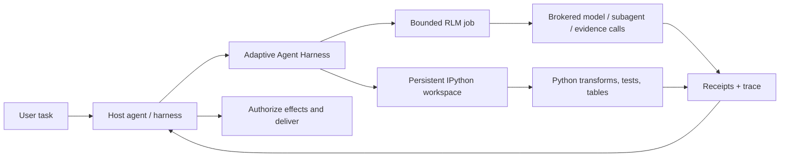

<div align="center">

> **`0.6.0a0`** public alpha · [`phenomenoner/adaptive-agent-harness@v0.6.0a0`](https://github.com/phenomenoner/adaptive-agent-harness/releases/tag/v0.6.0a0)

# Adaptive Agent Harness

### มอบโต๊ะทำงานให้เอเจนต์ — ไม่ใช่แค่พรอมป์ที่ใหญ่ขึ้น

**RLM ที่โฮสต์ประกอบเข้าด้วยกัน + IPython แบบคงสถานะ + การดำเนินการที่คงทน + อำนาจที่โฮสต์เป็นผู้ถือครอง**

[](https://www.python.org/)
[](https://modelcontextprotocol.io/)
[](https://github.com/phenomenoner/adaptive-agent-harness/releases/tag/v0.6.0a0)
[](../../LICENSE)
[](#สถานะโครงการ)

[**เริ่มต้นอย่างรวดเร็ว**](#เริ่มต้นอย่างรวดเร็ว) · [**ทำไมต้อง RLM + IPython?**](#ทำไมต้อง-rlm--ipython) · [**สิ่งที่คุณจะได้รับ**](#สิ่งที่คุณจะได้รับ) · [**สถาปัตยกรรม**](#สถาปัตยกรรม) · [**สถานะทางเทคนิค**](../../TECHNICAL-STATUS.md)

</div>

[English](../../README.md) · [**繁中**](README.zh-TW.md) · [简中](README.zh-CN.md) · [Español](README.es.md) · [Português](README.pt-BR.md) · [Français](README.fr.md) · [Deutsch](README.de.md) · [日本語](README.ja.md) · [한국어](README.ko.md) · [Русский](README.ru.md) · [العربية](README.ar.md) · [Italiano](README.it.md) · [Tiếng Việt](README.vi.md) · [ไทย](README.th.md) · [Čeština](README.cs.md) · [Suomi](README.fi.md) · [Norsk](README.no.md) · [Lietuvių](README.lt.md)

---

## คำตอบใน 30 วินาที

เอเจนต์ส่วนใหญ่ถูกขอให้แก้ปัญหาใหญ่ผ่านอินเทอร์เฟซเดียวที่มีต้นทุนสูงและลืมบริบทได้ง่าย: พรอมป์

**Adaptive Agent Harness จึงมอบโต๊ะทำงานที่ตั้งโปรแกรมได้แทน** โฮสต์สามารถประกอบและใช้พื้นผิวพี่น้องกันสองแบบเคียงข้างกัน: workspace IPython แบบคงสถานะสำหรับการคำนวณที่มีสถานะ และงาน RLM แบบมีขอบเขตสำหรับหลักฐานและการเรียกโมเดลผ่าน broker ใบเสร็จที่คงทนและพื้นผิว MCP ขนาดเล็กช่วยให้โฮสต์กำกับดูแลทั้งสองแบบและเชื่อมต่อกลับได้

อัลฟาสาธารณะปัจจุบัน **ไม่ดำเนินงาน RLM ภายใน workspace IPython และไม่แบ่งปันสถานะระหว่างกันโดยอัตโนมัติ** โฮสต์เป็นผู้ถ่ายโอนหลักฐาน ค่า หรืออาร์ติแฟกต์ที่เลือกไว้อย่างชัดเจน

ผลลัพธ์คือรากฐานที่ใช้งานได้จริงสำหรับเอเจนต์ที่ต้องการ:

- ให้เหตุผลกับอินพุตที่มีขนาดใหญ่กว่าหน้าต่างบริบทเดียว;
- เปลี่ยนการโต้ตอบจากการเรียกเครื่องมือซ้ำ ๆ ให้เป็นโปรแกรม Python ที่กระชับ;
- คงตัวแปร ตาราง ฟังก์ชันช่วย และหลักฐานไว้ข้ามขั้นตอน;
- อยู่รอดจากการตัดการเชื่อมต่อของ frontend โดยไม่สับสนว่าเป็นการยกเลิก;
- ทำงานต่อได้เฉพาะจากขอบเขตที่แน่นอนและมีใบเสร็จ (receipt) รองรับ;
- ให้โฮสต์เป็นผู้ถืออำนาจขั้นสุดท้าย ข้อมูลรับรอง เอฟเฟกต์ และการส่งมอบ

ดิสทริบิวชัน Python ปัจจุบันใช้ชื่อ **`adaptive-agent-runtime`** รีโพซิทอรีนี้คือบ้านโครงการสาธารณะภายใต้ชื่อ **Adaptive Agent Harness**

---

## RLM คืออะไร?

**Recursive Language Model (RLM) หรือโมเดลภาษาแบบเวียนซ้ำ** ถือว่าพรอมป์หรือคอร์ปัสขนาดยาวเป็นข้อมูลในสภาพแวดล้อมภายนอก แทนที่จะยัดทุกอย่างลงในบริบทที่โมเดลกำลังใช้งาน โมเดลสามารถเขียนโปรแกรมเพื่อ:

1. ตรวจสอบข้อมูล;
2. กรอง แบ่ง เชื่อม จัดอันดับ หรือสรุปข้อมูล;
3. เรียกโมเดลหรือซับเอเจนต์กับส่วนข้อมูลที่เลือก;
4. รวมหลักฐานที่ส่งกลับมา;
5. ทำซ้ำภายในขอบเขตที่ระบุไว้อย่างชัดเจน

แนวคิดสำคัญไม่ใช่ “การเวียนซ้ำไม่รู้จบ” แต่คือ **การขยายขนาดการอนุมานด้วยโปรแกรม ณ เวลาประมวลผล**: ใช้การเรียกโมเดลในจุดที่เพิ่มคุณค่า และใช้การคำนวณทั่วไปในส่วนอื่นทั้งหมด

แบบจำลองความคิดอย่างง่าย:

```text
Traditional long-context agent
  prompt -> one model call -> more prompt -> another model call

RLM-style agent
  long input -> Python examines it -> selected model/subagent calls
             -> Python combines evidence -> bounded answer + trace
```

คำนี้มาจากงาน [Recursive Language Models](https://arxiv.org/abs/2512.24601) ของ Zhang, Kraska และ Khattab Adaptive Agent Harness ใช้ **รันไทม์ RLM แบบมีขอบเขตและผ่าน broker**; ไม่ได้อ้างว่างานทุกประเภทจำเป็นต้องใช้การเวียนซ้ำ หรือการเรียกมากขึ้นจะทำให้คำตอบดีขึ้นโดยอัตโนมัติ

---

## ทำไมต้อง IPython?

เอเจนต์ที่ทำงานเป็นเวลานานก็ต้องมีที่ให้คิด **ไปพร้อมกับข้อมูล** ไม่ใช่แค่พูดถึงข้อมูล IPython เสริมพื้นผิว RLM โดยมอบ workspace คำนวณที่คงอยู่แยกต่างหากให้โฮสต์:

- ตัวแปรยังพร้อมใช้ข้ามขั้นตอนการทำงาน;
- สามารถตรวจสอบ DataFrame อาร์เรย์ เอกสารที่แยกวิเคราะห์แล้ว และผลลัพธ์จากกราฟได้โดยตรง;
- ฟังก์ชันช่วยสามารถแทนที่ลูปการเรียกเครื่องมือซ้ำ ๆ;
- โมเดลสามารถทดสอบสมมติฐาน ตรวจสอบผลลัพธ์ และปรับขั้นตอนถัดไป;
- การอ้างอิงแบบกระชับอยู่ในบริบทได้ ขณะที่ข้อมูลเต็มยังคงอยู่ใน workspace;
- สามารถทำ checkpoint ให้สถานะที่มีลักษณะคล้าย JSON เฉพาะส่วนที่เลือก โดยไม่แสร้งว่าวัตถุ Python ที่กำลังทำงานอยู่ทุกชนิดสามารถพกพาได้

ทรานสคริปต์แชตคือบันทึกสิ่งที่พูดกัน **workspace ของ IPython คือชุดทำงานของสิ่งที่คำนวณแล้ว**

ความแตกต่างนี้สำคัญต่อการวิจัยระยะยาว การวิเคราะห์โค้ดเบส การตรวจสอบข้อมูล pipeline การประเมินผล และงานใด ๆ ที่ไม่เช่นนั้นเอเจนต์จะต้องอ่านข้อมูลเดิมซ้ำไปซ้ำมา

---

## ทำไมต้อง RLM × IPython?

ที่นี่ “×” หมายถึง **การจัดองค์ประกอบโดยโฮสต์** ไม่ใช่การผูก RLM กับ workspace ภายในโปรเซสเดียวกัน แต่ละพื้นผิวพี่น้องกันครอบคลุมโหมดความล้มเหลวที่แตกต่างกัน:

| ชั้น | สิ่งที่เพิ่มให้ |
|---|---|
| **RLM** | ตัดสินใจว่าจะแยกปัญหาใหญ่อย่างไร และการเรียกโมเดล/ซับเอเจนต์ที่มีขอบเขตจะมีประโยชน์ตรงไหน |
| **IPython** | ดำเนินการวนซ้ำ การเชื่อม การกรอง การจัดอันดับ การทดสอบ และการสืบค้นแบบมีสถานะใน workspace ที่ทำงานอยู่ |
| **Adaptive Agent Harness** | เพิ่มตัวตนของการดำเนินการที่คงทน การอนุญาต งบประมาณ ใบเสร็จ (receipt) อาร์ติแฟกต์ นโยบายการกู้คืน และการเข้าถึง MCP ที่เป็นกลางต่อโฮสต์ |
| **เอเจนต์โฮสต์ของคุณ** | ถือครองตัวตน ข้อมูลรับรองของผู้ให้บริการ การอนุมัติ เอฟเฟกต์ที่มีสิทธิ์ การยอมรับ และการส่งมอบขั้นสุดท้าย |

โฮสต์สามารถประกอบทั้งสองส่วนโดยถ่ายโอนหลักฐาน ค่า หรืออาร์ติแฟกต์ที่เลือกไว้อย่างชัดเจนระหว่างพื้นผิวทั้งสอง ไม่มี namespace ร่วมโดยนัย และไม่มีเส้นทางการทำงาน RLM ไปยัง IPython โดยอัตโนมัติ



กฎกำกับดูแลตั้งใจให้เรียบง่าย:

> **โฮสต์ประกอบพื้นผิวพี่น้องกันอย่างชัดเจน; Python เป็นภาษาของ workspace และโฮสต์ยังคงเป็นขอบเขตอำนาจ**

---

## สิ่งที่คุณจะได้รับ

### โต๊ะทำงานเอเจนต์ที่ตั้งโปรแกรมได้

- workspace plain-Python และ IPython ที่คงอยู่;
- การรันโค้ดแบบมีขอบเขตพร้อมการตรวจสอบ generation และ revision;
- มี NumPy และ pandas ในรันไทม์เริ่มต้น;
- checkpoint แบบ deterministic ของ JSON subset พร้อมข้อยกเว้นที่ระบุไว้อย่างชัดเจน;
- การจัดการผลลัพธ์ขนาดใหญ่กว่าหรือไม่สามารถฝังในบรรทัดได้โดยใช้อาร์ติแฟกต์

### เครื่องยนต์ RLM ผ่าน broker

- งาน RLM ขั้นตอน ข้อมูลการใช้งาน และผลลัพธ์สุดท้ายที่บันทึกไว้;
- สัญญา broker ที่ชัดเจนสำหรับคำขอโมเดล ซับเอเจนต์ อาร์ติแฟกต์ และหลักฐาน;
- งบประมาณต่อการดำเนินการสำหรับเวลาทำงาน การเรียกโมเดล โทเค็น การดำเนินการลูก และอาร์ติแฟกต์;
- handle และใบเสร็จ (receipt) ที่เก็บรักษาไว้ แทนที่จะคิดว่า “เครื่องมือน่าจะทำงานแล้ว”;
- การ reconcile เมื่อการเรียกอาจเริ่มไปแล้วแต่ยังไม่มีใบเสร็จ (receipt) ที่เป็นแหล่งอำนาจ

### การดำเนินการที่คงทน

- ID เชิงตรรกะของการดำเนินการที่เสถียร แยกจากความพยายาม worker lease และการเชื่อมต่อ frontend;
- งานที่รับเข้าแล้วสามารถอยู่ต่อได้นานกว่าคำขอ MCP หนึ่งครั้ง;
- เหตุการณ์ที่อ่านตาม cursor ได้ รวมถึงการดำเนินการดูสถานะ ยกเลิก และ reconcile;
- supervisor ที่คงทนพร้อม frontend ที่ยืนยันตัวตนแบบชั่วคราว;
- ตัวตนการเริ่มกระบวนการที่แม่นยำ แทนการระบุความเป็นเจ้าของจาก PID เพียงอย่างเดียว;
- ความพยายามถัดไปที่รักษา deadline การยกเลิก และการใช้งานสะสมไว้

### สัญญาที่พกพาได้

- เครื่องมือ MCP 30 รายการบนพื้นผิว v7 ปัจจุบัน;
- schema ที่มีเวอร์ชันและ asset ที่ผูกกับ digest;
- คำแนะนำการดำเนินการที่รวมมาให้สำหรับโปรไฟล์ Codex และ Hermes;
- broker อ้างอิงแบบ deterministic สำหรับการพัฒนาและการทดสอบความสอดคล้อง;
- ขอบเขตที่เป็นกลางต่อโฮสต์ ซึ่งไม่ต้องพึ่ง AHC, Prime Agent หรือ NOOA

---

## จุดที่โดดเด่น

Adaptive Agent Harness เหมาะอย่างยิ่งกับ:

- **การวิจัยเอกสารยาว** — ค้นหา แบ่งส่วน เปรียบเทียบ และสังเคราะห์หลักฐานแบบเวียนซ้ำ;
- **การตรวจสอบโค้ดเบส** — รักษาชุดสัญลักษณ์ เส้นทางการเรียก หลักฐานจากการทดสอบ และการเปลี่ยนแปลงที่เป็นตัวเลือกไว้;
- **การวิเคราะห์ข้อมูล** — สลับระหว่างคำถามภาษาธรรมชาติกับการดำเนินการบน DataFrame;
- **pipeline การประเมินผล** — ผูกอินพุต คะแนน ใบเสร็จ (receipt) และอาร์ติแฟกต์ไว้กับการดำเนินการเดียว;
- **การทดลองโครงสร้างพื้นฐานเอเจนต์** — ทดสอบการดำเนินการที่คงทนและการกู้คืนโดยไม่ต้องสร้างระบบปฏิบัติการเอเจนต์สำหรับผู้ใช้อีกชุดหนึ่ง;
- **การผสานรวม worker ที่ควบคุมได้** — วาง worker ที่มีความสามารถมากขึ้นไว้หลังงบประมาณ handle และการยอมรับจากโฮสต์ที่ระบุไว้อย่างชัดเจน

ระบบนี้ตั้งใจให้แคบกว่าเอเจนต์เขียนโค้ดอัตโนมัติเต็มรูปแบบ นั่นมีประโยชน์เมื่อคุณมี orchestrator อยู่แล้วและต้องการชั้นการคำนวณกับหลักฐานที่เชื่อถือได้อยู่ข้างใต้

---

## เกี่ยวข้องกับโครงการ RLM อื่นอย่างไร

เราเรียนรู้จากผลงานสาธารณะโดยไม่แสร้งว่าโครงการเหล่านั้นใช้แทนกันได้:

- **[Prime Agent](https://github.com/PrimeIntellect-ai/prime-agent)** แสดงให้เห็นคุณค่าของผลิตภัณฑ์จากสภาพแวดล้อม IPython ที่คงอยู่ การใช้เครื่องมือเชิงโปรแกรม child agent ในตัว และความต่อเนื่องที่มี daemon อยู่เบื้องหลัง Prime เป็นประสบการณ์เอเจนต์ด้านการเขียนโค้ด/การวิจัยที่ครบถ้วนกว่า Adaptive Agent Harness เป็นชั้นรันไทม์/ควบคุมที่แคบกว่า และสามารถเสริม worker อย่าง Prime แทนที่จะมาแทนที่
- **[NVIDIA Object Oriented Agents (NOOA)](https://github.com/NVIDIA-NeMo/labs-OO-Agents)** แสดงโมเดลวัตถุแบบมีชนิดที่เป็น native ของ Python สำหรับความสามารถของเอเจนต์ และการประสานงานสไตล์ CodeAct ในที่นี้ NOOA เป็นเพียงข้อมูลนำเข้าสำหรับการออกแบบ: ไม่มี adapter หรือ dependency ของ NOOA รวมมาให้
- **[Recursive Language Models](https://arxiv.org/abs/2512.24601)** ให้กระบวนทัศน์การอนุมานหลัก: ถือว่าบริบทยาวเป็นสภาพแวดล้อมภายนอกที่โมเดลสามารถตรวจสอบด้วยโปรแกรมและสอบถามแบบเวียนซ้ำได้

ดู [Why RLM + IPython](../../docs/WHY-RLM-AND-IPYTHON.md) สำหรับเหตุผลด้านการออกแบบและบันทึกแหล่งข้อมูลเชิงลึก

---

## เริ่มต้นอย่างรวดเร็ว

> **อัลฟาสาธารณะ:** ใช้แท็กที่ pin ไว้ ตรวจสอบความสามารถที่โฮสต์ส่งคืน และเริ่มต้นด้วย workspace ที่ใช้แล้วทิ้ง โปรเจกต์นี้เรียกใช้ Python ที่โมเดลเขียน และ **ไม่ใช่แซนด์บ็อกซ์ด้านความปลอดภัย**

### ติดตั้งจากแท็กสาธารณะล่าสุด

```bash
uv tool install --force \
  "git+https://github.com/phenomenoner/adaptive-agent-harness.git@v0.6.0a0"
```

### ตั้งค่า Codex App

```bash
aar-codex-setup
```

รีสตาร์ต Codex Desktop หากใบเสร็จการตั้งค่าระบุ `restart_required: true`; หลังใช้แผนด้วยตนเอง ให้เก็บใบเสร็จ `restart_required_after_manual_apply: true` ไว้; ใบเสร็จ no-op ที่ตามมาซึ่งมี `restart_required: false` ไม่สามารถลบล้างภาระการรีสตาร์ตได้ จากนั้นเรียก `aar_capabilities` ในงานใหม่

### พัฒนาจากซอร์ส

```bash
git clone https://github.com/phenomenoner/adaptive-agent-harness.git
cd adaptive-agent-harness
uv sync --locked
uv run aar-contract verify
uv run pytest -q
```

### เริ่มต้นด้วย workflow MCP

1. เรียก `aar_capabilities` และผูกกับ generation ของรันไทม์และ capability digest ที่ส่งกลับมา
2. สร้างหรือ attach กับ workspace หรือส่งการดำเนินการ `rlm.execute` แบบมีขอบเขต
3. เก็บ operation handle ที่ส่งกลับมา
4. เมื่อจำเป็น ให้อ่าน status/event จากการเชื่อมต่อใหม่ที่ได้รับอนุญาต
5. ทำ reconcile กับความไม่แน่นอนก่อนลองงานที่มีลักษณะเป็น effect ซ้ำ

หมายเหตุการติดตั้งและโฮสต์โดยละเอียด:

- [การติดตั้ง Codex](../../docs/CODEX-INSTALL.md)
- [ความเข้ากันได้กับโฮสต์](../../HOST-COMPATIBILITY.md)
- [สถาปัตยกรรม](../../ARCHITECTURE.md)
- [สกิลการดำเนินการ](../../skills/aar-operations/SKILL.md)
- [สถานะการตรวจสอบทางเทคนิค](../../TECHNICAL-STATUS.md)

---

## สถาปัตยกรรม

Adaptive Agent Harness ใช้การออกแบบแบบ small-waist:

```text
Host / orchestrator
  ├─ owns identity, provider credentials, approvals, effects, delivery
  └─ connects through MCP or a native adapter
          |
          v
Adaptive Agent Harness
  ├─ operation registry + event log + receipts
  ├─ bounded RLM engine + broker journal
  ├─ programmable workspace manager
  ├─ durable supervisor + exact worker identity
  ├─ checkpoints, artifacts, assets, export/import
  └─ capability, grant, budget, deadline, and generation fencing
          |
          v
Plain Python / IPython workers and host-authorized brokers
```

ตั้งใจให้ frontend ของ MCP เปลี่ยนแทนได้ มันไม่ได้เป็นเจ้าของฐานข้อมูล continuity หรือวงจรชีวิตของ worker; supervisor ที่คงทนเป็นผู้ดูแลสิ่งเหล่านั้น

---

## สถานะโครงการ

อัลฟาสาธารณะปัจจุบัน: **`0.6.0a0`**


> **Translation status:** the overview below retains the `v0.3.0a1` public baseline as historical
> context. For `v0.6.0a0` receipt-backed model routing, current verification, and exact release
> boundaries, read the canonical English [release notes](../RELEASE-v0.6.0a0.md) and
> [model-routing guide](../MODEL-ROUTING-AND-EVALUATION.md).

Current `v0.6.0a0` public release evidence:

- รองรับ Python 3.11 ถึง 3.14;
- 38-tool MCP v8 executable surface (frozen 30-tool MCP v7 prefix + exact 8-tool successor suffix);
- schema SQLite แบบเพิ่มต่อเนื่องจนถึง v5;
- full repository run: **743 passed, 5 platform-gated skips, 1 existing MCP Sampling deprecation warning**;
- การตรวจสอบ supervisor/frontend แบบ exact-wheel ที่สะอาดบน Linux/WSL;
- สถานการณ์ supervisor ที่คงทน การแทนที่ frontend การสูญเสียกระบวนการ writer ที่ล้าสมัย การนำใบเสร็จ (receipt) กลับมาใช้ซ้ำ และ successor ของ RLM ที่ผูกกับ policy

แถวความเข้ากันได้ของ native-Windows และ Hermes ที่ติดตั้งไว้ก่อนหน้านี้ยังคงเก็บไว้ในฐานะ
**บริบททางประวัติศาสตร์ตามรายงานของผู้ดูแล** ใบเสร็จจากโฮสต์ที่ใช้สนับสนุนไม่ได้รวมอยู่ใน
รีโพซิทอรีสาธารณะนี้ ดังนั้นจึงไม่สามารถตรวจสอบแถวเหล่านั้นอย่างเป็นอิสระจากทรีนี้ และแถวเหล่านั้นไม่ใช่
เกณฑ์การเผยแพร่สำหรับ source candidate สาธารณะ

ยังเปิดอยู่:

- การกู้คืนสถานะ workspace IPython ที่กว้างขึ้นแบบ portable โดยอัตโนมัติไปยัง generation ใหม่;
- adapter สำหรับการ reconcile เอฟเฟกต์ภายนอกทั่วไป;
- การแยกด้านความปลอดภัยสำหรับผู้เช่าหลายราย;
- เอฟเฟกต์แบบ exactly-once ทั่วไป;
- การเผยแพร่ไปยัง package registry และการรับประกัน API ที่เสถียร

อ่าน [TECHNICAL-STATUS.md](../../TECHNICAL-STATUS.md), [HOST-COMPATIBILITY.md](../../HOST-COMPATIBILITY.md) ก่อนกล่าวอ้างความพร้อมใช้งานจริง

---

## สิ่งที่โครงการนี้ **ไม่** ทำ

- มัน **ไม่ใช่แซนด์บ็อกซ์ด้านความปลอดภัย**
- โดยการออกแบบ มัน **ไม่เก็บข้อมูลรับรองของผู้ให้บริการของคุณ**
- มัน **ไม่ดำเนินการเอฟเฟกต์ภายนอกตามอำเภอใจ และไม่ส่งข้อความผู้ใช้ด้วยตัวเอง**
- มัน **ไม่รับประกัน semantics แบบ exactly-once สากล**
- มัน **ไม่ชุบชีวิตสแตก Python ซ็อกเก็ต เจเนอเรเตอร์ หรือหน่วยความจำของกระบวนการ native แบบใด ๆ ตามอำเภอใจ**
- มัน **ไม่ทำให้ Prime Agent, NOOA, CodeGraph, Hermes, Codex หรือ AHC กลายเป็น dependency ของรันไทม์**

ถ้อยแถลงเรื่องอำนาจคือ:

> **Adaptive Agent Harness คำนวณและเสนอ โฮสต์เป็นผู้อนุญาตและส่งมอบ**

---

## การมีส่วนร่วม

ยินดีรับ issues, pull request ที่มุ่งเน้น, รายงานความเข้ากันได้ และ fixture ของความล้มเหลวที่ทำซ้ำได้ โปรดอ่าน [CONTRIBUTING.md](../../CONTRIBUTING.md) และ [SECURITY.md](../../SECURITY.md) ก่อน

หัวข้อที่มีประโยชน์สำหรับการมีส่วนร่วม:

- โปรไฟล์โฮสต์เพิ่มเติมและแถวความเข้ากันได้แบบ black-box;
- คุณสมบัติการใช้ checkpoint และความสะดวกในการจัดการข้อยกเว้น;
- adapter สำหรับการ reconcile broker/effect;
- กลยุทธ์ RLM แบบมีขอบเขตและ benchmark ที่เน้นหลักฐาน;
- แบ็กเอนด์ของ worker และคลังอาร์ติแฟกต์;
- การแก้ไขเอกสารและคำแปล

---

## ใบอนุญาต

[MIT](../../LICENSE) © 2026 phenomenoner.

---

## เอกสารอ้างอิง

- Alex L. Zhang, Tim Kraska และ Omar Khattab, [Recursive Language Models](https://arxiv.org/abs/2512.24601), arXiv:2512.24601.
- [Prime Agent](https://github.com/PrimeIntellect-ai/prime-agent), Prime Intellect.
- [NVIDIA Object Oriented Agents](https://github.com/NVIDIA-NeMo/labs-OO-Agents), NVIDIA-NeMo.
- [Model Context Protocol](https://modelcontextprotocol.io/).
