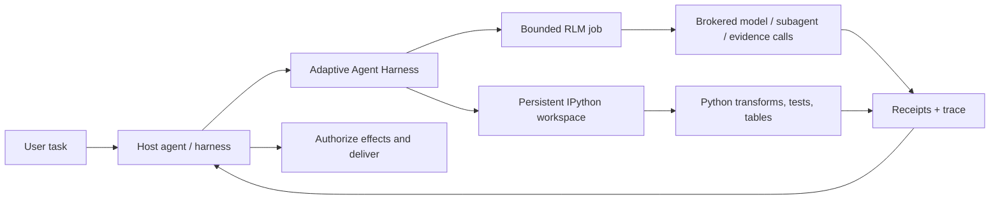

<div align="center">

> **`0.6.0a2` release-contract target** · target tag `v0.6.0a2` · source text does not establish publication; read the canonical English [release notes](../RELEASE-v0.6.0a2.md) before using the tag.

# Adaptive Agent Harness

### Trao cho agent một bàn làm việc — không chỉ một prompt lớn hơn.

**RLM do host phối hợp + IPython bền vững + thao tác lâu bền + quyền hạn do host nắm giữ**

[](https://www.python.org/)
[](https://modelcontextprotocol.io/)
[](../RELEASE-v0.6.0a2.md)
[](../../LICENSE)
[](#trạng-thái-dự-án)

[**Bắt đầu nhanh**](#bắt-đầu-nhanh) · [**Vì sao RLM + IPython?**](#vì-sao-rlm--ipython) · [**Bạn nhận được gì**](#bạn-nhận-được-gì) · [**Kiến trúc**](#kiến-trúc) · [**Trạng thái kỹ thuật**](../../TECHNICAL-STATUS.md)

</div>

[English](../../README.md) · [**繁中**](README.zh-TW.md) · [简中](README.zh-CN.md) · [Español](README.es.md) · [Português](README.pt-BR.md) · [Français](README.fr.md) · [Deutsch](README.de.md) · [日本語](README.ja.md) · [한국어](README.ko.md) · [Русский](README.ru.md) · [العربية](README.ar.md) · [Italiano](README.it.md) · [Tiếng Việt](README.vi.md) · [ไทย](README.th.md) · [Čeština](README.cs.md) · [Suomi](README.fi.md) · [Norsk](README.no.md) · [Lietuvių](README.lt.md)

---

## Câu trả lời trong 30 giây

Phần lớn agent được yêu cầu giải quyết những vấn đề lớn bằng một giao diện đắt đỏ và mau quên: prompt.

**Adaptive Agent Harness thay vào đó cung cấp một bàn làm việc có thể lập trình.** Host có thể phối hợp và sử dụng song song hai bề mặt ngang hàng: các workspace IPython bền vững cho tính toán có trạng thái và các job RLM có giới hạn cho bằng chứng cùng các lệnh gọi model qua broker. Receipt bền vững và bề mặt MCP nhỏ gọn giúp host quản lý cả hai và kết nối lại được.

Alpha công khai hiện tại **không chạy một job RLM bên trong workspace IPython và không tự động chia sẻ trạng thái giữa chúng**. Host là bên chịu trách nhiệm chuyển giao rõ ràng các bằng chứng, giá trị hoặc artifact được chọn.

Kết quả là một nền tảng thực tiễn cho các agent cần:

- suy luận trên những đầu vào lớn hơn một cửa sổ ngữ cảnh duy nhất;
- biến phần trao đổi lặp đi lặp lại của các lệnh gọi công cụ thành những chương trình Python gọn;
- duy trì biến, bảng, hàm trợ giúp và bằng chứng qua nhiều bước;
- tiếp tục sau khi frontend ngắt kết nối mà không nhầm đó là hủy;
- chỉ tiếp tục từ một ranh giới chắc chắn, có biên nhận xác nhận;
- để host nắm quyền hạn cuối cùng, thông tin xác thực, hiệu ứng và việc chuyển giao.

Bản phân phối Python hiện có tên **`adaptive-agent-runtime`**. Kho này là trang chủ công khai của dự án dưới tên **Adaptive Agent Harness**.

---

## RLM là gì?

**Mô hình ngôn ngữ đệ quy (Recursive Language Model, RLM)** coi prompt dài hoặc corpus là dữ liệu trong một môi trường bên ngoài. Thay vì nhồi mọi thứ vào ngữ cảnh đang hoạt động của model, model có thể viết các chương trình để:

1. kiểm tra dữ liệu;
2. lọc, tách, nối, xếp hạng hoặc tóm tắt dữ liệu;
3. gọi model hoặc subagent trên những lát dữ liệu đã chọn;
4. kết hợp các bằng chứng được trả về;
5. lặp lại trong những giới hạn được nêu rõ.

Điểm quan trọng không phải là “đệ quy vô hạn”, mà là **mở rộng quy mô suy luận bằng chương trình**: dành các lệnh gọi model cho nơi chúng tạo ra giá trị, và dùng tính toán thông thường cho mọi phần còn lại.

Một mô hình tư duy đơn giản:

```text
Traditional long-context agent
  prompt -> one model call -> more prompt -> another model call

RLM-style agent
  long input -> Python examines it -> selected model/subagent calls
             -> Python combines evidence -> bounded answer + trace
```

Thuật ngữ này xuất phát từ công trình [Recursive Language Models](https://arxiv.org/abs/2512.24601) của Zhang, Kraska và Khattab. Adaptive Agent Harness triển khai một **runtime RLM có broker và giới hạn**; nó không tuyên bố rằng mọi workload đều cần đệ quy, hay nhiều lệnh gọi hơn sẽ tự động tạo ra câu trả lời tốt hơn.

---

## Vì sao IPython?

Các agent chạy lâu cũng cần một nơi để **suy nghĩ cùng với dữ liệu**, không chỉ nói về dữ liệu. IPython bổ sung cho bề mặt RLM bằng cách cung cấp cho host một workspace tính toán bền vững riêng biệt:

- biến vẫn khả dụng qua các bước thực thi;
- DataFrame, mảng, tài liệu đã phân tích và kết quả đồ thị có thể được kiểm tra trực tiếp;
- hàm trợ giúp có thể thay thế các vòng lặp gọi công cụ lặp đi lặp lại;
- model có thể kiểm tra một giả thuyết, xem xét kết quả và tinh chỉnh bước tiếp theo;
- các tham chiếu gọn có thể ở lại trong ngữ cảnh trong khi dữ liệu đầy đủ vẫn nằm trong workspace;
- trạng thái dạng JSON được chọn có thể được checkpoint mà không giả vờ rằng các object Python đang chạy tùy ý là portable.

Bản ghi chat là bản ghi những gì đã được nói. **Workspace IPython là tập hợp những gì đã được tính toán.**

Sự khác biệt này quan trọng đối với nghiên cứu dài, điều tra codebase, khảo sát dữ liệu, pipeline đánh giá và mọi tác vụ mà nếu không có nó agent sẽ phải đọc lại cùng một tài liệu hết lần này đến lần khác.

---

## Vì sao RLM × IPython?

Ở đây, “×” nghĩa là **sự phối hợp do host thực hiện**, không phải ràng buộc RLM/workspace trong cùng một tiến trình. Mỗi bề mặt ngang hàng xử lý một kiểu lỗi khác nhau:

| Lớp | Thành phần đóng góp |
|---|---|
| **RLM** | Quyết định cách phân rã một vấn đề lớn và nơi các lệnh gọi model/subagent có giới hạn sẽ hữu ích. |
| **IPython** | Thực thi vòng lặp, phép nối, bộ lọc, xếp hạng, kiểm thử và điều tra có trạng thái trong một workspace đang hoạt động. |
| **Adaptive Agent Harness** | Bổ sung định danh thao tác lâu bền, grant, ngân sách, biên nhận, artifact, chính sách khôi phục và quyền truy cập MCP trung lập với host. |
| **Host agent của bạn** | Nắm giữ định danh, credential của provider, phê duyệt, hiệu ứng đặc quyền, việc chấp nhận và chuyển giao cuối cùng. |

Host có thể phối hợp chúng bằng cách chuyển rõ ràng các bằng chứng, giá trị hoặc artifact được chọn giữa hai bề mặt. Không có namespace dùng chung ngầm định hay đường thực thi RLM sang IPython tự động.



Quy tắc chủ đạo cố ý đơn giản:

> **Host phối hợp rõ ràng các bề mặt ngang hàng; Python là ngôn ngữ của workspace, còn host vẫn là ranh giới quyền hạn.**

---

## Bạn nhận được gì

### Bàn làm việc agent có thể lập trình

- workspace plain-Python và IPython bền vững;
- thực thi code có giới hạn với kiểm tra generation và revision;
- NumPy và pandas có sẵn trong runtime mặc định;
- checkpoint tập con JSON tất định với các loại trừ được nêu rõ;
- xử lý dựa trên artifact cho các kết quả lớn hơn hoặc không thể inline.

### Bộ máy RLM qua broker

- job RLM, step, dữ liệu sử dụng và kết quả cuối được lưu giữ;
- các hợp đồng broker rõ ràng cho yêu cầu model, subagent, artifact và truy vấn bằng chứng;
- ngân sách theo từng thao tác cho thời gian chạy, lệnh gọi model, token, thao tác con và artifact;
- handle và biên nhận được lưu giữ thay vì “có lẽ tool đã chạy”;
- đối soát khi một lệnh gọi có thể đã bắt đầu nhưng chưa có biên nhận có thẩm quyền.

### Thao tác lâu bền

- ID thao tác logic ổn định, tách biệt khỏi attempt, worker, lease và kết nối frontend;
- công việc đã được chấp nhận có thể tồn tại lâu hơn một request MCP;
- sự kiện đọc được theo cursor, cùng các thao tác status, cancel và reconcile;
- supervisor lâu bền với các frontend xác thực tạm thời;
- định danh bắt đầu tiến trình chính xác thay vì quyền sở hữu chỉ dựa trên PID;
- các attempt kế nhiệm bảo toàn deadline, cancellation và mức sử dụng tích lũy.

### Hợp đồng portable

- 38 công cụ MCP trên bề mặt v8 hiện tại;
- schema có phiên bản và asset gắn với digest;
- hướng dẫn thao tác đi kèm cho các profile Codex và Hermes;
- broker tham chiếu tất định cho phát triển và kiểm thử tuân thủ;
- các ranh giới trung lập với host, không yêu cầu AHC, Prime Agent hoặc NOOA.

---

## Những nơi nó phát huy tác dụng

Adaptive Agent Harness phù hợp với:

- **nghiên cứu tài liệu dài** — tìm kiếm, chia lát, so sánh và tổng hợp bằng chứng đệ quy;
- **điều tra codebase** — duy trì tập symbol, đường dẫn gọi, bằng chứng kiểm thử và thay đổi ứng viên;
- **phân tích dữ liệu** — chuyển giữa câu hỏi bằng ngôn ngữ tự nhiên và các thao tác DataFrame;
- **pipeline đánh giá** — gắn đầu vào, điểm số, biên nhận và artifact với một thao tác duy nhất;
- **thử nghiệm hạ tầng agent** — kiểm thử thực thi lâu bền và khôi phục mà không phải xây dựng thêm một hệ điều hành agent hướng tới người dùng;
- **tích hợp worker có kiểm soát** — đặt các worker giàu tính năng hơn sau ngân sách, handle và sự chấp nhận rõ ràng của host.

Nó cố ý hẹp hơn một coding agent tự chủ đầy đủ. Điều đó hữu ích khi bạn đã có một orchestrator và cần một lớp tính toán cùng bằng chứng đáng tin cậy bên dưới nó.

---

## Nó liên quan thế nào đến các dự án RLM khác

Chúng tôi học hỏi từ các công trình công khai mà không giả vờ rằng các dự án có thể thay thế lẫn nhau:

- **[Prime Agent](https://github.com/PrimeIntellect-ai/prime-agent)** cho thấy giá trị sản phẩm của môi trường IPython bền vững, việc sử dụng công cụ bằng chương trình, child agent gốc và tính liên tục do daemon cung cấp. Prime là trải nghiệm coding/research agent đầy đủ hơn. Adaptive Agent Harness là lớp runtime/control hẹp hơn và có thể bổ trợ cho một worker như Prime thay vì thay thế nó.
- **[NVIDIA Object Oriented Agents (NOOA)](https://github.com/NVIDIA-NeMo/labs-OO-Agents)** cho thấy mô hình object có kiểu, native Python cho capability của agent và orchestration kiểu CodeAct. Ở đây NOOA chỉ là đầu vào thiết kế: không có adapter NOOA hay dependency NOOA nào được đóng gói.
- **[Recursive Language Models](https://arxiv.org/abs/2512.24601)** cung cấp paradigm suy luận cốt lõi: coi context dài là một môi trường bên ngoài mà model có thể kiểm tra bằng chương trình và truy vấn đệ quy.

Xem [Why RLM + IPython](../../docs/WHY-RLM-AND-IPYTHON.md) để đọc phần lý do thiết kế và ghi chú nguồn sâu hơn.

---

## Bắt đầu nhanh

> **Alpha công khai:** dùng tag đã ghim, kiểm tra các capability mà host trả về và bắt đầu với workspace dùng một lần. Project này thực thi Python do model viết và **không phải sandbox bảo mật**.

### Cài đặt từ tag công khai mới nhất

```bash
# Use only after external GitHub readback confirms the target tag exists.
uv tool install --force \
  "git+https://github.com/phenomenoner/adaptive-agent-harness.git@v0.6.0a2"
```

### Thiết lập Codex App

```bash
aar-codex-setup
```

Khởi động lại Codex Desktop nếu biên nhận thiết lập cho biết `restart_required: true`; sau khi áp dụng thủ công, giữ lại biên nhận `restart_required_after_manual_apply: true`; biên nhận no-op về sau có `restart_required: false` không thể xóa bỏ yêu cầu khởi động lại. Sau đó gọi `aar_capabilities` trong một task mới.

### Phát triển từ source

```bash
git clone https://github.com/phenomenoner/adaptive-agent-harness.git
cd adaptive-agent-harness
uv sync --locked
uv run aar-contract verify
uv run pytest -q
```

### Bắt đầu với workflow MCP

1. Gọi `aar_capabilities` và liên kết với generation runtime cùng capability digest được trả về.
2. Tạo hoặc attach vào một workspace, hoặc submit một thao tác `rlm.execute` có giới hạn.
3. Giữ operation handle được trả về.
4. Khi cần, đọc status/event từ một kết nối mới đã được ủy quyền.
5. Đối soát mọi trạng thái không chắc chắn trước khi thử lại công việc có thể tạo hiệu ứng.

Ghi chú cài đặt và host chi tiết:

- [Cài đặt Codex](../../docs/CODEX-INSTALL.md)
- [Tương thích với host](../../HOST-COMPATIBILITY.md)
- [Kiến trúc](../../ARCHITECTURE.md)
- [Skill thao tác](../../skills/aar-operations/SKILL.md)
- [Trạng thái xác minh kỹ thuật](../../TECHNICAL-STATUS.md)

---

## Kiến trúc

Adaptive Agent Harness theo thiết kế small-waist:

```text
Host / orchestrator
  ├─ owns identity, provider credentials, approvals, effects, delivery
  └─ connects through MCP or a native adapter
          |
          v
Adaptive Agent Harness
  ├─ operation registry + event log + receipts
  ├─ bounded RLM engine + broker journal
  ├─ programmable workspace manager
  ├─ durable supervisor + exact worker identity
  ├─ checkpoints, artifacts, assets, export/import
  └─ capability, grant, budget, deadline, and generation fencing
          |
          v
Plain Python / IPython workers and host-authorized brokers
```

Frontend MCP được thiết kế để có thể thay thế. Nó không sở hữu cơ sở dữ liệu continuity hay vòng đời worker; supervisor lâu bền mới sở hữu chúng.

---

## Trạng thái dự án

Alpha công khai hiện tại: **`0.6.0a2`**.

> **Translation status:** the overview below retains the `v0.3.0a1` public baseline as historical
> context. For `v0.6.0a2` receipt-backed model routing, current verification, and exact publication
> boundaries, read the canonical English [release notes](../RELEASE-v0.6.0a2.md) and
> [model-routing guide](../MODEL-ROUTING-AND-EVALUATION.md).


`v0.6.0a2` release-contract evidence represented by this source:

- hỗ trợ Python 3.11 đến 3.14;
- 38-tool MCP v8 executable surface (frozen 30-tool MCP v7 prefix + exact 8-tool successor suffix);
- schema SQLite mang tính bổ sung đến v5;
- current full-repository verification is recorded in the canonical English release note and external release receipt;
- probe supervisor/frontend exact-wheel sạch trên Linux/WSL;
- các kịch bản supervisor lâu bền, thay thế frontend, mất tiến trình, writer cũ, tái sử dụng biên nhận và successor RLM gắn với policy.

Các dòng tương thích native-Windows và Hermes đã cài đặt trước đây được giữ lại dưới dạng
**bối cảnh lịch sử do maintainer báo cáo**. Receipt host hỗ trợ không được đưa vào
repository công khai này, vì vậy không thể audit độc lập các dòng đó từ cây này và chúng không phải là
tiêu chí phát hành cho candidate mã nguồn công khai.

Vẫn còn mở:

- khôi phục tự động, portable cho trạng thái workspace IPython mở rộng vào generation mới;
- adapter đối soát hiệu ứng bên ngoài nói chung;
- cô lập bảo mật đa tenant;
- hiệu ứng exactly-once tổng quát;
- phát hành lên package registry và các bảo đảm API ổn định.

Hãy đọc [TECHNICAL-STATUS.md](../../TECHNICAL-STATUS.md), [HOST-COMPATIBILITY.md](../../HOST-COMPATIBILITY.md) trước khi đưa ra các tuyên bố về production.

---

## Project này **không** làm gì

- Nó **không phải sandbox bảo mật**.
- Theo thiết kế, nó **không giữ credential của provider của bạn**.
- Nó **không thực thi các hiệu ứng bên ngoài tùy ý và không tự gửi message cho người dùng**.
- Nó **không hứa hẹn semantics exactly-once phổ quát**.
- Nó **không hồi sinh các stack Python tùy ý, socket, generator hoặc bộ nhớ tiến trình native**.
- Nó **không biến Prime Agent, NOOA, CodeGraph, Hermes, Codex hoặc AHC thành dependency của runtime**.

Tuyên bố về ranh giới quyền hạn là:

> **Adaptive Agent Harness tính toán và đề xuất. Host ủy quyền và chuyển giao.**

---

## Đóng góp

Hoan nghênh issue, pull request tập trung, báo cáo tương thích và fixture lỗi có thể tái hiện. Vui lòng đọc [CONTRIBUTING.md](../../CONTRIBUTING.md) và [SECURITY.md](../../SECURITY.md) trước.

Các hướng đóng góp hữu ích:

- profile host bổ sung và các dòng tương thích black-box;
- tính đủ điều kiện của checkpoint và tính thuận tiện của loại trừ;
- adapter đối soát broker/effect;
- chiến lược RLM có giới hạn và benchmark nặng về bằng chứng;
- backend worker và kho artifact;
- sửa lỗi tài liệu và bản dịch.

---

## Giấy phép

[MIT](../../LICENSE) © 2026 phenomenoner.

---

## Tài liệu tham khảo

- Alex L. Zhang, Tim Kraska và Omar Khattab, [Recursive Language Models](https://arxiv.org/abs/2512.24601), arXiv:2512.24601.
- [Prime Agent](https://github.com/PrimeIntellect-ai/prime-agent), Prime Intellect.
- [NVIDIA Object Oriented Agents](https://github.com/NVIDIA-NeMo/labs-OO-Agents), NVIDIA-NeMo.
- [Model Context Protocol](https://modelcontextprotocol.io/).
