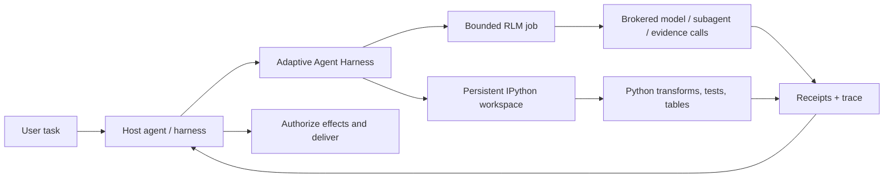

<div align="center">

> **`0.5.0a0`** public alpha · [`phenomenoner/adaptive-agent-harness@v0.5.0a0`](https://github.com/phenomenoner/adaptive-agent-harness/releases/tag/v0.5.0a0)

# Adaptive Agent Harness

### 给智能体一张工作台——而不只是更大的提示词。

**由 host 组合的 RLM + persistent IPython + durable operations + host-owned authority**

[](https://www.python.org/)
[](https://modelcontextprotocol.io/)
[](https://github.com/phenomenoner/adaptive-agent-harness/releases/tag/v0.5.0a0)
[](../../LICENSE)
[](#项目状态)

[**快速开始**](#快速开始) · [**为什么是 RLM + IPython？**](#为什么是-rlm--ipython) · [**你将获得什么**](#你将获得什么) · [**架构**](#架构) · [**技术状态**](../../TECHNICAL-STATUS.md)

</div>

[English](../../README.md) · [**繁中**](README.zh-TW.md) · [简中](README.zh-CN.md) · [Español](README.es.md) · [Português](README.pt-BR.md) · [Français](README.fr.md) · [Deutsch](README.de.md) · [日本語](README.ja.md) · [한국어](README.ko.md) · [Русский](README.ru.md) · [العربية](README.ar.md) · [Italiano](README.it.md) · [Tiếng Việt](README.vi.md) · [ไทย](README.th.md) · [Čeština](README.cs.md) · [Suomi](README.fi.md) · [Norsk](README.no.md) · [Lietuvių](README.lt.md)

---

## 30 秒看懂

大多数智能体都被要求用一个昂贵又健忘的接口——提示词——解决大型问题。

**Adaptive Agent Harness 改为提供一张可编程工作台。**它提供两个由 host 组合的 sibling surfaces，可以并列使用：用于有状态计算的持久 IPython workspaces，以及用于经 broker 的 evidence 和 model calls 的有界 RLM jobs。持久化 receipts 和小型 MCP surface 让两者都可治理，也可重新连接。

当前公开 alpha **不会在 IPython workspace 内执行 RLM job，也不会在两者之间自动共享 state。**选定的 evidence、values 或 artifacts 必须由 host 明确传递。

这为需要以下能力的智能体提供了实用基础：

- 对超出单个 context window 的输入进行推理；
- 将重复的工具调用往返转换为精简的 Python 程序；
- 在步骤之间保留变量、表格、辅助函数和证据；
- 在前端断开连接后继续工作，不把断线误认为取消；
- 只从有收据支持、边界明确的位置恢复；
- 将最终权限、凭证、效果和交付留给 host。

Python 发行包目前名为 **`adaptive-agent-runtime`**。这个 repository 以 **Adaptive Agent Harness** 的名称作为它的公开项目主页。

---

## 什么是 RLM？

**Recursive Language Model (RLM)** 将长提示词或 corpus 视为外部环境中的数据。模型不必把所有内容都塞进当前 context，而是可以编写程序来：

1. 检查数据；
2. 筛选、拆分、连接、排序或总结数据；
3. 对选定的切片调用模型或子智能体；
4. 组合返回的证据；
5. 在明确限制内重复执行。

重要的概念不是“无限递归”，而是**程序化的推理时扩展（programmatic inference-time scaling）**：把模型调用花在能增加价值的地方，其余工作使用普通计算完成。

一个简单的心智模型：

```text
Traditional long-context agent
  prompt -> one model call -> more prompt -> another model call

RLM-style agent
  long input -> Python examines it -> selected model/subagent calls
             -> Python combines evidence -> bounded answer + trace
```

这个术语来自 Zhang、Kraska 和 Khattab 的 [Recursive Language Models](https://arxiv.org/abs/2512.24601) 工作。Adaptive Agent Harness 实现的是**有界、经 broker 的 RLM runtime**；它不声称每个 workload 都需要递归，也不声称更多调用会自动产生更好的答案。

---

## 为什么是 IPython？

长时间运行的智能体也需要一个能**与数据一起**思考的地方，而不只是谈论数据。IPython 通过提供一个独立的持久计算工作区，补充 RLM surface：

- 变量会在不同执行步骤之间保持可用；
- 可以直接检查 DataFrames、数组、解析后的文档和图结果；
- 辅助函数可以取代重复的工具调用循环；
- 模型可以测试假设、检查结果，再完善下一步；
- 精简引用可以留在 context 中，而完整数据保留在工作区；
- 可以对选定的 JSON-like 状态创建 checkpoint，而不假装任意存活的 Python 对象都是可移植的。

聊天记录是已说内容的记录。**IPython 工作区则是已计算内容的工作集合。**

这一区分对于长期研究、代码库分析、数据调查、评估，以及任何智能体原本会反复重读相同材料的任务都很重要。

---

## 为什么是 RLM × IPython？

这里的“×”表示 **host composition**，而不是进程内的 RLM/workspace binding。每个 sibling surface 都覆盖不同的失效模式：

| 层 | 贡献 |
|---|---|
| **RLM** | 决定如何拆解大型问题，以及哪些地方适合使用有界的模型／子智能体调用。 |
| **IPython** | 在实时工作区中执行循环、连接、筛选、排名、测试和有状态的调查。 |
| **Adaptive Agent Harness** | 加入持久化操作身份、授权、预算、收据、artifacts、恢复策略和 host-neutral 的 MCP 访问。 |
| **Your host agent** | 拥有身份、provider 凭证、审批、特权效果、接受和最终交付。 |

host 负责在两个 surface 之间明确传递选定的 evidence、values 或 artifacts，以组合它们。不存在隐式的 shared namespace，也没有自动的 RLM-to-IPython execution path。



治理规则刻意保持简单：

> **host 会明确组合这些 sibling surfaces；Python 是工作区语言，而 host 仍然是 authority boundary。**

---

## 你将获得什么

### 可编程智能体工作台

- 持久的 plain-Python 和 IPython 工作区；
- 带 generation 和 revision 检查的有界代码执行；
- 默认 runtime 提供 NumPy 和 pandas；
- 具有明确排除项的确定性 JSON-subset checkpoints；
- 由 artifact 支持的较大或非 inline 结果处理。

### 经 broker 的 RLM 引擎

- 持久化的 RLM jobs、步骤、用量和终端结果；
- 明确的 model-request、subagent、artifact 和 evidence broker contracts；
- 每个操作各自的 wall-time、model-call、token、child-operation 和 artifact 预算；
- 保留 handles 和 receipts，而不是“工具大概运行了”；
- 当调用可能已经启动但没有权威收据时进行 reconciliation。

### 持久化操作

- 稳定的逻辑操作 ID，与 attempts、workers、leases 以及前端连接分离；
- 能够超越单个 MCP request 存活的已接受工作；
- 可用 cursor 读取的 events，以及 status、cancel 和 reconcile 操作；
- 具有持久性的 supervisor 与短暂、已认证的前端；
- 精确的 process-start 身份，而不是只依赖 PID 的所有权；
- 保留 deadline、cancellation 和累计用量的 successor attempts。

### 可移植 contracts

- 当前 v7 surface 上的 30 个 MCP tools；
- 版本化 schemas 和 digest-bound assets；
- Codex 和 Hermes profiles 的内置操作指南；
- 用于开发和 conformance testing 的确定性 reference brokers；
- 不要求 AHC、Prime Agent 或 NOOA 的 host-neutral 边界。

---

## 它最适合的地方

Adaptive Agent Harness 很适合：

- **长文档研究**——搜索、切片、比较，并递归综合证据；
- **代码库调查**——保留 symbol 集合、call paths、测试证据和候选变更；
- **数据分析**——在自然语言问题和 DataFrame 操作之间切换；
- **评估 pipelines**——让输入、分数、收据和 artifacts 绑定到同一个操作；
- **智能体基础设施实验**——测试持久执行和恢复，而不必构建第二套面向用户的 agent OS；
- **受控 worker 集成**——把更丰富的 workers 放在明确的预算、handles 和 host acceptance 之后。

它刻意比完整的 autonomous coding agent 更窄。当你已经有 orchestrator，只需要底层一个可靠的计算和证据平面时，这反而很有用。

---

## 这与其他 RLM 项目的关系

我们从公开工作中学习，但没有假设这些项目可以互换：

- **[Prime Agent](https://github.com/PrimeIntellect-ai/prime-agent)** 展示了持久 IPython 环境、程序化工具使用、原生 child agents 和 daemon-backed continuity 的产品价值。Prime 是更完整的 coding/research agent 体验。Adaptive Agent Harness 是更窄的 runtime/control layer，可以补足像 Prime 这样的 worker，而不是取代它。
- **[NVIDIA Object Oriented Agents (NOOA)](https://github.com/NVIDIA-NeMo/labs-OO-Agents)** 展示了 Python 原生、具类型的 agent capability 对象模型和 CodeAct-style orchestration。NOOA 在这里仅作为设计输入：没有随附的 NOOA adapter 或 dependency。
- **[Recursive Language Models](https://arxiv.org/abs/2512.24601)** 提供核心推理范式：将长 context 视为外部环境，让模型以程序化方式检查并递归查询。

请参阅 [为什么是 RLM + IPython](../../docs/WHY-RLM-AND-IPYTHON.md)，了解更深入的设计理由和来源笔记。

---

## 快速开始

> **公开 alpha：** 使用 pinned tag，检查 host 返回的 capabilities，并从 disposable workspaces 开始。此项目会执行模型编写的 Python，且**不是安全沙箱**。

### 从最新公开 tag 安装

```bash
uv tool install --force \
  "git+https://github.com/phenomenoner/adaptive-agent-harness.git@v0.5.0a0"
```

### Codex App 设置

```bash
aar-codex-setup
```

如果 setup receipt 表示 `restart_required: true`，请重新启动 Codex Desktop；手动应用后请保留 `restart_required_after_manual_apply: true` receipt；后续 no-op receipt 中的 `restart_required: false` 不能清除重启义务。然后在新的 task 中调用 `aar_capabilities`。

### 从 source 开发

```bash
git clone https://github.com/phenomenoner/adaptive-agent-harness.git
cd adaptive-agent-harness
uv sync --locked
uv run aar-contract verify
uv run pytest -q
```

### 从 MCP workflow 开始

1. 调用 `aar_capabilities`，并绑定返回的 runtime generation 和 capability digest。
2. 创建或连接 workspace，或提交一个有界的 `rlm.execute` operation。
3. 保留返回的 operation handle。
4. 需要时，从新的、已授权连接读取 status／events。
5. 在重试任何具有 effect 形状的工作前，先解决不确定性。

详细安装和 host 笔记：

- [Codex 安装](../../docs/CODEX-INSTALL.md)
- [Host 兼容性](../../HOST-COMPATIBILITY.md)
- [架构](../../ARCHITECTURE.md)
- [Operation skill](../../skills/aar-operations/SKILL.md)
- [技术验证状态](../../TECHNICAL-STATUS.md)

---

## 架构

Adaptive Agent Harness 遵循 small-waist 设计：

```text
Host / orchestrator
  ├─ owns identity, provider credentials, approvals, effects, delivery
  └─ connects through MCP or a native adapter
          |
          v
Adaptive Agent Harness
  ├─ operation registry + event log + receipts
  ├─ bounded RLM engine + broker journal
  ├─ programmable workspace manager
  ├─ durable supervisor + exact worker identity
  ├─ checkpoints, artifacts, assets, export/import
  └─ capability, grant, budget, deadline, and generation fencing
          |
          v
Plain Python / IPython workers and host-authorized brokers
```

MCP frontend 刻意可以替换。它不拥有 continuity database 或 worker lifecycle；这些由 durable supervisor 负责。

---

## 项目状态

当前公开 alpha：**`0.5.0a0`**。

> **Translation status:** the overview below retains the `v0.3.0a1` public baseline as historical
> context. For `v0.5.0a0` receipt-backed model routing, current verification, and exact release
> boundaries, read the canonical English [release notes](../RELEASE-v0.5.0a0.md) and
> [model-routing guide](../MODEL-ROUTING-AND-EVALUATION.md).


Current `v0.5.0a0` public release evidence:

- Python 3.11 至 3.14 覆盖范围；
- 38-tool MCP v8 executable surface (frozen 30-tool MCP v7 prefix + exact 8-tool successor suffix);
- 直到 v5 的 additive SQLite schema；
- full repository run: **743 passed, 5 platform-gated skips, 1 existing MCP Sampling deprecation warning**;
- 在 Linux/WSL 上通过 clean exact-wheel supervisor/frontend probe；
- durable supervisor、frontend replacement、process-loss、stale-writer、receipt-reuse 和 policy-bound RLM successor 场景。

较早的 native-Windows 和 installed-Hermes compatibility rows 保留为 **maintainer-reported historical context**。支持这些 rows 的 host receipts 未包含在这个公开 repository 中，因此这些 rows 无法从这个 tree 独立审计，也不属于 public source release 的 release criteria。

仍待完成：

- 将更广泛的 IPython workspace state 可移植地自动恢复到新的 generation；
- 通用的 external-effect reconciliation adapters；
- multi-tenant security isolation；
- generic exactly-once effects；
- package-registry publication 和稳定的 API guarantees。

在提出 production claims 前，请阅读 [TECHNICAL-STATUS.md](../../TECHNICAL-STATUS.md)、[HOST-COMPATIBILITY.md](../../HOST-COMPATIBILITY.md)。

---

## 这个项目**不会**做什么

- 它**不是安全沙箱**。
- 依设计，它**不持有你的 provider 凭证**。
- 它**不会自行执行任意 external effects，也不会自行交付用户消息**。
- 它**不承诺普遍适用的 exactly-once semantics**。
- 它**不会复活任意 Python stacks、sockets、generators 或 native process memory**。
- 它**不会让 Prime Agent、NOOA、CodeGraph、Hermes、Codex 或 AHC 成为 runtime dependency**。

权限声明如下：

> **Adaptive Agent Harness 负责计算和提出方案。host 负责授权和交付。**

---

## 贡献

欢迎提交 issues、聚焦的 pull requests、兼容性报告和可复现的失败 fixtures。请先阅读 [CONTRIBUTING.md](../../CONTRIBUTING.md) 和 [SECURITY.md](../../SECURITY.md)。

适合贡献的领域：

- 更多 host profiles 和 black-box compatibility rows；
- checkpoint eligibility 和 exclusion ergonomics；
- broker/effect reconciliation adapters；
- 有界 RLM strategies 和 evidence-heavy benchmarks；
- worker backends 和 artifact stores；
- 文档和翻译修正。

---

## 许可证

[MIT](../../LICENSE) © 2026 phenomenoner.

---

## 参考资料

- Alex L. Zhang、Tim Kraska 和 Omar Khattab，[Recursive Language Models](https://arxiv.org/abs/2512.24601)，arXiv:2512.24601。
- [Prime Agent](https://github.com/PrimeIntellect-ai/prime-agent)，Prime Intellect。
- [NVIDIA Object Oriented Agents](https://github.com/NVIDIA-NeMo/labs-OO-Agents)，NVIDIA-NeMo。
- [Model Context Protocol](https://modelcontextprotocol.io/)。
