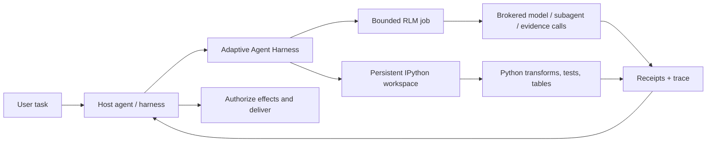

<div align="center">

# Adaptive Agent Harness

### 給代理程式一張工作台——不只是更大的提示詞。

**由 host 組合的 RLM + persistent IPython + durable operations + host-owned authority**

[](https://www.python.org/)
[](https://modelcontextprotocol.io/)
[](https://github.com/phenomenoner/adaptive-agent-harness/releases/tag/v0.4.0a5)
[](../../LICENSE)
[](#專案狀態)

[**快速開始**](#快速開始) · [**為什麼是 RLM + IPython？**](#為什麼是-rlm--ipython) · [**你會得到什麼**](#你會得到什麼) · [**架構**](#架構) · [**技術狀態**](../../TECHNICAL-STATUS.md)

</div>

[English](../../README.md) · [**繁中**](README.zh-TW.md) · [简中](README.zh-CN.md) · [Español](README.es.md) · [Português](README.pt-BR.md) · [Français](README.fr.md) · [Deutsch](README.de.md) · [日本語](README.ja.md) · [한국어](README.ko.md) · [Русский](README.ru.md) · [العربية](README.ar.md) · [Italiano](README.it.md) · [Tiếng Việt](README.vi.md) · [ไทย](README.th.md) · [Čeština](README.cs.md) · [Suomi](README.fi.md) · [Norsk](README.no.md) · [Lietuvių](README.lt.md)

---

## 30 秒看懂

多數代理程式都被要求用一個昂貴又健忘的介面——提示詞——解決大型問題。

**Adaptive Agent Harness 改為提供一張可程式化的工作台。**它提供兩個由 host 組合的 sibling surfaces，可並列使用：用於有狀態計算的持久 IPython workspaces，以及用於經 broker 的 evidence 與 model calls 的有界 RLM jobs。持久化 receipts 與小型 MCP surface 讓兩者都可治理，也能重新連線。

目前公開 alpha **不會在 IPython workspace 內執行 RLM job，也不會自動在兩者之間共享 state。**選定的 evidence、values 或 artifacts 必須由 host 明確傳遞。

這為需要以下能力的代理程式提供了實用基礎：

- 對單一 context window 容量以外的輸入進行推理；
- 將重複的工具呼叫來回轉成精簡的 Python 程式；
- 在步驟之間保留變數、表格、輔助函式與證據；
- 在前端斷線時繼續運作，不把斷線誤認為取消；
- 只從有收據支援、界線明確的位置恢復；
- 將最終權限、憑證、效果與交付留給 host。

Python 發行套件目前名為 **`adaptive-agent-runtime`**。此 repository 以 **Adaptive Agent Harness** 名義作為它的公開專案首頁。

---

## 什麼是 RLM？

**Recursive Language Model (RLM)** 將長提示詞或 corpus 視為外部環境中的資料。模型不必把所有內容硬塞進目前的 context，而是可以撰寫程式來：

1. 檢查資料；
2. 篩選、切分、連接、排序或摘要資料；
3. 對選定的切片呼叫模型或子代理；
4. 組合回傳的證據；
5. 在明確限制內重複執行。

重要概念不是「無限遞迴」，而是**程式化的推理時擴展（programmatic inference-time scaling）**：把模型呼叫花在能增加價值的地方，其餘工作使用一般計算完成。

一個簡單的心智模型：

```text
Traditional long-context agent
  prompt -> one model call -> more prompt -> another model call

RLM-style agent
  long input -> Python examines it -> selected model/subagent calls
             -> Python combines evidence -> bounded answer + trace
```

這個術語來自 Zhang、Kraska 與 Khattab 的 [Recursive Language Models](https://arxiv.org/abs/2512.24601) 研究。Adaptive Agent Harness 實作的是**有界、經 broker 的 RLM runtime**；它不宣稱每個 workload 都需要遞迴，也不宣稱更多呼叫會自動產生更好的答案。

---

## 為什麼是 IPython？

長時間運作的代理程式也需要一個能**和資料一起**思考的地方，而不只是談論資料。IPython 透過提供獨立且持久的計算工作區，補足 RLM surface：

- 變數會在不同執行步驟之間保持可用；
- 可以直接檢查 DataFrames、陣列、解析後的文件與圖形結果；
- 輔助函式可以取代重複的工具呼叫迴圈；
- 模型可以測試假設、檢查結果，再調整下一步；
- 精簡參照可以留在 context 中，而完整資料保留在工作區；
- 可以對選定的 JSON-like 狀態建立 checkpoint，而不假裝任意存活中的 Python 物件都可攜。

聊天逐字稿是已說過內容的紀錄。**IPython 工作區則是已計算內容的工作集合。**

這項區分對長期研究、程式碼庫分析、資料調查、評估，以及任何代理程式原本會不斷重讀相同材料的任務都很重要。

---

## 為什麼是 RLM × IPython？

這裡的「×」表示 **host composition**，不是 in-process 的 RLM/workspace binding。每個 sibling surface 都涵蓋不同的失效模式：

| 層 | 貢獻 |
|---|---|
| **RLM** | 決定如何拆解大型問題，以及哪些地方適合使用有界的模型／子代理呼叫。 |
| **IPython** | 在即時工作區中執行迴圈、連接、篩選、排名、測試與有狀態的調查。 |
| **Adaptive Agent Harness** | 加入持久化操作身分、授權、預算、收據、artifacts、復原政策與 host-neutral 的 MCP 存取。 |
| **Your host agent** | 擁有身分、provider 憑證、核准、特權效果、接受與最終交付。 |

Host 負責在兩個 surface 之間明確傳遞選定的 evidence、values 或 artifacts，以組合它們。不存在隱含的 shared namespace，也沒有自動的 RLM-to-IPython execution path。



治理規則刻意保持簡單：

> **Host 會明確組合這些 sibling surfaces；Python 是工作區語言，而 host 仍是 authority boundary。**

---

## 你會得到什麼

### 可程式化的代理工作台

- 持久的 plain-Python 與 IPython 工作區；
- 帶有 generation 與 revision 檢查的有界程式碼執行；
- 預設 runtime 提供 NumPy 與 pandas；
- 具明確排除項目的確定性 JSON-subset checkpoints；
- 以 artifact 支援較大型或非 inline 結果的處理方式。

### 經 broker 的 RLM 引擎

- 持久化的 RLM jobs、步驟、用量與終端結果；
- 明確的 model-request、subagent、artifact 與 evidence broker contracts；
- 每個操作各自的 wall-time、model-call、token、child-operation 與 artifact 預算；
- 保留 handles 與 receipts，而不是「工具大概執行了」；
- 當呼叫可能已啟動但沒有權威收據時進行 reconciliation。

### 持久化操作

- 穩定的邏輯操作 ID，與 attempts、workers、leases 及前端連線分離；
- 能超越單一 MCP request 存活的已接受工作；
- 可用 cursor 讀取的 events，以及 status、cancel 與 reconcile 操作；
- 具持久性的 supervisor 與短暫、已驗證的前端；
- 精確的 process-start 身分，而非只依賴 PID 的擁有權；
- 保留 deadline、cancellation 與累積用量的 successor attempts。

### 可攜式 contracts

- 目前 v7 surface 上的 30 個 MCP tools；
- 版本化 schemas 與 digest-bound assets；
- Codex 與 Hermes profiles 的內含操作指南；
- 用於開發與 conformance testing 的確定性 reference brokers；
- 不要求 AHC、Prime Agent 或 NOOA 的 host-neutral 邊界。

---

## 它最適合的地方

Adaptive Agent Harness 很適合：

- **長文件研究**——搜尋、切片、比較，並遞迴綜合證據；
- **程式碼庫調查**——保留 symbol 集合、call paths、測試證據與候選變更；
- **資料分析**——在自然語言問題與 DataFrame 操作之間切換；
- **評估 pipelines**——讓輸入、分數、收據與 artifacts 綁定到同一個操作；
- **代理基礎設施實驗**——測試持久執行與復原，不必打造第二套面向使用者的 agent OS；
- **受控 worker 整合**——把更豐富的 workers 放在明確的預算、handles 與 host acceptance 之後。

它刻意比完整的 autonomous coding agent 更窄。當你已經有 orchestrator，只需要一個可靠的計算與證據平面在底層時，這反而很有用。

---

## 這與其他 RLM 專案的關係

我們從公開工作中學習，但沒有假設這些專案可以互換：

- **[Prime Agent](https://github.com/PrimeIntellect-ai/prime-agent)** 展示持久 IPython 環境、程式化工具使用、原生 child agents 與 daemon-backed continuity 的產品價值。Prime 是更完整的 coding/research agent 體驗。Adaptive Agent Harness 是較窄的 runtime/control layer，可以補足像 Prime 這樣的 worker，而不是取代它。
- **[NVIDIA Object Oriented Agents (NOOA)](https://github.com/NVIDIA-NeMo/labs-OO-Agents)** 展示以 Python 為原生環境、具型別的 agent capability 物件模型與 CodeAct-style orchestration。NOOA 在此僅作為設計輸入：沒有隨附的 NOOA adapter 或 dependency。
- **[Recursive Language Models](https://arxiv.org/abs/2512.24601)** 提供核心推理範式：將長 context 視為外部環境，讓模型以程式化方式檢查並遞迴查詢。

請參閱 [為什麼是 RLM + IPython](../../docs/WHY-RLM-AND-IPYTHON.md)，了解更深入的設計理由與來源筆記。

---

## 快速開始

> **公開 alpha：** 使用 pinned tag，檢查 host 回傳的 capabilities，並從 disposable workspaces 開始。此專案會執行模型撰寫的 Python，且**不是安全沙箱**。

### 從最新公開 tag 安裝

```bash
uv tool install --force \
  "git+https://github.com/phenomenoner/adaptive-agent-harness.git@v0.4.0a5"
```

### Codex App 設定

```bash
aar-codex-setup
```

如果 setup receipt 表示設定已變更，請重新啟動 Codex App，然後在新的 task 中呼叫 `aar_capabilities`。

### 從 source 開發

```bash
git clone https://github.com/phenomenoner/adaptive-agent-harness.git
cd adaptive-agent-harness
uv sync --locked
uv run aar-contract verify
uv run pytest -q
```

### 從 MCP workflow 開始

1. 呼叫 `aar_capabilities`，並綁定回傳的 runtime generation 與 capability digest。
2. 建立或連接 workspace，或提交一個有界的 `rlm.execute` operation。
3. 保留回傳的 operation handle。
4. 需要時，從新的、已授權連線讀取 status／events。
5. 在重試任何具有 effect 形狀的工作前，先釐清不確定性。

詳細安裝與 host 筆記：

- [Codex 安裝](../../docs/CODEX-INSTALL.md)
- [Host 相容性](../../HOST-COMPATIBILITY.md)
- [架構](../../ARCHITECTURE.md)
- [Operation skill](../../skills/aar-operations/SKILL.md)
- [技術驗證狀態](../../TECHNICAL-STATUS.md)

---

## 架構

Adaptive Agent Harness 遵循 small-waist 設計：

```text
Host / orchestrator
  ├─ owns identity, provider credentials, approvals, effects, delivery
  └─ connects through MCP or a native adapter
          |
          v
Adaptive Agent Harness
  ├─ operation registry + event log + receipts
  ├─ bounded RLM engine + broker journal
  ├─ programmable workspace manager
  ├─ durable supervisor + exact worker identity
  ├─ checkpoints, artifacts, assets, export/import
  └─ capability, grant, budget, deadline, and generation fencing
          |
          v
Plain Python / IPython workers and host-authorized brokers
```

MCP frontend 刻意可以替換。它不擁有 continuity database 或 worker lifecycle；這些由 durable supervisor 負責。

---

## 專案狀態

目前公開 alpha：**`0.4.0a5`**。

> **Translation status:** the overview below retains the `v0.3.0a1` public baseline as historical
> context. For `v0.4.0a5` receipt-backed model routing, current verification, and exact release
> boundaries, read the canonical English [release notes](../RELEASE-v0.4.0a5.md) and
> [model-routing guide](../MODEL-ROUTING-AND-EVALUATION.md).


從這個公開 candidate 重現的結果：

- Python 3.11 至 3.14 覆蓋範圍；
- 30-tool MCP v7 surface；
- 直到 v5 的 additive SQLite schema；
- 完整 repository 執行：**249 passed, 1 platform-gated skip**；
- 在 Linux/WSL 上通過 clean exact-wheel supervisor/frontend probe；
- durable supervisor、frontend replacement、process-loss、stale-writer、receipt-reuse 與 policy-bound RLM successor 情境。

較早的 native-Windows 與 installed-Hermes compatibility rows 會保留為 **maintainer-reported historical context**。其支援用的 host receipts 並未包含在這個公開 repository 中，因此這些 rows 無法從此 tree 獨立稽核，也不屬於 public source candidate 的 release criteria。

仍待完成：

- 將更廣泛的 IPython workspace state 可攜地自動還原到新 generation；
- 一般化的 external-effect reconciliation adapters；
- multi-tenant security isolation；
- generic exactly-once effects；
- package-registry publication 與穩定的 API guarantees。

在提出 production claims 前，請閱讀 [TECHNICAL-STATUS.md](../../TECHNICAL-STATUS.md)、[HOST-COMPATIBILITY.md](../../HOST-COMPATIBILITY.md)。

---

## 這個專案**不會**做什麼

- 它**不是安全沙箱**。
- 依設計，它**不持有你的 provider 憑證**。
- 它**不會自行執行任意 external effects，也不會自行交付使用者訊息**。
- 它**不承諾普遍適用的 exactly-once semantics**。
- 它**不會復活任意 Python stacks、sockets、generators 或 native process memory**。
- 它**不會讓 Prime Agent、NOOA、CodeGraph、Hermes、Codex 或 AHC 成為 runtime dependency**。

權限聲明如下：

> **Adaptive Agent Harness 負責計算與提出方案。host 負責授權與交付。**

---

## 貢獻

歡迎提交 issues、聚焦的 pull requests、相容性報告與可重現的失敗 fixtures。請先閱讀 [CONTRIBUTING.md](../../CONTRIBUTING.md) 與 [SECURITY.md](../../SECURITY.md)。

適合貢獻的領域：

- 更多 host profiles 與 black-box compatibility rows；
- checkpoint eligibility 與 exclusion ergonomics；
- broker/effect reconciliation adapters；
- 有界 RLM strategies 與 evidence-heavy benchmarks；
- worker backends 與 artifact stores；
- 文件與翻譯修正。

---

## 授權

[MIT](../../LICENSE) © 2026 phenomenoner.

---

## 參考資料

- Alex L. Zhang、Tim Kraska 與 Omar Khattab，[Recursive Language Models](https://arxiv.org/abs/2512.24601)，arXiv:2512.24601。
- [Prime Agent](https://github.com/PrimeIntellect-ai/prime-agent)，Prime Intellect。
- [NVIDIA Object Oriented Agents](https://github.com/NVIDIA-NeMo/labs-OO-Agents)，NVIDIA-NeMo。
- [Model Context Protocol](https://modelcontextprotocol.io/)。
