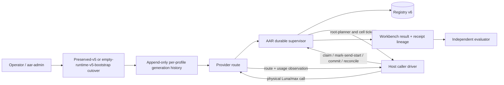

# AR-PRW — Provider-Ready RLM Workbench

**Status:** successor specification candidate reopened for S0 review; product implementation is authorized but held pending successor freeze

**Provisional package target:** `adaptive-agent-runtime 0.6.0a0`

**Product lane:** local/developer MCP plus durable supervisor; authenticated public MCP remains a separate product lane

**Predecessor:** `../aar-rlm-native-workbench-v2/` and exact implemented baseline `v0.5.0a0` (`bd30df40a9f3e77bcf2d244dbf4fd9bba0148ba1`)

## 1. Decision claim

AAR needs one narrow successor release to make the already-implemented MCP v8 workbench operable through a truthful host-owned caller-delegated journey. The release MUST close the observed migration, activation, root-planner, grant, backend-admission, and route-qualification gaps without introducing a second workbench, model broker, provider client, daemon, database, or inference back-channel.

The recommended mechanism is **operator-owned host activation over the existing registry-v6, caller-work, AR-MB route, receipt, usage, and supervisor primitives**.

## 2. Source custody

| Role | Identity | Authority |
|---|---|---|
| Exact executable/source baseline | clean `v0.5.0a0` commit `bd30df40a9f3e77bcf2d244dbf4fd9bba0148ba1` | Read-only predecessor evidence |
| Active successor specification | dedicated clean branch `codex/aar-provider-ready-workbench-v1-impl` rooted at the exact baseline | PMO specification/control edits only while S0 is open |
| Historical reviewed SDD generation | complete custody-tree digest `sha256:bb0287e1718033c773e763096b202591307458e1524ab8de9ea8d5a29039afee`; validator semantic digest `sha256:30dbc6ffb52a289792d7b37d782ce8b537fd0741957af9854b9538a863a01047` | Immutable local evidence, summarized publicly by digest |

The user-owned dirty canonical worktree remains preserved and is not an implementation target. Product-source writers remain blocked until this successor specification validates deterministically, receives independent current-byte review, and the first bounded worker packet passes review. Local filesystem paths are intentionally omitted from the public package.

## 3. Necessity and simpler alternatives

### Observable outcome

From a preserved v5 runtime, an operator can perform a receipt-backed v6 cutover from a credential-free activation intent, generate and activate the final host profile, start the supervisor, obtain scoped workbench grants, submit a caller-delegated workbench job, service every root-planner and cell broker request through durable tickets, and read exact route/usage evidence. The same installed candidate can then be independently qualified against Prime Agent under `openai-codex / gpt-5.6-luna / max`.

### Alternatives

| Alternative | Decision | Reason |
|---|---|---|
| Treat 38-tool discovery as ready | REMOVE | Discovery does not prove schema cutover, grants, planner, backend wiring, or provider treatment. |
| Flip backend rows to `configured=true` | REMOVE | It creates a false-green capability projection without an executable planner or authorized driver. |
| Add another provider client inside AAR | REMOVE | AAR already has AR-MB contracts and caller-work; credentials and physical calls remain host-owned. |
| Add a second service/daemon or state DB | REMOVE | The supervisor, runtime DB, generation fences, and content-addressed files already supply the required owners. |
| Keep synchronous injected planner as the caller-delegated production route | RESTRICT | It remains useful for deterministic tests/native service-managed adapters, but caller-delegated root planning must use durable tickets. |
| Add new MCP tools or change frozen v7/v8 bytes | DEFER | The required closure can be expressed through existing v8 tools plus an operator CLI and packaged profile contracts. |
| Operator-owned activation over existing primitives | KEEP | It is the smallest mechanism that makes the existing implementation executable and falsifiable. |

## 4. Gap register

| ID | Observed v0.5 state | Required successor closure |
|---|---|---|
| GAP-01 | Installing v0.5 can reopen a preserved registry whose `schema_migrations` ends at 5. | Public, dry-runnable, receipt-backed v5→v6 operator cutover. |
| GAP-02 | Migration primitives exist, but no supported operator command owns stop/snapshot/authority/apply/reconcile. | `aar-admin` cutover commands and an external-to-DB epoch directory. |
| GAP-03 | Official launchers accept no activation profile. | Acyclic content-addressed activation intent plus generated final host profile bound at supervisor startup. |
| GAP-04 | Default host publishes no `rlm.workbench.execute` authority. | Principal-, session-, budget-, route-, and profile-scoped grant publication after verified activation only. |
| GAP-05 | All six live workbench rows are unconfigured. | Backend rows derived from instantiated native/caller adapters, never copied from unverified booleans. |
| GAP-06 | `run_claimed()` requires an injected synchronous planner; production profile provides none. | Durable caller-work root-planner tickets for initial/correction/recovery/finalizer logical owners. |
| GAP-07 | Existing admission effectively conflates “fully configured host” with “this job has all required methods.” | Deterministic method-scoped admission; unavailable optional calls fail at invocation. |
| GAP-08 | Route and usage contracts exist, but the live workbench journey does not produce qualification evidence. | Exact Luna/max driver manifest, route receipt, provider-reported usage, physical-attempt lineage, and negative probes. |
| GAP-09 | Local canonical branch and current executable baseline diverge. | Clean implementation-base reconciliation before source work. |

## 5. Scope

### Required

1. Preserve existing registry-v6 DDL and attestations; do not introduce schema v7 unless implementation proves a missing durable field that cannot be represented by existing rows or external activation artifacts.
2. Add one operator CLI surface, provisionally `aar-admin`, for stdout-only read-only planning/status, explicit cutover/abort/reconcile/restore, canonical empty-v5 bootstrap that stops before cutover, and activation commands.
3. Add fourteen frozen strict schemas: activation intent, final host profile, method-adapter manifest, append-only activation-generation authority, cutover plan, operator prepared marker, cutover receipt, restore receipt, operator terminal marker, activation readback, server-side workbench grant set, provider-alias attestation, evaluator evidence classification, and paired-evaluation admission.
4. Bind the activation intent and generated final profile to package, migration, route catalog, grants, adapters, recovery compatibility, and runtime identity.
5. Publish workbench grants only from a verified active profile.
6. Replace caller-delegated root planner execution with the existing durable caller-work lifecycle.
7. Derive required backend methods from the admitted job and fail closed per method.
8. Preserve `aar.mcp-tools.v7` bytes, the v8 38-tool order/schemas, existing workspace/RLM behavior, and no-code public plugin policy.
9. Produce T0–T3 no-inference and installed-wheel evidence before any live qualification.
10. Keep T4 Luna/max qualification and T5 paired benchmark separately authorized and separately identified.

### Non-goals

- Provider credentials inside AAR profiles, databases, receipts, logs, or packages.
- Automatic package upgrade, Git synchronization, remote config mutation, release, publish, or benchmark execution.
- Provider-signed attestation when the provider exposes none.
- Exact Prime physical-request/retry/token telemetry where stock Prime does not expose it.
- Detached child agents, automatic privileged effects, arbitrary Python stack serialization, or replay of a possibly spent request.
- A universal host plugin ABI. The first release proves one generic caller-driver contract and one Hermes-owned Luna/max profile.

## 6. Architecture summary

No arrow grants authority merely by existing. Operator activation authorizes configuration; AAR owns operation/ticket/fence state; the host owns physical calls; provider evidence owns only what it actually reports; the evaluator owns scoring.

## 7. Status vocabulary

| Status | Meaning |
|---|---|
| `spec_planned` | This SDD is structurally complete and independently reviewed; no source claim. |
| `implementation_in_progress` | Authorized source work exists on a clean accepted base. |
| `implemented_unverified` | Candidate bytes exist but T0–T3 are incomplete. |
| `implementation_verified` | One immutable wheel/source/profile candidate passes every required T0–T3 row. |
| `live_qualified` | Separately authorized T4 proves the exact effective route and evidence boundary. |
| `benchmark_planned` | `live_qualified` plus frozen paired protocol/fixtures, instrumentation reconciliation and the strict planning document; this is not T5 launch permission. |
| `blocked` | A named prerequisite prevents the next state; no higher claim is inferred. |

## 8. Normative package

- `BASELINE.md` — exact v0.5 source custody, line evidence, hashes, and observed admission gaps.
- `ARCHITECTURE.md` — owners, boundaries, activation composition, and compatibility.
- `CONTRACTS.md` — proposed public/operator contracts and error taxonomy.
- `LIFECYCLE.md` — temporal ownership, linearization points, crash/cancel/reconcile rules.
- `MIGRATION.md` — v5→v6 operator cutover and activation transaction.
- `EVALUATION.md` — Luna/max route qualification and AAR-vs-Prime admission.
- `ACCEPTANCE.md` — tiered gates and claim rules.
- `IMPLEMENTATION-PLAN.md` — source lanes and RED-first order; current product authority is recorded by the implementation control plane.
- `verification/requirements.json` — machine-readable requirement register.
- `verification/acceptance-matrix.json` — machine-readable discriminating rows.
- `verification/validate_spec.py` — structural validator only.
- `HANDOFF.md` — current public transfer boundary.
- `decisions/ADR-004-freeze-activation-contract-domains.md` — S0 lexical, collection, matching, generation-owner, and security-test decision.

The predecessor v2 SDD remains normative for unchanged workbench contracts. This package is a successor amendment; silence here does not repeal a predecessor invariant.
